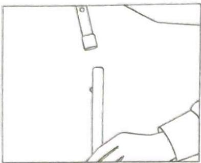
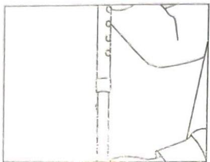
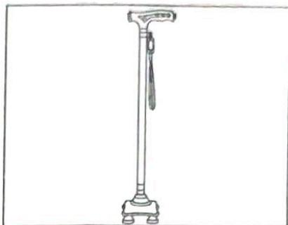
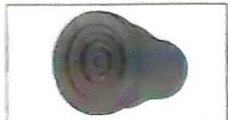
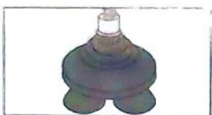
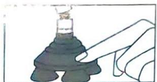
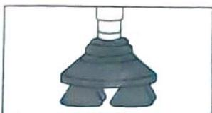
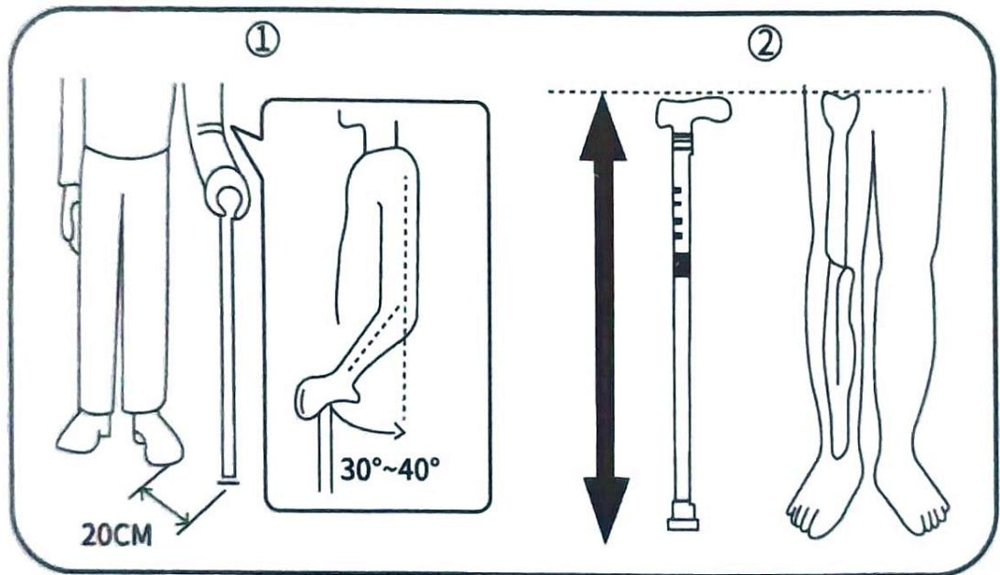

## 医用拐(手杖) 使用说明书

河南幸实科技有限公司

## 使用方法

可供年老体弱，盲人，下肢残疾等人使用。

1、旋转锁扣，连接上面两节；

2、抓住产品上端部分,用手指按下弹钮,上下调节至合适高度,注意要确认听到“咔嗒”声,表明调节到位;

3、最后将锁扣拧紧固定，牢固后方可使用。

### 身高与拐杖长度

下表仅供参考

<table><tr><td>身高 (cm)</td><td>148</td><td>152</td><td>156</td><td>160</td><td>164</td><td>168</td><td>172</td><td>176</td><td>180</td><td>184</td></tr><tr><td>手杖高 (cm)</td><td>73</td><td>75.5</td><td>78</td><td>80.5</td><td>83</td><td>85.5</td><td>88</td><td>90.5</td><td>93</td><td>95.5</td></tr></table>

拐杖高度的调节有以下三种参考方式, 详见图示。

①当拐杖放于脚前20CM的位置时，肘关节的角度成30°\~40°时的高度。

②垂直手臂时地面到手腕的高度或地面到股骨关节臼的高度。

③拐杖长度的计算方法：

(弓背的人只要保持弓背状态站立即可)

身高÷2+2\~3cm (一般鞋底的厚度)=拐杖长度

## 保管方式

医用拐应避开高温或低温环境,避免塑料零件过早老化,确保医用拐安全使用。

## 运输及贮存

本产品需储存在干燥, 通风, 平稳, 无腐蚀性物品 (或无腐蚀性气体) 的室内。对于废弃物的处理按城市有关环境保护的规定进行处理。

## 预期用途

用于行动障碍患者的辅助行走或站立,进行康复训练。

## 结构形式

医用拐分为:伸缩式,折叠式,折凳式,多脚式,腋下拐,肘拐。

主要性能与结构:通常由支脚、手柄、支撑托、支撑架或臂套组成;或由手柄、手柄套、助行脚和支架组成。

## 保修说明

尊敬的用户：

非常感谢您购买本公司产品,为了您能更好地享受本公司优质产品和服务,请您在购买时详细填写保修卡,并仔细阅读产品使用说明书或向销售人员了解正确的使用及保养方法。

A. 在正常使用情况下(非人为因素)造成的损坏, 本产品购买之日起保修一年, 终身服务。

B. 客户自行涂改无效, 维修时请出示此卡, 否则不予保修。

C. 在保修期内, 凡属产品本身品质问题, 如非人为因素引起损坏, 请用户携带商品、保修卡及发票/收据返回经销商处免费维修。

D. 以下情况不属于免费维修范围, 本公司有权利不提供包退包换及免费保修服务, 但是可以提供维修服务(仅收取零件更换成本费)。

·未按使用说明书要求安装或使用不当导致的故障或损坏。

· 产品经过非我公司授权人员拆装或修理导致的故障或损坏。

·因不可抗力因素或人为行为导致的故障或损坏。

·其他非产品本身材料、制造等问题而导致的故障或损坏。

· 产品部件中属消耗零件正常损耗。如脚垫/泡棉腋托/泡棉握把请您妥善保存此卡和相关购货票据。

**📌 注意**

在使用此产品前，请确保充分理解如下警告。

咨询经销商或健康专家以避免造成任何身体伤害或物品损坏

- 在医生或治疗师在指导下进行合理的使用

- 如果发现脚垫有磨损和失效,请及时更换不得在湿滑地面使用

- 确定所有固定组件均完好和牢固。

主要材质:碳纤维,橡胶脚垫

★ 最大承重：100KG

★ 调节高度：62-96CM

注:本说明书图示仅具代表性,实物以您所购买产品上的编号为准

【产品名称】医用拐

【备案型号】309-2T-613

【技术要求 / 备案号】浙甬械备 20180199 号

【生产备案凭证号】浙甬食药监械生产备20180006号

【经销单位】河南幸实科技有限公司

【经销单位地址】河南自贸试验区郑州片区（郑东）榆林北路36号1号楼29层

2901号

【销售热线】400-996-5810

【注册单位】宁波超艺日用品有限公司

【生产地址】浙江省宁波市奉化区尚田街道桥棚村

【使用期限】3年

CE

\- CE 认证

IS9001质量管理体系认证

<!-- 标题改动：删除##01伪标题；正确使用方法→使用方法；内层使用方法取消##；身高和拐杖长度关系降为###；删除##下表仅供参考伪标题；【】符号从标题移除；售后产品保修卡→保修说明；●改为标准列表符 -->