使用说明书 灭蚊灯

## 产品概述

全自动灭蚊灯利用蚊子趋光、随气流而动、喜群聚的特性，利用先进的诱蚊技术和灵活的捕捉方式，让蚊虫无论在哪个方向都能被诱引，捕杀率高，效率显著。

**产品特色**：

1 此灯设有防蚊虫逃脱装置（防逃百叶窗），蚊子进去后全方位锁定，经过24小时自然脱水死亡，同时被捕捉的活蚊释放的信息素，诱使同类聚拢，连续不断诱捕，捕杀彻底。

2 不使用任何化学药品，无毒、无味、无辐射、安全环保。

3 耗电量非常低，每天24小时使用，一个月损耗3度电。

4 光线柔和、声音微弱、不影响睡眠。

**使用技巧**：

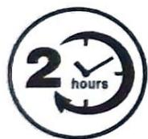

睡前提前2-3小时开启，避免人与机器接触太近，人体排出的二氧化碳会影响捕蚊效果；

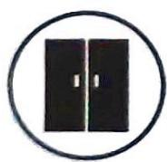

灭蚊时请把门窗关闭，封闭的空间灭蚊效果会更加有效；

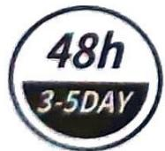

首次使用灭蚊器时请连续开机48小时以上，期间请勿打开储蚊盒，以免未脱水的蚊子逃脱，后续使用可3-5天清理一次储蚊盒。

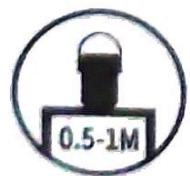

请放置于0.5-1米左右的高度，蚊子更容易被灯光吸引；

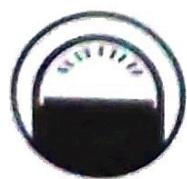

为达更佳灭蚊效果，需保证灭蚊器为房间里唯一光源；

**产品外观**：

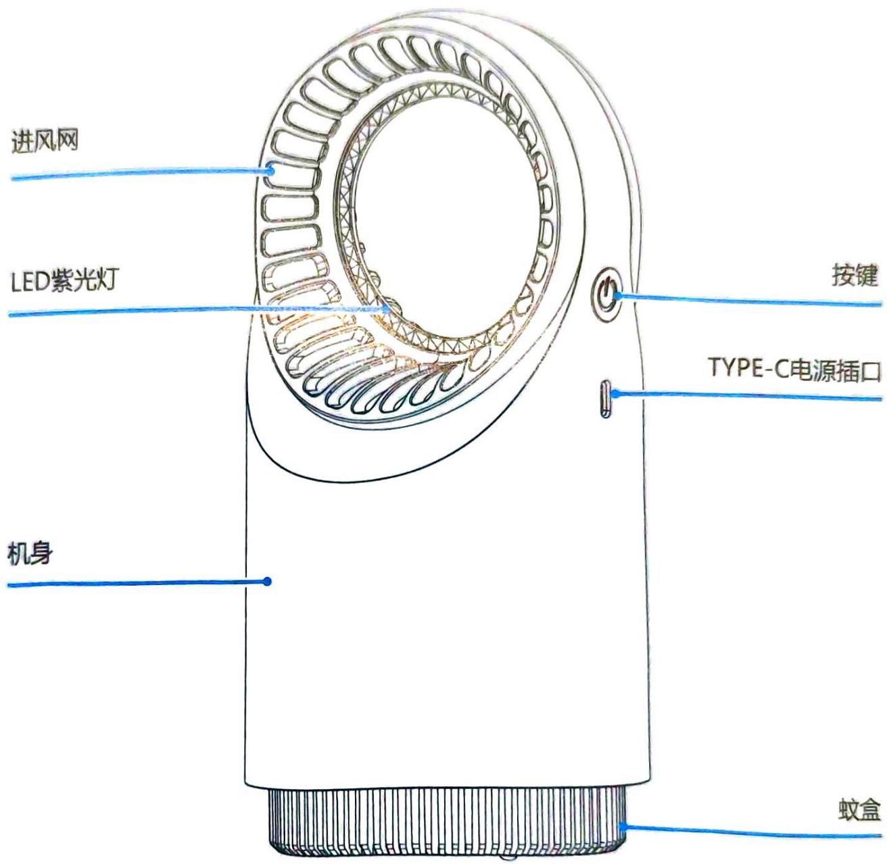

## 使用方法

### 操作步骤

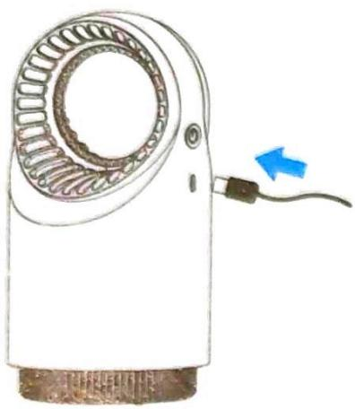

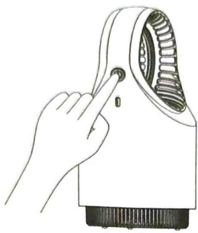

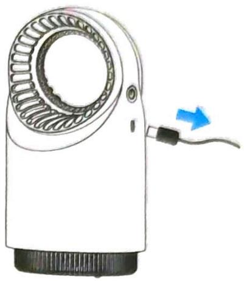

1. 插入电源线，适配DC5V充电宝、电脑、手机充电头等电源。

2. 按侧面物理开关启动机器。

3. 停止使用时，按开关关闭机器或拔掉电源即可。

### 蚊虫清理

**📌 注意**

\- 使用前检查电源线是否有出现外漏现象或被折破。

\- 使用前检查风扇有没有卡住。

\- 若出现以上情况，产品暂时不能使用，维修合格后方可使用。

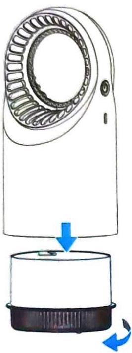

1. 左旋15度，取出蚊盒

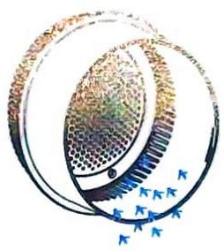

2. 将蚊子残体倒掉

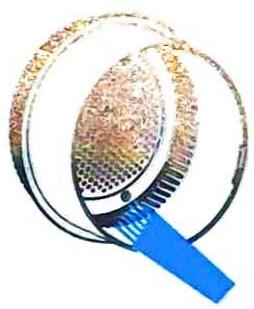

3.用水冲洗或者用毛刷清理蚊盒

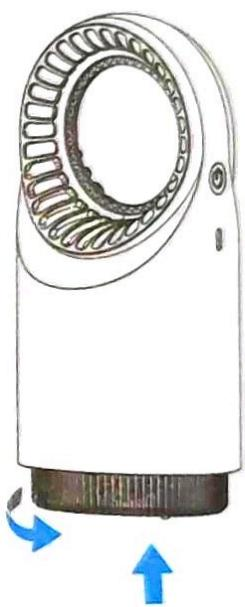

4.右旋15度，将蚊盒装回机身

## 安全注意事项

**📌 注意**

\- 在清洗及维修前，先拔出插头，切断电源，每周定期清理蚊盒。

\- 灭蚊器不能放在儿童或者无行为能力的人接触的地方。

\- 机器工作时，严禁眼睛长时间注视光源。

请在正常的监管或指引下，安全使用本产品。使用时，尽可能远离或放置在婴幼儿触不及的位置上。

\- 为了达到更佳捕蚊效果，首次使用时，请保持连续工作12个小时以上，期间请勿打开蚊盒，以免未风干的蚊虫逃脱。

\- 请睡前2-3小时提前开启灭蚊器，人体气味的吸引力远大于诱蚊灯光，请尽量避免在您的旁边开启灭蚊灯。

\- 请为了达到更佳灭蚊效果，请保证夜间灭蚊灯为房间唯一光源。

\- 本产品非化学类挥发原理，因此不能像蚊香等产品一样马上可以将蚊虫驱赶，本产品属于纯物理灭蚊、无毒、无味、无烟、无辐射，可以将有限空间内的蚊虫捕杀干净，请耐心使用。

**🚫 禁止事项**

\- 避免其它光线的干扰，避免强风直吹本机。

\- 禁止喷杀虫剂到此机器上。

\- 禁止长时近距离接近正在工作的机器。

\- 严禁把手指或金属等物件伸进风罩格栅格处。

\- 电源或者风机如有损坏，为了避免风险，请务必交给专业人员维修或者更改。

\- 长时间不用时，请拔下电源插头。

## 产品参数

<table><tr><td>工作电压</td><td>5V=</td></tr><tr><td>额定功率</td><td>4W</td></tr><tr><td>充电接口</td><td>Type-C</td></tr><tr><td>产品尺寸</td><td>Φ115x235mm</td></tr><tr><td>包装尺寸</td><td>145x145x265 mm</td></tr><tr><td>净重</td><td>390g</td></tr><tr><td>毛重</td><td>550g</td></tr><tr><td>使用环境</td><td>室内使用(请勿用于如谷仓、养殖场等场所)</td></tr><tr><td>执行标准</td><td>GB 4706.1-2005</td></tr></table>

## 维修服务

用户在保修期内出现非人为损坏的产品性能故障可以享受下列三包服务：

\- 自购买日起12个月内，凡属正常情况下因产品本身质量问题所导致的故障及损坏，您都将获得免费保修服务。

\- 整机保修，易耗品（灯珠除外）。

\- 寄回维修时，请将保修卡填写和发票等购物凭证一起寄回。

### 三包范围外情况

属于下列情况（但不限于下列情况）不在"三包"服务范围内：

\- 因错误安装、操作或在非产品所规定的工作环境下使用造成的故障或损坏。

\- 因擅自拆机维修和改装而造成的损坏。

· 错误或使用不当配件而造成的损坏。

· 因人为或其它自然灾害造成的损坏。

\- 保修卡若经涂改即作废。

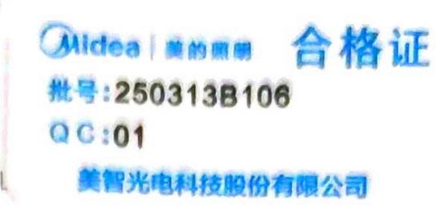

  
微信扫一扫，服务立马到

美智光电科技股份有限公司  
地址: 江西省贵溪市工业园1号  
网址: www.midea.com

本资料上所有内容均经过认真核对，如有任何印刷错漏或内容上的误解，可向本公司咨询。产品若有技术改进，会编进新版手册中，恕不另行通知。产品外观、颜色如有改动，以实物为准。

## 常见问题

**Q: 灭蚊灯使用过程注意事项有哪些?**

A: 在家庭灭蚊时, 不可有其它光线的干扰 (如日光灯、电视机、窗外的光线等) 要关窗避免强风 (如电风扇、空调机等) 直吹本机, 保持室内气流处于静止状态。将吸入式灭蚊器放置在高度约0.8米的空旷处, 本机产生的气流在室内形成循环, 蚊子受到诱虫灯光和气流的吸引, 聚集到全自动吸蚊机周围, 不断进入机内风干而死。

**Q: 为什么人与产品分离使用?**

A: 使用本机时建议人员暂时离开现场, 因吸血是蚊子的天性, 人体气味对蚊子的吸引力远大于其它, 因此当有人在场时, 会直接影响灭蚊效果。晚饭后, 家人外出散步乘凉是灭蚊的时机。如仍残留少许蚊子, 可让灭蚊器持续工作到天亮, 可安然入睡。

**Q: 可以在有人员活动的场所使用吗?**

A: 在办公室、医务室、值班室、家居等场所、如有人在场，应把本机放置在光线暗处，可随时灭杀进入室内的蚊子，达到降低室内蚊子密度的目的，不至于影响人们的生活工作。

**Q: 开了一整天，怎么还没有捉到蚊子？**

A: 灭蚊灯采用物理风干原理, 不像蚊香立刻就见效, 建议按正确的使用方法工作5-7天, 工作越久, 蚊虫越少, 直至没有。

**Q: 灭蚊灯正确的使用方法是什么?**

A: 灭蚊灯白天晚上都能抓蚊子, 和人错开使用才能发挥它的作用。为了确保您晚上睡一个安稳的觉。白天提前放在卧室抓蚊子, 关好门窗, 拉上窗帘, 拍打一下容易藏蚊子的地方, 把蚊子驱赶出来, 让蚊子更能感觉到灭蚊灯的引诱。当人离开房间, 让灭蚊灯留在卧室抓蚊子。晚上回家睡觉时, 把灭蚊灯移到客厅, 洗手间、厨房继续抓家里其它地方的蚊子。

<!-- 标题改动说明：原文件存在不标准标题（产品秘籍、使用说明灭蚊器使用方法未加空格、属于下列情况...超长标题）、缺少逻辑层级（蚊虫清理方法应属于使用方法下）。本次重构将产品特色、使用技巧、产品外观合并为"产品概述"；使用方法拆分为操作步骤和蚊虫清理两个子章节；超长三包外标题简化为"三包范围外情况"并归入维修服务下；常见问题Q&A简化为"常见问题"。 -->
