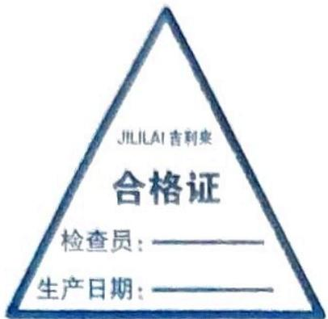
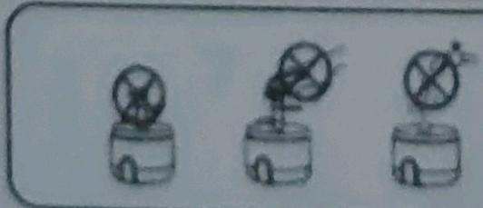

## 产品概述

JILILAI 吉利来 充电式食物料理机

制造商：安徽宏路智能科技有限公司

地址：安徽省六安市舒城县经济开发区纬三路6号

服务电话：0564- 8688000

生产日期：2025.06.02

公司质检部：本产品经检验合格准予出厂

废电池处理：

在产品废弃前，必须将电池从器具中取出，在取出电池时器具必须断电。

先用螺丝刀拧下底部的固定螺丝，取下外盖后即可取出电池，取出后废电池请交给专业回收部门或投入废电池回收箱。

执行标准：GB4706.1-2005

GB4706.30-2008

使用产品前请仔细阅读本说明书

请保留说明书以备查阅

### 环保清单

<table><tr><td rowspan="2">部件名称</td><td colspan="6">有害物质或元素</td></tr><tr><td>铅(Bb)</td><td>汞(Hg)</td><td>镉(Cd)</td><td>六价铬(Cr(VI))</td><td>多溴联苯(PBB)</td><td>多溴二苯醚(PBDE)</td></tr><tr><td>塑胶件</td><td>○</td><td>○</td><td>○</td><td>○</td><td>○</td><td>○</td></tr><tr><td>玻璃杯</td><td>○</td><td>○</td><td>○</td><td>○</td><td>○</td><td>○</td></tr><tr><td>五金件</td><td>○</td><td>○</td><td>○</td><td>○</td><td>○</td><td>○</td></tr><tr><td>线路板</td><td>×</td><td>○</td><td>○</td><td>○</td><td>○</td><td>○</td></tr><tr><td>电池</td><td>×</td><td>○</td><td>○</td><td>○</td><td>○</td><td>○</td></tr><tr><td>硅胶</td><td>○</td><td>○</td><td>○</td><td>○</td><td>○</td><td>○</td></tr><tr><td>包装</td><td>○</td><td>○</td><td>○</td><td>○</td><td>○</td><td>○</td></tr><tr><td colspan="7">本表格依据SJ/T11364的规定编制。○:表示该物质在该部件所有均质材料中含量均在GB/T 26572规定的限量要求以下。×:表示该物质在该部件的某一均质材料中含量超出GB/T26572规定的限量要求。注:本表公示的产品中有害物质含量不包含电池。</td></tr><tr><td colspan="7">10 在本说明所述的正常使用条件下,本产品的环保使用期限为10年,在环保使用期内可以放心使用,超过环保使用期限之后则应该进入回收循环系统。</td></tr></table>

### 产品参数

<table><tr><td>产品名称</td><td colspan="3">充电式食物料理机</td></tr><tr><td>工作电流</td><td>10A</td><td>额定电压</td><td>3.7V</td></tr><tr><td>充电电流</td><td>300mA</td><td>充电电压</td><td>5V</td></tr><tr><td>执行标准</td><td colspan="3">GB4706.1-2005/GB4706.30-2008</td></tr></table>

感谢您选购本公司系列产品，为了使我们的产品更好的为您服务，使用前请详细阅读本说明书；并妥善保存以备随时查阅。  
充电型产品第一次使用时请先充电180分钟；产品充电时不得开机操作，严禁任何液体注入电源开关及产品内部。

一键式开关

插电口&充电口

安全隔离盘

金属刀片（内置）

PP 杯 & 玻璃杯

产品以实物为准！

## 使用方法

1. 第一次使用请先将机器材充满电，充电时蓝色指示灯长亮，满电后蓝灯熄灭，然后将隔离盘、刀架、料理杯清洗干净。

2. 先将刀架装入料理杯的刀轴上，再将洗净的食物放入料理杯中，放入的食物不能超过最上限，或不能超过料理杯容积的二分之一。

3. 食物装入料理杯后，将隔离盘卡槽对准料理杯卡点，装在料理杯上，再将机头卡点对准隔离盘卡槽，放上机头；待放稳机头后按下 **开关按键**启动机器料理食物：食物过多时，可能启动时卡住刀片不转，请适当取出一些食物，继续启动机器。

4. 启动后15秒左右放开开关，如果觉得食物不够理想细腻，请继续按住开关进行料理；料理完后，取下头，再将料理杯上的隔离盘取下将杯里食物倒出。

5. 清洁方法：隔离盘、刀架、杯体右直接浸水清洗。主机不得浸入水中清洗，只需用干净的布擦拭干净即可。

## 安全注意事项

### 使用须知

1、请勿进行改造，非专业维修人员禁止拆卸和修理，否则易发生火灾、触电和受伤事故。修理请到扬子售后部门或与本公司指定的"定点维修处"联系。

2、请将本产品置于儿童或无行为能力人接触范围以外，儿童及无行为能力的人在监护人监督下也不能使用本产品。

3、请勿将料理器放入微波炉加热或冰箱冷冻，以免造成料理器破裂或导致本产品电路短路而无法使用。

4、本产品仅适用个人或家庭使用、不适合商用。

5、取出刀片排空料理杯和清洗时，小心刀片伤手，严禁料理机超负荷使用。

6、本产品不能用来加工过硬的食物，例如：咖啡豆、大豆、阿胶、大米、冰块或冷冻食物类似食材。

7、本产品连续工作时间不能超过30秒，连续工作30秒后，需休息2分钟后才能使用，以工作30秒间隔2分钟为一个周期，连续工作3个周期后必须让产品冷却30分钟后再工作，以保证产品寿命。

8、本产品自购买日起保修一年，请妥善保存保修卡，遗失后不补发。

9、本器具需要在提供最大输出功率不超过12W的适配器下进行充电使用。

### 使用警示

请勿将刀片架单独放至在机头上！

不能将手在这种情况触碰刀片！

请勿直接用水冲洗产品机头

## 食材参考

<table><tr><td>食物</td><td>份量</td><td>最长切碎揽拦时间</td><td>备注</td></tr><tr><td>猪肉</td><td>杯体容量的1/3(先切成约2cm左右的小块)</td><td>40-60秒</td><td>需去骨去皮去筋</td></tr><tr><td>牛肉</td><td>杯体容量的1/3(先切成约2cm左右的小块)</td><td>40-60秒</td><td>需去骨去皮去筋</td></tr><tr><td>大蒜</td><td>杯体1/2容量</td><td>15-30秒</td><td></td></tr><tr><td>辣椒</td><td>杯体1/2容量</td><td>15-30秒</td><td></td></tr><tr><td>胡萝卜</td><td>杯体1/2容量(先切成约2cm左右的小块)</td><td>15-30秒</td><td></td></tr><tr><td>蔬菜</td><td>杯体1/2容量</td><td>15-30秒</td><td></td></tr></table>

备注：1.在表中未注明的食物请参照上表类似食物操作；  
2. 单档的绞菜用点动功能。

## 售后服务

### 保修卡

售后保修联络卡 (以下内容均为必填项)

购买平台：\_\_\_\_ 购买账号：\_\_\_\_

交易号: 保修/退换货型号:

保修/退换货原因：

联系电话: 方便联系时间:

商品寄回前请务必先与客服联系，确保能够有效缩短维修/退换货的时间！

<!-- 标题改动说明：将原"JILILAI 吉利来 充电式食物料理机使用说明书"改为"## 产品概述"，将环保清单和产品参数表格归入h3子标题（"### 环保清单""### 产品参数"）；原无标题的使用步骤正文归入新增的"## 使用方法"；"注意事项"和"△使用警示"合并为"## 安全注意事项"下的"### 使用须知"和"### 使用警示"两个h3子标题，并删除△伪标题符号；"食物份量/工作时间表"改为"## 食材参考"；"保修卡"和"售后保修联络卡"合并为"## 售后服务"下的"### 保修卡"。 -->
