使用说明书

请妥善保管，以备参阅

使用产品前请仔细阅读

本说明书

水槽洗碗机

JBSD2T-Q3
JBSD2T-Q3L

## 目录

目录 1
安全注意事项 2
装箱单 4
安装方法 5
主要技术参数 6
控制面板 6
操作说明 6
餐具摆放位置 8
日常清理 8
清洁保养建议 9
常见故障的识别与处理 10
电气接线图 10
部件名称图 11
非正常和故障代码 13
客户服务 14
保修卡 15

执行标准
GB4706.1-2005 《家用和类似用途电器的安全第一部分：通用要求》
GB4706.25-2008 《家用和类似用途电器的安全 洗碗机的特殊要求》
Q/FT021-2017 《家用水槽洗碗机》

## 安全注意事项

安全注意事项

为了避免对使用人员及其他人员造成危害及财产损害，特作如下区分及标志。均为有关安全的重要事项，敬请严格遵守，并在充分理解内容的基础上正确使用。

根据危害、损害程度进行的内容区分根据危害、损害程度进行的内容区分
危险 若忽视这一标志，并进行错误操作，易导致人员危险，重伤或引起火灾。
警告 若忽视这一标志，并进行错误操作，有可能导致人员危险，重伤或引起火灾。
注意 若忽视这一标志，并进行错误操作，有可能导致人员受伤或造成物品损害。
建议 为了安全、正确地进行使用，希望予以了解的内容。

### 图标说明

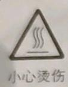  
小心烫伤

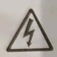  
小心触电

  
严格执行

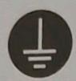  
需要接地

  
禁止

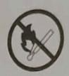  
禁止明火

  
禁止触摸

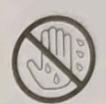  
禁止用潮湿的手操作

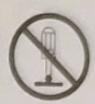  
禁止拆卸

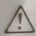

注意:本公司产品上的钢化玻璃按GB15763.2进行品质监控,但玻璃的钢化机理决定了存在极小概率的钢化玻璃自爆,自爆概率参照GB15763.2。一旦发生非使用不当的自爆,我公司承诺免费更换该配件。

\*特别说明:请严格按照本说明书规定使用,由于本产品不当使用造成的任何财产损失、人身损害,本公司不承担责任。
本说明书各项规定若有与国家法律强制性规定相冲突之处,请以法律规定为准。

**🚨 危险**

<table><tr><td colspan="3">危险</td></tr><tr><td>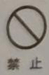</td><td>严禁电源插头、接插件等电器部件沾水,如果沾水使用可能会导致触电或其它意外伤害。</td><td>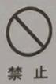 请不要对电源线进行改制、拉伸、结扣及施加重物挤压等。否则易导致电源线破损而发生触电和火灾等事故。</td></tr><tr><td>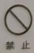</td><td>请不要让儿童单独使用或靠近产品底部,否则有可能会导致触电或其它意外伤害。</td><td>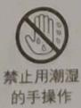 请不要用潮湿的手触摸电源插头,电器部件,否则易发生触电事故。</td></tr><tr><td>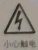</td><td>在提供安装和维修服务之前,必须切断电源,以免触电。</td><td>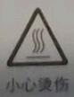 禁止使用酒精等易燃溶剂清洗槽体。</td></tr><tr><td>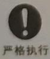</td><td>移动产品时要注意槽体边角,以免割伤。</td><td>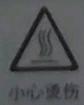 产品运行时,请勿强行打开门体,溅出的热水可能导致烫伤。</td></tr><tr><td>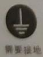</td><td colspan="2">插座必须具有可靠的接地线,以确保安全。不得将接地线接于煤气管、自来水管、避雷针及电话线上。接地不良可能引起触电及其他事故。</td></tr></table>

<table><tr><td>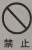</td><td>请不要使用多个插头的多功能插座。</td></tr><tr><td>禁止</td><td>请不要将重物放置在产品的玻璃上。</td></tr><tr><td>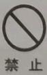</td><td>整机远离热源、煤气和酒精等易燃品。</td></tr><tr><td>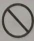禁止</td><td>保证下水管道畅通,管道堵塞可能导致产品无法正常工作。</td></tr><tr><td>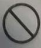禁止</td><td>不要将肉类放置于洗涤槽体内进行洗涤。</td></tr><tr><td></td><td>每次洗涤结束后,渣篮中的食物残渣请及时清理。</td></tr><tr><td></td><td>本产品不提供水龙头,需用户自行配置。</td></tr></table>

**⚠️ 警告**

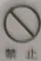

请不要使用松动或接触不良的电源插座。否则导致触电、短路、起火。

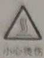

请不要让儿童和行动不便者自己使用，更不要放在幼儿可以触及到的地方使用，否则可能导致烫伤、触电和其它意外伤害。

不要在产品运行时触摸加热装置，可能会导致烫伤。

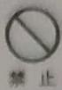

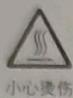

超声波正常运行时，如果感到稍有不适，请停止使用，并与厂家联系。

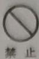

工作完毕后，开门有热气喷出，人应站在离门稍远处，以免被热气烫伤。

严格执行

刀和其他锋利的用具必须装在碗架里，并且尖端朝下或水平放置。

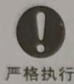

严格执行

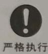

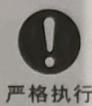

非专业人员不得擅自拆机维修或更换零件。

清洗餐具时禁止放入洗洁精和泡沫类洗涤剂。

如果出现任何故障请立即断电停止使用，并按照“常见故障识别与处理”进行相应处理。

如果产品使用中发生漏水，请停止使用并立即与厂家联系。

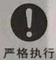

严格执行

不要直接用热水接通进水管路，会影响产品正常使用。

器具应使用新的软管组件连接到水源，旧的软管组件不应重复使用。

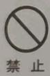

**📌 注意**

洗果蔬时，请勿将营养成分冲突的果蔬放置在一起，以免造成果蔬营养成分流失。

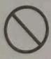

产品在使用期间会发热，注意避免接触产品的发热元器件及周边位置。

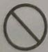

不要用粗糙擦洗剂或锋利的金属刮刀清洁玻璃，他们会擦伤玻璃表面，从而导致玻璃破碎。

产品运行时，不要直接将水倒入洗涤槽中，可能会导致产品无法正常工作。

安装产品的台面要有足够的支撑强度和高度，整机必须牢固的安装在台面上。

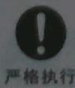

请勿将带大量泥沙的清洗物放置产品中，可能会导致产品无法正常工作。

**💡 建议**

\- 清洗的餐具内尽量不要有大块的残渣（如骨头），以免干扰喷淋臂旋转，影响机器正常使用和清洗效果。

使用和清洗效果。
- 安装完喷淋臂，请检查是否安装到位，以免喷淋臂脱落，损坏机器。

\- 关闭门体时，需按压门体，保证功能槽槽体密封。

\- 清洗餐具前，建议加入专用洗碗粉。
- 若餐具上有手洗甚至钢丝球也很难清洗的污渍，直接放入则无法清洗干净，建议对污渍进行预处理，再放入洗碗机进行洗涤。

\- 宝石、黄金等贵重物品不要放在槽体内进行洗涤，可能会损坏。

\- 放置餐具时，不要让高脚杯等易碎物品触碰其它餐具。

\- 洗涤完毕后，建议把门体打开，保持槽体干燥。

\- 在运行果蔬程序前，请先清理槽体底部残渣。

\- 您也可以通过下表查看清洗的餐具是否合适：

<table><tr><td>餐具及材料</td><td>是否可清洗</td><td>餐具及材料</td><td>是否可清洗</td></tr><tr><td>铝</td><td>是</td><td>不锈钢</td><td>是</td></tr><tr><td>一次性铝</td><td>否 它的材料会脱落附着在其它餐具上</td><td>纯银</td><td>是</td></tr><tr><td>瓶子和罐子</td><td>否 标签有胶,会堵塞喷淋臂,不利于洗涤</td><td>锡</td><td>否 会腐蚀生锈</td></tr><tr><td>铸铁</td><td>否 会生锈</td><td rowspan="2">木质 象牙类</td><td rowspan="2">否 未经处理的木质会产生扭曲、裂纹</td></tr><tr><td>陶瓷</td><td>是</td></tr><tr><td>水晶</td><td>是</td><td rowspan="2">空心手柄 刀具</td><td rowspan="2">否 刀具里的粘合剂在高温水的作用下会松脱</td></tr><tr><td>金</td><td>否 会变色</td></tr><tr><td>玻璃</td><td>是</td><td rowspan="2">铜、青铜</td><td rowspan="2">否 在高温水和洗涤剂作用下会变形和变色</td></tr><tr><td>一次性塑料</td><td>否 不能承受高温水和洗涤剂</td></tr><tr><td>塑料</td><td>是</td><td></td><td></td></tr></table>

注：如果是其它特殊材料，请咨询售后。

## 装箱单

请您开箱后逐一检查以下产品和附件是否齐全，如有缺少或损坏：

■ 属本公司或销售商责任的，请与销售商联系处理；

■ 属用户自行责任的，请就近与本公司当地售后服务中心联系。

<table><tr><td>使用说明书</td><td>1份</td></tr><tr><td>整机</td><td>1台</td></tr><tr><td>合格证</td><td>1张</td></tr><tr><td>产品编号标签</td><td>6张</td></tr><tr><td>菜篮</td><td>1套</td></tr></table>

<table><tr><td>碗架</td><td>1套</td></tr><tr><td>排水管组件</td><td>1套</td></tr><tr><td>三通接头</td><td>1个</td></tr><tr><td>进水管</td><td>1根</td></tr><tr><td>下水器</td><td>1个</td></tr></table>

## 安装方法

应该平稳的安装在操作、保养方便并且牢固的地方，不得倾斜安装。

■ 严禁将产品装在可能受潮或者容易被水淋湿的地方。

■ 本产品是嵌入在橱柜内的，安装产品的橱柜材料必须耐温耐湿。

■ 安装产品时，产品与燃气表、燃气管道应保持30CM以上的距离。

■ 洗碗机安装后，如果不能触及电源插头，则应由符合布线规定的固定布线的开关完成，以满足维修或突发事件时，通过此开关切断电源。

### 开孔与橱柜尺寸

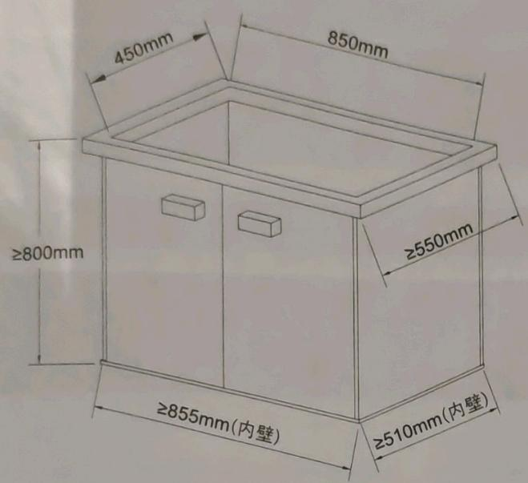

排水管安装图  
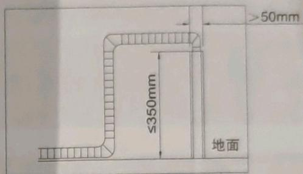

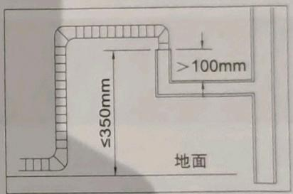

主视图  
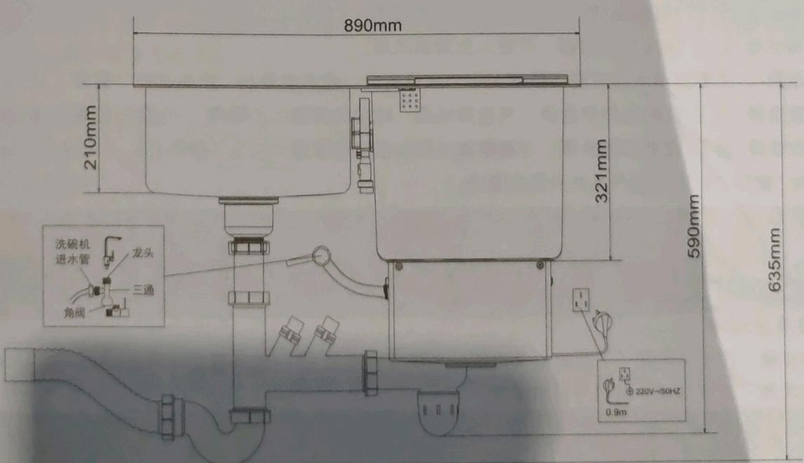

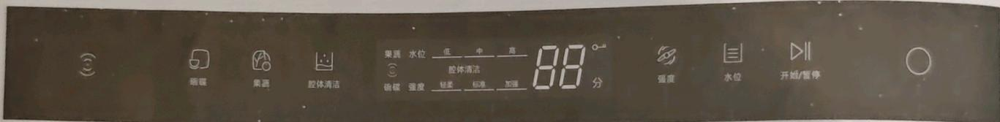

## 主要技术参数

<table><tr><td>机型</td><td>JBSD2T-Q3/JBSD2T-Q3L</td></tr><tr><td>电源</td><td>220V-/50Hz</td></tr><tr><td>整机额定功率</td><td>1850W</td></tr><tr><td>净重</td><td>22kg</td></tr><tr><td>正常工作水压</td><td>0.03MPa-1MPa</td></tr><tr><td>加热方式</td><td>加热盘加热</td></tr><tr><td>耗水量</td><td>碗碟清洗：5.7L 果蔬清洗：低水位15L、中水位21L、高水位26L</td></tr><tr><td>外形尺寸</td><td>长度890mmX宽度480mmX高度(含排水管)635mm</td></tr><tr><td>洗碗温度</td><td>轻柔洗45℃、标准洗70℃、加强洗70℃</td></tr><tr><td>漂洗方式</td><td>喷淋式漂洗</td></tr><tr><td>程序</td><td>轻柔洗、标准洗和加强洗</td></tr><tr><td>标准收纳容量</td><td>饭碗11个、餐盘8个、汤盆1个、玻璃杯4个(佐料碟2个)、汤勺、筷子等小物若干</td></tr></table>

## 控制面板

超声波键 洗碗键 洗果蔬键 自清洁键 显示屏 强度选择 水位选择 开始暂停 开关键

1. 超声波键 ③：按压启动超声功能，也可以单独启动。

2. 洗碗键 ☐：按 **压洗碗键**，可进入洗碗程序。

3. 洗果蔬键 📄：按 **压洗果蔬键**，可进入洗果蔬程序。

4. 自清洁键 ☐：按 **压自清洁键**，可进入自清洁程序。

5. 显示屏：主要显示洗涤时间、强度大小、水位高低、超声波开启、产品运行、暂停。

6. 强度选择：洗碗程序中选择，可选择轻柔、标准和超强三个程序。

7. 水位选择 ☐ 洗果蔬中选择，可选择高、中、低三个程序。

8. 开始/暂停 ▷ 控制产品的开始和暂停。

9. 开关键 ○ 控制电源的开启和关闭。

## 操作说明

### 碗碟清洗

操作步骤：按 **压开关键** ○ 此时数字闪烁→选择洗碗模式 □ →选择强度（可选） ⚙ →按压 ▶ 开始洗涤→洗涤结束并关机→日常清理。

选择强度（如下表）

<table><tr><td></td><td>轻柔洗</td><td>标准洗</td><td>加强洗</td></tr><tr><td>适合餐具</td><td>薄酒杯、高脚杯等易碎品</td><td>一般脏污的餐具</td><td>严重脏污的餐具</td></tr><tr><td>洗涤时间</td><td>18分钟</td><td>26分钟</td><td>30分钟</td></tr><tr><td>耗水量</td><td>5.7L</td><td>5.7L</td><td>7.8L</td></tr><tr><td>建议洗涤剂用量</td><td>8g</td><td>8g</td><td>15g</td></tr><tr><td>洗涤温度</td><td>45°C</td><td>70°C</td><td>70°C</td></tr></table>

### 果蔬清洗

操作步骤：按 **压开关键** ○ 此时数字闪烁→选择果蔬模式 ⚙ →选择强度（可选） ⚙ →选择水位（可选） ⊗ →超声功能默认→按压 ▷ 开始洗涤。

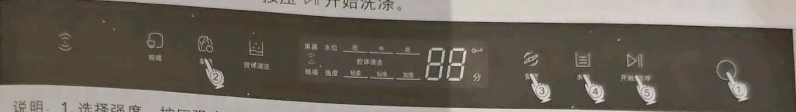

2. 选择水位：按 **压水位键**可选择洗、标准洗、加强洗三种强度的一种。

3. 选择超声波功能：超声波按键主要控制是否使用超声波功能，系统默认超声波开启，按 **压超声波键**可取消。

<table><tr><td></td><td></td><td>轻柔洗</td><td>标准洗</td><td>加强洗</td><td>单独超声波清洗</td></tr><tr><td rowspan="3">清洗时间</td><td>低水位</td><td>12分钟</td><td>15分钟</td><td>19分钟</td><td>13分钟</td></tr><tr><td>中水位</td><td>13分钟</td><td>16分钟</td><td>20分钟</td><td>14分钟</td></tr><tr><td>高水位</td><td>14分钟</td><td>17分钟</td><td>21分钟</td><td>15分钟</td></tr><tr><td>清洗对象</td><td>高中低水位</td><td>●樱桃、草莓、杨梅等易洗烂的果蔬</td><td>●苹果、梨、橙子、葡萄、桃子、黄瓜、青菜、番茄等果蔬</td><td>●番薯、土豆和花生等表面较脏的果蔬●表面打蜡、农药侵蚀较严重的果蔬</td><td>●只去除果蔬表面农药残留</td></tr></table>

注：系统默认标准洗低水位。

### 单独超声清洗

操作步骤：按 **压开关键** ○ 此时数字闪烁→选择超声波模式 ③ →选择水位（可选）| | →按压 ▷| 开始洗涤。

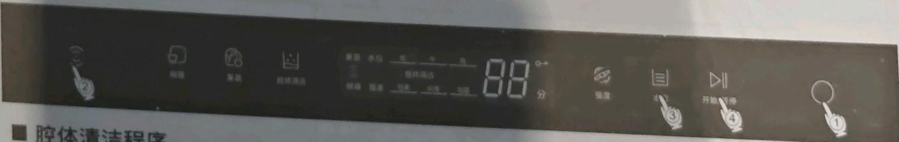

### 腔体清洁

操作步骤：按 **压开关键** ○ 此时数字闪烁→选择自清洁模式 □→按压 ▶ 开始洗涤。

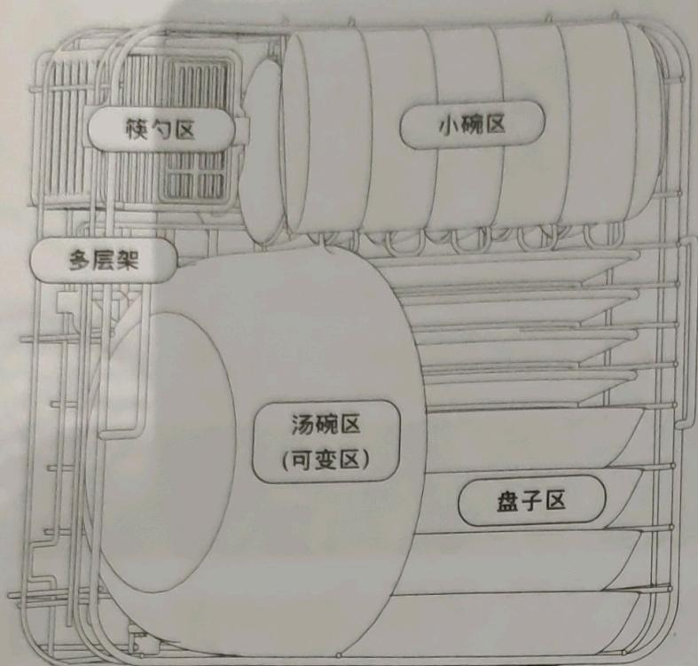

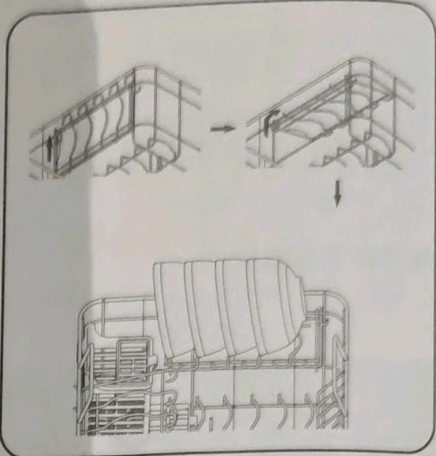  
多层架：上拉后翻转支架可摆放餐具  
注意：使用碗架前，请先剪掉塑料扎带。

## 日常清理与保养

1. 打开门体，清洁门体上残留的污垢。

3. 逆时针旋转移除喷淋臂并清洗。

2. 清洁槽体四壁和壁角，可以适当的加入洗涤剂。

4.拿下过滤网板并清洗。

5.清洗槽体底部。

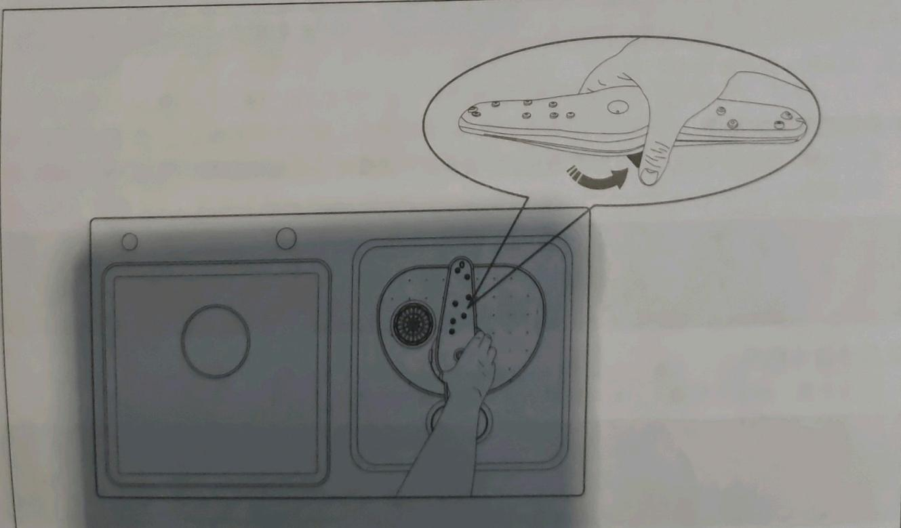

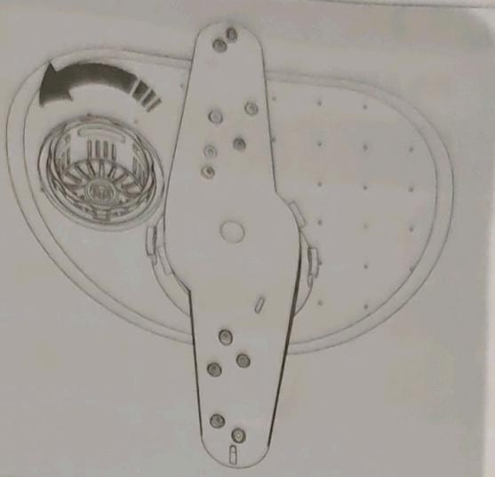

清理保养建议

1. 密封条清洁时不要使用洗涤剂，密封条可能会因为日久而穿孔或者裂开，如出现此情况，请及时更换新的密封条。

2. 如果长时间不使用，可先进行自清洁功能，自清洁后即可正常使用。

3. 面板和门体玻璃的清洁：

可以用热水和少量清洗剂进行手动清洗，用海绵布拭抹，清洁后用软布抹干。不要用百洁布、金属丝状物等摩擦，以免刮伤表面。

4. 不锈钢槽体清洁：

### 不锈钢槽体养护

水槽洗碗机采用304不锈钢槽体，请注意保护谨防划伤！

1. 如果您是新装修的用户，可以在槽体外观涂一层油，避免装修过程中的金属碎屑产生浮锈。此外，假如长期不用水槽洗碗机的话，也可用一层油涂刷在槽体上，以保护槽体。

2. 经常清洗槽体，采用中性的洁净剂，并用清水完全清洁干净。清洁过程要轻柔，避免用钢刷或粗糙的刷子，洗净后用海绵或抹布擦干。

3. 不要把柠檬、酱汁、泡菜、芥末或其余富含盐份的、或带侵蚀性的食物长时间置于槽体内及面板上，以防止其腐蚀槽体。

4. 尽量避免槽体与强力漂白粉、家用化学品和肥皂长期的接触。

5. 尽量避免刀叉、炊具等尖锐坚硬的器皿撞击水槽，以防止刮花、划伤或碰凹槽体外观。

6. 不要把低碳钢或铸铁炊具长期摆放于槽体中，也不要把钢丝球、橡胶洗碗片，湿润的洗碗海绵或其余清洁垫遗置于槽体中，避免长此以往形成“浮锈”、“霉斑”等。

7. 若槽体出现“浮锈”、“霉斑”等，可用五洁粉或牙膏涂在锈迹和斑点处，用抹布擦洗干净即可，不要运用百洁丝、打磨片或打磨材料来清洁槽体。

5. 喷淋臂和渣篮逆时针方向旋转即可取出，可以用清水进行清洗。

6. 清洗后请不要让控制面板上有积水，会影响正常使用。

7. 每次清洗后，渣篮里的食物残渣要及时清理，否则会影响下次清洗效果，并产生异味。

## 常见故障处理

如果您在使用中发现异常状况，请停止使用，拔去电源插头，检查以下内容：

<table><tr><td>故障现象</td><td>可能原因</td><td>检修方法</td></tr><tr><td rowspan="4">程序正常, 喷淋臂不转</td><td>喷淋臂没有正确安装</td><td>检查喷淋臂是否装好</td></tr><tr><td>有杂物掉入洗涤槽体内,阻碍喷淋臂旋转</td><td>检查是否有杂物掉入</td></tr><tr><td>餐具放置不合理,导致喷淋臂卡住</td><td>检查餐具摆放是否复合标准摆放</td></tr><tr><td>喷淋臂堵塞</td><td>用清水清洗喷淋臂</td></tr><tr><td>按开关不工作, 灯不亮</td><td>未接通电源</td><td>检查电源插头是否插好</td></tr><tr><td rowspan="2">有异响</td><td>喷淋臂没有安装到位</td><td>检查喷淋臂是否安装到位</td></tr><tr><td>餐具没有按指定要求放置,导致餐具碰撞</td><td>检查餐具摆放是否复合标准摆放</td></tr></table>

上述故障排除后，仍不能正常工作，请与本公司当地售后服务中心联系维修。

## 电气接线图

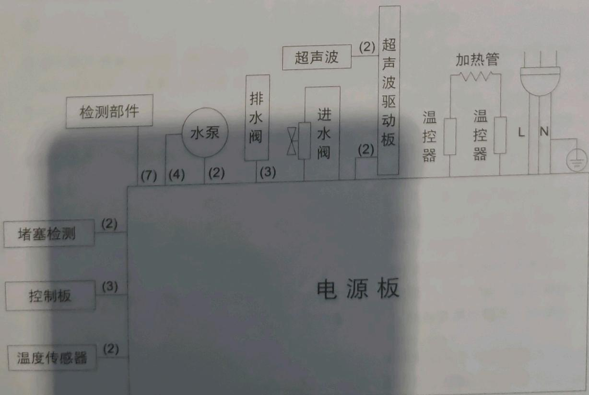

## 部件名称图

### JBSD2T-Q3

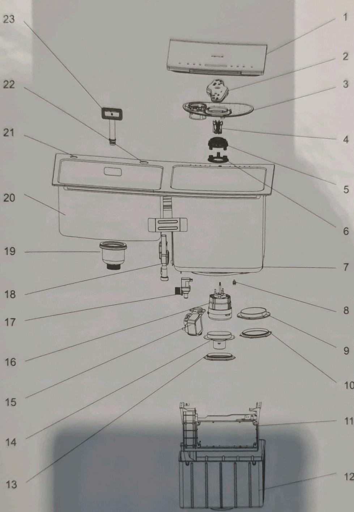

1. 门体

5.导流座

9. 加热盘

2. 喷淋臂

13. 超声波换能器密封垫

6. 电机座

3. 过滤网板

10.加热盘密封垫

7. 功能槽槽体

17.进水阀

4. 叶轮

11. 电器盒

14.超声波换能器

15.牵引阀

8. 温度传感器

19. 下水器

18.功能槽溢水组件

12.底盖

16.电机

20.水槽槽体

21.皂液器安装孔

22.水龙头安装孔

23.水槽溢水组件

### JBSD2T-Q3L

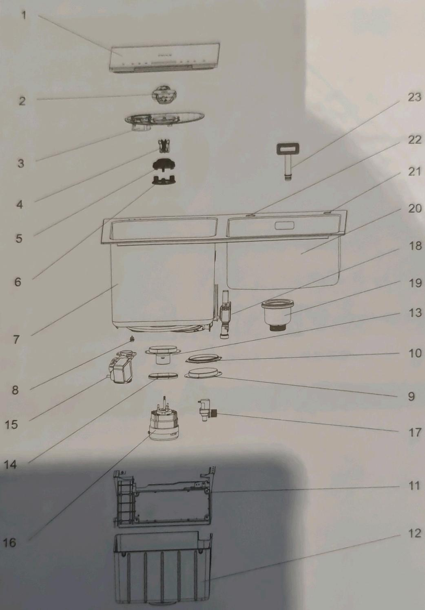

1. 门体
2. 喷淋臂
3. 过滤网板
4. 叶轮
5. 导流座
6. 电机座
7. 功能槽槽体
8. 温度传感器
9. 加热盘
10. 加热盘密封垫
11. 电器盒
12. 底盖
13. 超声波换能器
14. 超声波换能器密封垫
15. 牵引阀
16. 电机
17. 进水阀
18. 功能槽溢水组件
19. 下水器
20. 水槽槽体
21. 皂液器安装孔
22. 水龙头安装孔
23. 水槽溢水组件

## 故障代码

<table><tr><td>显示代码</td><td>故障显示</td><td>可能原因</td><td>解决措施</td></tr><tr><td>E0</td><td>电机和电源板通信错误</td><td>1.电机弱电连接线连接不良
2.电机弱电连接线坏
3.电机坏</td><td>请专业维修人员上门维修</td></tr><tr><td>E1</td><td>门未关闭</td><td>1.门控接插件接触不良
2.工作过程中门未关或未关到位
3.门控坏</td><td>关闭门，确保门关紧</td></tr><tr><td>E2</td><td>水压小</td><td>1.水龙头未开
2.水压小
3.进水阀坏</td><td>1.检查水阀门是否打开
2.检查水管是否有水
3.检查水压是否太小</td></tr><tr><td>E3</td><td>排水不畅</td><td>1.渣篮残渣太多，排水孔堵塞
2.下水管堵塞</td><td>清洗渣篮和下水管道</td></tr><tr><td>E4</td><td>加热管不工作</td><td>1.加热系统故障
2.温度探头的表面有异物影响
温度传输</td><td>检查温度探头是否有异物、如没有请专业维修人员上门维修</td></tr><tr><td>E5</td><td>温度传感器故障</td><td>温度传感器开路或短路</td><td>请专业维修人员上门维修</td></tr><tr><td>E7</td><td>排水阀故障</td><td>排水阀行程不到位</td><td>请专业维修人员上门维修</td></tr><tr><td>E8</td><td>水位低于安全水位</td><td>1.漏水
2.门密封不好</td><td>1.检查门体是否关好
2.是否漏水，排除上面问题
后请专业维修人员上门维修</td></tr><tr><td>EC</td><td>通讯故障</td><td>控制板连接线接触不良</td><td>请专业维修人员上门维修</td></tr><tr><td>F0</td><td>电机二次启动</td><td>电机叶轮被小残渣卡住</td><td>检查叶轮是否被小残渣卡住
请专业维修人员上门维修</td></tr><tr><td>F1</td><td>漏水保护开关保护</td><td>漏水</td><td>请立即切断电源、水源并
请专业维修人员上门维修</td></tr><tr><td>F2</td><td>漏电保护</td><td>1.零火线接反
2.接地没接</td><td>请立即切断电源、水源并
请专业维修人员上门维修</td></tr><tr><td>F3</td><td>溢水报警</td><td>进水阀坏</td><td>请专业维修人员上门维修</td></tr><tr><td>F4</td><td>高温报警</td><td>水温超过85°C</td><td>请专业维修人员上门维修</td></tr><tr><td>F5</td><td>电机过压欠压</td><td>电压过高或过低</td><td>请专业维修人员上门维修</td></tr><tr><td>F6</td><td>电机缺相</td><td>线圈内部短路或开路</td><td>请专业维修人员上门维修</td></tr><tr><td>F7</td><td>电机软件过流</td><td>电机电流超标</td><td>请专业维修人员上门维修</td></tr><tr><td>F8</td><td>电机硬件过流</td><td>电机电流超标</td><td>请专业维修人员上门维修</td></tr></table>

## 客户服务

如产品在使用中发生异常状况,请停止使用,拔去电源插头.请与本公司当地售后服务中心联系.
警告:只有经过专业培训的，并获得洗碗机维修资质的维修人员，才能对产品进行维修。
其他人员不得擅自维修该洗碗机，以免造成严重后果。

### 保修说明

1. 为更好的服务广大消费者,本公司对整机提供5年保修服务。除非购销合同中另有约定。

2. 免费保修期内，用户送修时必须持有送修产品的三包凭证（本公司随机提供的产品保修卡），三包有效期自收到商品之日算起。用户应妥善保存三包凭证和购机发票，如用户遗失三包凭证，将按照产品编码所示的生产日期延后3个月为起始日期推算保修期限。

3. 根据国家规定，下列项目不属于免费保修范围，实行收费修理：

-消费者因搬运、安装、使用、维护、保管不当造成损坏的；

-非承担三包维修者拆动造成损坏的；

-无三包凭证及有效发票的；

-三包凭证型号，编号与维修产品型号不符或者涂改的；

因不可抗力造成损坏的，

由于产品使用环境，例如：电源、温度、湿度等非本公司所能控制的因素引起的一切损坏和损失，均不在免费保修范围之内，本公司也不承担任何责任。

4. 本产品仅限于在中国大陆地区销售，使用。

## 有害物质含量

<table><tr><td rowspan="2">部件名称</td><td colspan="6">有害物质</td></tr><tr><td>铅(Pb)</td><td>汞(Hg)</td><td>镉(Cd)</td><td>六价铬 (Cr(VI))</td><td>多溴联苯 (PBB)</td><td>多溴二苯醚 (PBDE)</td></tr><tr><td>电机</td><td>×</td><td>○</td><td>○</td><td>○</td><td>○</td><td>○</td></tr><tr><td>螺钉、螺栓等紧固件</td><td>○</td><td>○</td><td>○</td><td>×</td><td>○</td><td>○</td></tr><tr><td>金属零部件及表面涂层</td><td>○</td><td>○</td><td>○</td><td>○</td><td>○</td><td>○</td></tr><tr><td>控制器件</td><td>×</td><td>○</td><td>○</td><td>○</td><td>○</td><td>○</td></tr><tr><td>塑料件</td><td>○</td><td>○</td><td>○</td><td>○</td><td>○</td><td>○</td></tr><tr><td>橡胶件</td><td>○</td><td>○</td><td>○</td><td>○</td><td>○</td><td>○</td></tr><tr><td>电源线及连接线</td><td>○</td><td>○</td><td>○</td><td>○</td><td>○</td><td>○</td></tr><tr><td>包装印刷件</td><td>○</td><td>○</td><td>○</td><td>○</td><td>○</td><td>○</td></tr><tr><td colspan="7">本表格依据SJ/T 11364的规定编制。○:表示该有害物质在该部件所有均质材料中的含量均在GB/T26572规定的限量要求以下。×:表示该有害物质至少在该部件的某一均质材料中的含量超出GB/T26572规定的限量要求。注:上表中打“×”的部件,由于技术原因目前无法实现替代,后续随着技术上的进步将逐渐改进。</td></tr><tr><td colspan="7">为了保护环境及人类健康:1.本产品报废后请将其与生活垃圾分开,消费者有责任将其送至有资质的回收点;2.回收处理中心将通过适当的方法回收再利用产品中的材料;3.关于本产品回收处理的详细信息请咨询当地政府、废品处理中心或经销商。</td></tr></table>

<!-- 标题改动：图标说明/开孔尺寸/操作子程序降为###；JBSD2T-Q3/Q3L归入部件名称图；日常清理与保养合并；免费保修注意事项降为###保修说明；精简冗余标题文字；◆符号改为标准列表符 -->