格兰仕电烤箱 iK2R(TM)
扫描二维码

## 电烤箱 使用说明书

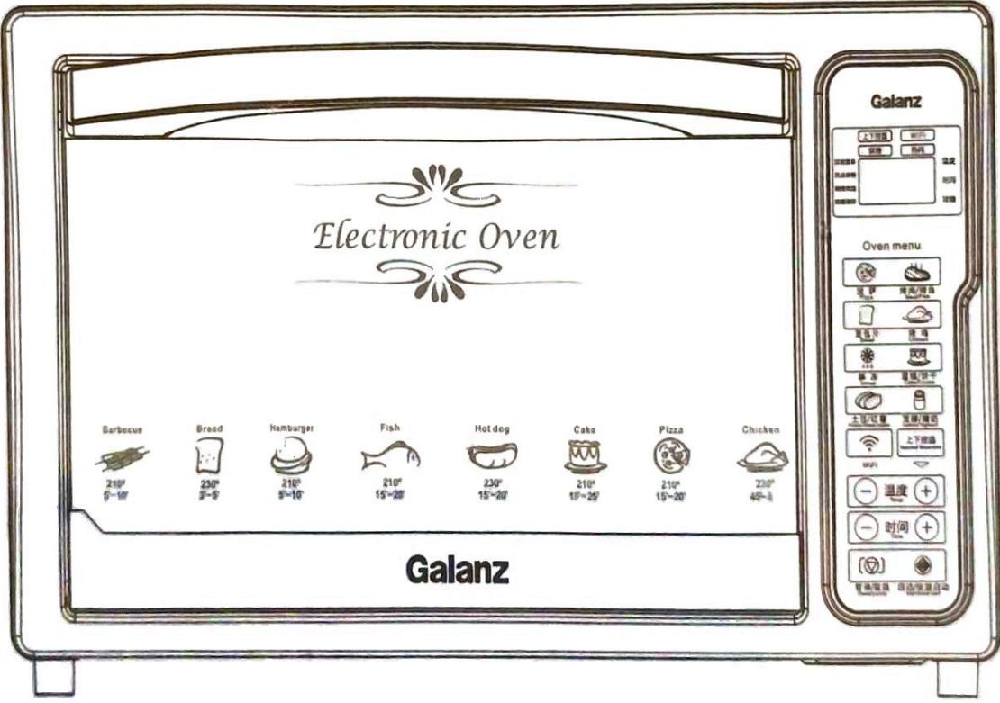  
适用于家庭

## 安全注意事项

## 使用本产品时请遵守下列安全注意事项

1. 使用电烤箱之前，请仔细阅读相关的说明。

2. 电烤箱工作过程中或刚用完后，外表面温度较高切勿触摸。

3. 若有孩童在旁，须加倍小心使用产品。切勿让小孩单独使用，切勿将电烤箱放于婴儿能接触到的地方。

4.请勿将电烤箱的电源线、插头或任何其它部分浸在水或其它液体中，以免产生火灾或其他危险。

5. 禁止将电源线悬挂在橱柜边缘或接其接触高温物体。

6. 经常检查电烤箱的电源线、插头是否有破损，一旦电源线或插头有破损迹象，应停止使用，并送到最近的维修服务中心去检查及维修。

7. 应正确使用电烤箱的配套附件，避免人为的操作而引发火灾或伤害。

8.请勿将电烤箱摆放在煤油炉、微波炉旁等高温环境中使用，并远离火源。

9.电烤箱使用过程中，与四周需保持至少10厘米的距离空间。

10. 当电烤箱不使用时或清洗前，应将插头从插座内拔出。移动或清洗电烤箱时，需待电烤箱冷却后再进行。

11.请勿用金属片覆盖屑盘或电烤箱的其它部份，以免电烤箱过热。

12.电烤箱工作时，必须小心移动食物盘或其他附件，避免被高温油或高温液体烫伤。

13. 烤箱只能烤制能消耗食物，不得将大块食物或金属物品放入电烤箱中烧烤，以免引发火灾或其他危险。

14.如果电烤箱在工作中接触易燃物或被一些易燃物如窗帘、织物等覆盖,可能引发火灾。

15.不得将下列物品放入烤箱中烧烤，包括：纸张、卡片、塑胶、布料、易燃塑料等。

16.电烤箱停止使用时，请勿将除烤箱配件以外的东西存贮在电烤箱里面。

17.要关闭电烤箱时,请先关停所有功能设置再把插头从插座中拔下来。

18.当从烤箱中插入或移动东西时，需戴上保护性、绝缘的防热手套。

19.电烤箱门由钢化玻璃制成。钢化玻璃比普通的玻璃要坚固，具有更强的抗破坏力。钢化玻璃可能破裂，但是它没有锋利的碎片，请勿刮花门的表面。如果有刮花或刻痕，请停止使用并与客户服务热线联系。

20.应将电烤箱放置在干燥的环境中，不可在室外使用本产品。

21.本产品仅供家庭使用，切勿将此电烤箱用于其他未指定用途。

22.使用电烤箱时请小心避免被锋利的边缘划伤。

23.玻璃门完全打开后，禁止在玻璃门上放置任何物品。

24.食物不能集中在烤网架和食物盘的局部，需均匀分布，重量不超过3.5kg。

25.器具工作时，门和外部表面温度较高,请小心避免被烫伤。

26.电源线属于Y连接器具，如果烤箱的电源线损坏，为了避免危险，必须由生产商、其维修部或类似部门的专业人员进行更换。

27.器具不能在外接定时器或独立的遥控控制系统的方式下运行。

此符号表示：本产品工作时，表面温度很高，小心烫伤。

## 重要安全指导

为了避免使用长电源线所带来的容易被缠住或绊倒的危险，此电烤箱采用较短的电源线，当然在小心使用的前提下，也可以使用延长的电源线。

1. 延长电源线的电力评级必须与电烤箱电源线的电力评级保持一致。

2. 延长的电源线必须当心使用，不得将电源线悬挂在桌子或橱柜的边缘，以免绊倒小孩。

3. 如果电源软线损坏，为避免危险，必须由生产商或其维修部或类似的专业人员来更换。

## 使用须知

## 首次使用电烤箱之前，应注意：

1. 仔细阅读使用说明书。

2. 去掉电烤箱保护膜。

3. 使用新电烤箱前，仔细检查电烤箱内所有的附件。拿出所有的附件，用清水洗干净。

4.彻底擦干所有的附件后再放回电烤箱内，插上电源便可使用。

5.初次使用电烤箱之前，将温度调到最大，预热15分钟以除去电烤箱上可能留下的机械油。有烟雾冒出属正常现象。

## 零部件名称介绍

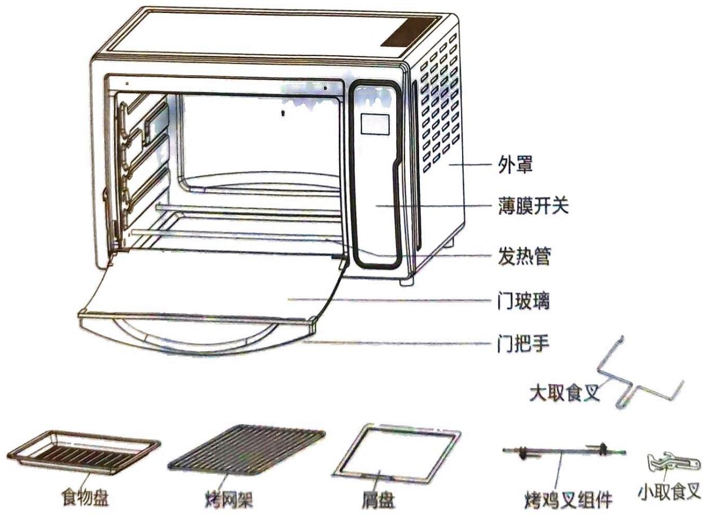

初次使用前，请熟悉下列电烤箱附件：

\- 烤网架: 用来放各种烧烤的食物。

\- 食物盘: 用来烧烤肉、鱼等其它容易滴汁或油的食物；采用烤网或旋转烤叉烤制油、汁较多的食物时，将烤盘放入烤箱下层以接收烤食物时滴落的油、汁。

\- 小取食叉: 用来取食物盘和烤网。

\- 大取食叉: 用来取旋转烤叉组件。

\- 旋转烤叉组件: 用来烧烤各种各样烤鸡和家禽肉。

\- 门把手: 用来帮助开关电烤箱门，以避免烫伤。

\- 玻璃门: 透明的、比普通的玻璃更强固和安全的钢化玻璃。你可以随时观察烧烤的情况。

\- 屑盘：用来接收烤食物时少量的油脂及面包屑。

## 控制面板介绍

## 1. LED屏图标说明

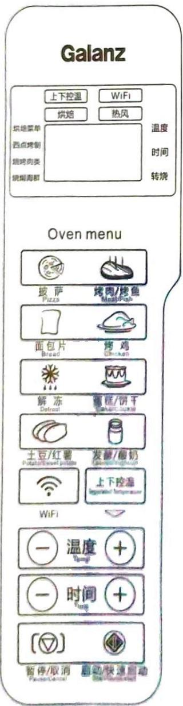

<table><tr><td>上管加热</td><td>旋转烤叉启动</td></tr><tr><td>下管加热</td><td>WiFi功能连接</td></tr><tr><td>风扇启动</td><td>88:88°C温度、时间</td></tr><tr><td colspan="2">2.功能键说明</td></tr><tr><td>披萨功能键</td><td>烤肉/烤鱼 功能键</td></tr><tr><td>面包片功能键</td><td>烤鸡 功能键</td></tr><tr><td>解冻功能键</td><td>蛋糕/饼干 功能键</td></tr><tr><td>土豆/红薯 功能键</td><td>发酵/酸奶 功能键</td></tr><tr><td>WiFi设定键</td><td>上下控温 上下控温 功能键</td></tr><tr><td>温度设定键</td><td>时间设定键</td></tr><tr><td>暂停/取消 设定键</td><td>启动/快速启动 设定键</td></tr></table>

## 3. 暂停/取消

(1)烤箱在启动状态下，可以通过按“暂停/取消”键，进入暂停状态。暂停后负载图标停止闪烁。

(2)烤箱在未启动状态下（已经选择功能），可以通过按“暂停/取消”键，取消功能选择。

(3)烤箱在暂停状态下，可以通过再按一次“暂停/取消”键，取消功能。面包片功能无暂停功能，按一次“暂停/取消”键，就取消功能。

## 操作说明

## 披萨

1. 按“披萨”键可选择进入披萨功能。此时，LED显示“上管☐”，“下管☐”，“风扇☐”图标。

2. 按 “温度+” 或 “温度-” 键，可以进行烹调温度调节。

3. 按 “时间+” 或 “时间-” 键，可以进行烹调时间调节。

4. 按 “启动” 键程序启动，并开始倒计时，LED闪烁显示 “上管☐”，“下管☐”，“风扇☐” 图标。

5. 工作过程中可进行时间、温度调节。

6. 程序运行时，按“暂停/取消”可暂停此程序，暂停后再按“暂停/取消”可取消此程序。

## 面包片

1. 按 “面包片” 键可选择进入面包片功能。此时，LED显示 “上管☐”，“下管☐” 图标、默认烤制等级 “04”。

2. 可按 “温度+”，“温度-”，“时间+”，“时间-” 键选择需要的烤制等级（共分6级，LED显示 01\~06）。同时按 **住这些按键**不动可以实现持续调节。（例如：按住 “温度+” 键不动 后，可以令烤制等级持续循环变化 04→05→06→01→02→03→04；按住 “温度-” 键不动后，可以令烤制等级持续循环变化 04→03→02→01→06→05→04）

3.面包片功能无温度和时间调节。

4. 按 “启动” 键程序启动，LED闪烁显示 “上管☐”，“下管☐” 图标。

5.工作过程中不可进行时间、温度、档位调节。

6. 程序运行时，按“暂停/取消”键即取消此程序，此程序无暂停功能。

## 烤鸡

1. 按 “烤鸡” 键可选择进入烤鸡功能。此时，LED显示 “上管☐”，“下管☐”，“旋转烤叉☐”，“风扇☐” 图标。

2. 按 “温度+” 或 “温度-” 键，可以进行烹调温度调节。

3. 按 “时间+” 或 “时间-” 键，可以进行烹调时间调节。

4. 按 “启动” 键程序启动, 并开始倒计时, LED闪烁显示 “上管☐”, “下管☐”, “旋转烤叉☐”, “风扇☒” 图标。

5. 工作过程中可进行时间、温度调节。

6. 程序运行时，按“暂停/取消”可暂停此程序，暂停后再按“暂停/取消”可取消此程序。

## 操作说明 (2)

## 烤肉/烤鱼

1. 按 “烤肉/烤鱼” 键可选择进入烤肉/烤鱼功能。此时，LED显示 “上管 ☐”，“下管 ☐” 图标。

2. 按 “温度+” 或 “温度-” 键，可以进行烹调温度调节。

3. 按 “时间+” 或 “时间-” 键，可以进行烹调时间调节。

4. 按 “启动” 键程序启动，并开始倒计时，LED闪烁显示 “上管 ☐”，“下管 ☐” 图标。

5. 工作过程中可进行时间或温度的调节。

6. 程序运行时，按“暂停/取消”可暂停此程序，暂停后再按“暂停/取消”可取消此程序。

## 蛋糕/饼干

1. 按 “蛋糕/饼干” 键可选择进入蛋糕/饼干功能。此时，LED显示 “上管 ☐”，“下管 ☐” 图标。

2. 按 “温度+” 或 “温度-” 键进行烹调温度调节。

3. 按“时间+”或“时间-”键，可以进行烹调时间调节。

4. 按 “启动” 键程序启动，并开始倒计时，LED闪烁显示 “上管 ☐”，“下管 ☐” 图标。

5. 工作过程中可进行时间、温度调节。

6.程序运行时，按“暂停/取消”可暂停此程序，暂停后再按“暂停/取消”可取消此程序。

## 发酵/酸奶

1. 按 “发酵/酸奶” 键可选择进入发酵/酸奶功能。此时，LED显示 “上管☐” 图标。

2. 按 “温度+” 或 “温度-” 键，不能进行烹调温度调节。

3. 按 “时间+” 或 “时间-” 键，可以进行烹调时间调节。

4. 按 “启动” 键程序启动，并开始倒计时，LED闪烁显示 “上管 ☐” 图标。

5. 工作过程中可进行时间调节，不能进行温度调节。

6. 程序运行时，按“暂停/取消”可暂停此程序，暂停后再按“暂停/取消”可取消此程序。

## 土豆/红薯

1. 按 “土豆/红薯” 键可选择进入土豆 / 红薯功能。此时，LED显示 “上管 ☐”，“下管 ☐” 图标。

2. 按 “温度+” 或 “温度-” 键，可以进行烹调温度调节。

3. 按 “时间+” 或 “时间-” 键，可以进行烹调时间调节。

4. 按 “启动” 键程序启动，并开始倒计时，LED闪烁显示 “上管 ☐”，“下管 ☐” 图标。

5. 工作过程中可进行时间、温度调节。

6. 程序运行时，按“暂停/取消”可暂停此程序，暂停后再按“暂停/取消”可取消此程序。

## 操作说明 (3)

## 解冻

1. 按“解冻”键可选择进入解冻功能。此时，LED显示“上管”，“风扇”图标。

2. 按 “温度+” 或 “温度-” 键无效，不能进行烹调温度调节。

3. 按 “时间+” 或 “时间-” 键，可以进行烹调时间调节。

4. 按“启动”键程序启动，并开始倒计时，LED闪烁显示“上管☐”，“风扇☐”图标。

5. 工作过程中可进行时间的调节，温度不能调节。

6. 程序运行时，按“暂停/取消”可暂停此程序，暂停后再按“暂停/取消”可取消此程序。

## 快速

1.待机状态下，直接按“启动/快速启动”键。此时，LED显示“上管☐”，“下管☐”图标。

2. 按 “温度+” 或 “温度-” 键无效，不能进行烹调温度调节。

3. 按 “时间+” 或 “时间-” 键，可以进行烹调时间调节。

4. 工作过程中可进行时间的调节，温度不能调节。

5.程序运行时，按“暂停/取消”可暂停此程序，暂停后再按“暂停/取消”可取消此程序。

## 上下控温

1. 按 “上下控温” 键可选择进入上下控温功能。此时，LED显示 “上管 ☐”，“旋转烤叉 ☑”，“风扇 ☒” 图标。

2. 按“上下控温”键，待机状态可进行上管、下管、上下管切换。

若选择上下管，启动后按“上下控温”键调节上管、下管温度。

3. 按“温度+”或“温度-”键，可以进行烹调温度调节。

4. 按“时间+”或“时间-”键，可以进行烹调时间调节。

5. 按 “启动” 键程序启动，并开始倒计时，LED闪烁显示“上管☐”，“下管☐”，

“风扇”，“旋转烤叉”图标。

6.程序运行时，按“暂停/取消”可暂停此程序，暂停后再按“暂停/取消”可取消此程序。

## 智能家电WiFi操作指南

## WiFi设备添加流程

## 1. 手机扫描二维码

用户通过手机利用第三方扫描工具，扫描厂商设备的二维码图标或说明书二维码，自动跳转进入阿里智能APP下载界面，点击下载安装阿里智能APP。

注：如用户已安装阿里智能APP，可直接打开阿里智能APP扫描添加设备。

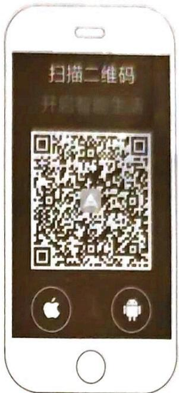  
用户扫描二维码

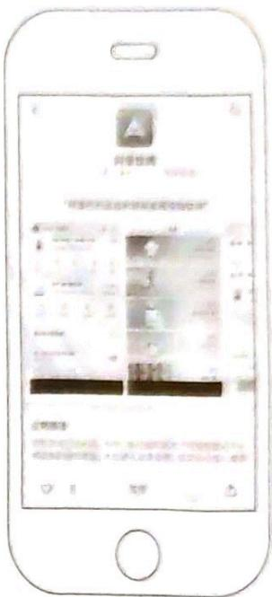  
阿里智能APP下载界面

## 2. 注册并登录阿里智能

注：如用户已有淘宝登录账户，无需再注册，用淘宝账户登录即可。

用户打开阿里智能APP，点击下方“免费注册”填写用户注册信息，用户注册成功后输入用户账号信息即可登录。密码丢失用户可以通过找回密码找回。

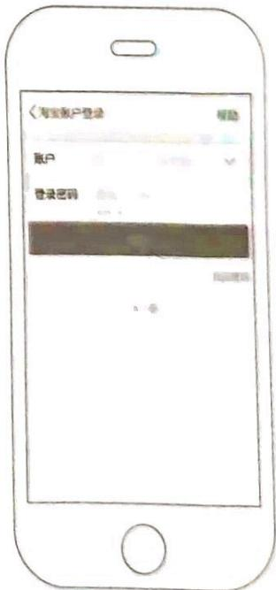  
用户登陆界面

## 智能家电WiFi操作指南 (2)

## 3. 添加设备

1) 用户设备添加：用户成功登陆后，点击界面右上角“+”图标；跳转到添加设备界面，点击“添加设备”；进入选择添加方式界面(有三种方式可供选择：扫描二维码、蓝牙扫描、按分类查找)。用户扫描说明书封面上的二维码图标，进行设备添加。跳转到设置格兰仕电烤箱iK2R(TM)，长按WiFi键3秒，听到“滴”一声，松手即进入配网状态。

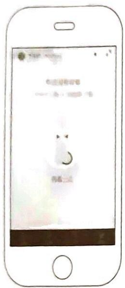  
设备添加

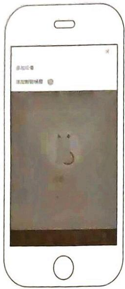  
设备添加

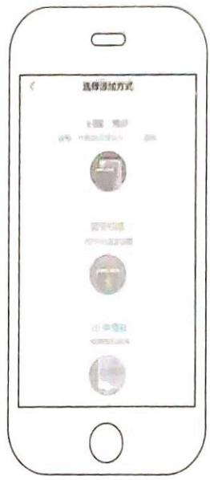  
选择添加方式

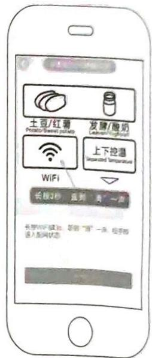  
设置配网

2) 用户WiFi密码设置：用户启动WiFi状态后，根据提示在手机端输入当前手机所在WiFi网络的名称和密码，并点击“搜索设备”，开始配置。配置WiFi需少许时间，配置成功会提示配置成功，并自动跳转到菜单设置界面。

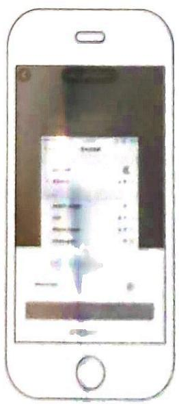  
设置WiFi信息

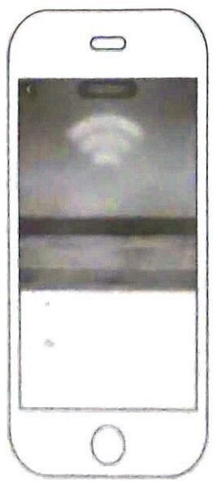  
设备添加中界面

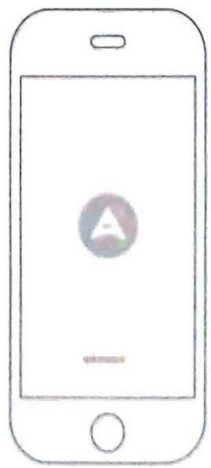  
设备添加成功界面

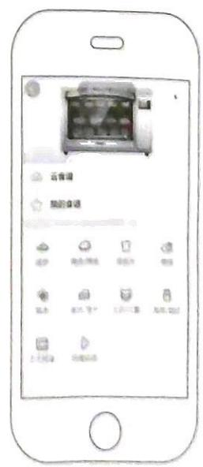  
菜单设置界面

## 智能家电WiFi操作指南 (3)

## 4. 分置设备

用户可以通过“设备分享”方式，来实现给其他用户分享使用控制设备功能。

分享者：返回设置界面，点击设备列表左上角处的“：”图标

→→点击“设备管理”

→→选择要分享的设备“iK2R(TM)”

→→点击“设备二维码绑定分享”

→→生成该设备的分享二维码

被分享者(需安装阿里智能APP后才能使用): 扫描设备的分享二维码, 添加设备。

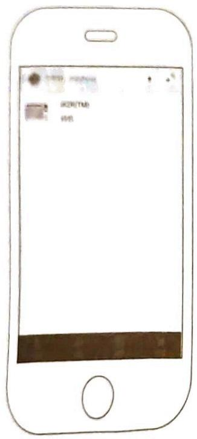

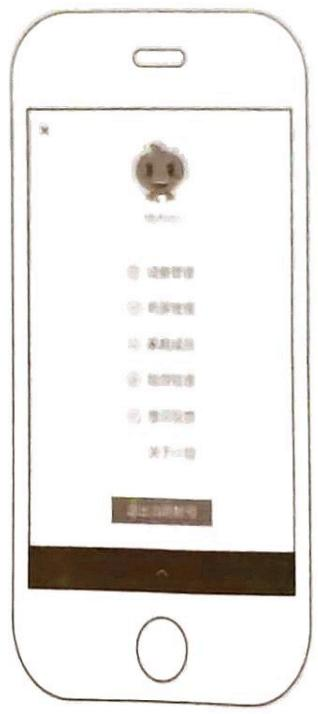

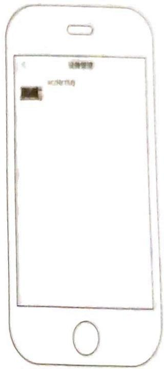

设备列表  
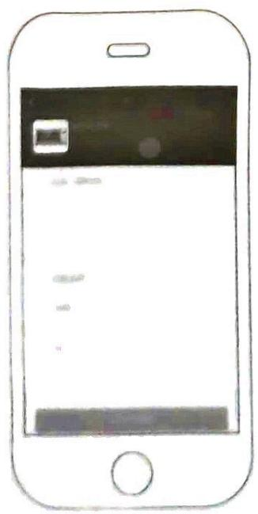  
设备分享设置界面  
设备管理

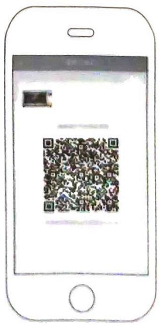  
分享二维码界面  
点击需分享的设备名称

## 智能家电WiFi操作指南 (4)

## 5. 解绑设备

用户如需进行APP解绑则长按产品上的“暂停/取消”键10秒，直到“滴”一声，即完成解绑。

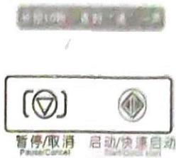

## WiFi密码变更说明

当用户网络环境改变时（例如更换路由器或更换密码），需要按上述步骤重新连接。

注：由于软件持续更新中，不能保证你下载的APP软件界面同本印刷品内容完全一致。

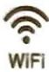

## 智能家电WiFi操作注意事项

1. 根据《产品智能手机WiFi操作指南》对产品、手机、网络三者进行配置。在配置时产品显示屏上会显示配置的步骤，配置成功后自动返回原界面。注意配置时手机与产品必须在同一无线局域网内。

2. 配置成功后，如没有改变网络环境（例如更换路由器），则产品接通电源后会自动连上云端服务器。如网络环境更改，则需要根据《产品智能手机WiFi操作指南》进行重新配置联网。

3.产品上的WiFi灯长亮表示产品已经连接上云端服务器，可以在手机端进行操控。如WiFi灯闪烁则表示产品还没能连接上云端服务器。

4. 如出现手机无法控制产品的情况，请先按下表排查故障。

<table><tr><td>现象</td><td>可能造成的原因</td><td>处理方法</td></tr><tr><td>配置的步骤显示停在“01”,并手机上显示配置不成功</td><td>没有按手机界面上的“下一步”进行配置,或手机配置时间已超时</td><td>重新按《产品智能手机WiFi操作指南》操作</td></tr><tr><td>配置的步骤显示停在“02”,并手机上显示配置不成功</td><td>手机上输错的WiFi密码</td><td>重新输入正确的WiFi密码</td></tr><tr><td>配置的步骤显示停在“03”,并手机上显示配置不成功</td><td>无线路由器不能连接网络</td><td>检查路由器的网络连接</td></tr></table>

如经过以上排查还不能正常工作，请联系客服维修。

## 清洁与保养

1. 在清洁电烤箱前应首先拔掉电源插头待其冷却后再进行清洁，擦干后储存。把电烤箱放入纸箱内，然后放在干净，干燥的环境中。请勿在电烤箱仍然是热的且插头没拔的情况下进行储存。请勿将电源线紧紧的缠绕在电烤箱的四周，请将电源线放在烤箱后面储存电源线的地方。当把烤箱放入纸箱内时，请勿压住电源线，以免造成电源线磨损和破裂。

2. 电烤箱内外表面、食物盘、烤网架的清洁可用软棉布或海绵沾上中性清洁剂擦拭，并用清水抹干净，应避免使用硬刷子和物品洗刷刮削以免损坏电烤箱内外表面及食物盘、烤网架的保护层。

3.避免使用汽油、天那水、抛光剂等有毒或腐蚀性清洁剂进行清洁。

4. 使用电烤箱之前必须将清洗的零部件擦干后再插上电源。

## 使用技巧与常识

1. 烤箱操作时，玻璃门上粘有水珠或者雾气属于正常现象。

2. 解冻后的食物请立即开始烹调。

3. 冷冻过后的食物与很厚的肉块需要长时间的烘烤。

4.需要解冻的食物必须放在烤盘上里，以防止融化的冰水滴在发热管上，这可能导致发热管损坏。

5.烤箱在工作中尽量不要打开玻璃门，避免热流涌出使工作时间延长。

6.如果烤的面包是经过冷藏或者是较厚的面包，可以设置相对高一点温度操作。

7. 烧烤过程中，有烟雾出现属于正常现象，烧烤前尽量切除肉类上的脂肪可减小烟雾的产生。

8.为确保器具的使用寿命更长，烤箱操作时必须要放置屑盘。

9.切勿让烤箱在玻璃门打开的状态下工作；切勿让烤盘，烤架及其他东西直接压在下发热管。

## 产品规格

<table><tr><td>产品型号</td><td>额定功率</td><td>额定电压</td><td>有效容积</td><td>有效频率</td></tr><tr><td>iK2R(TM)</td><td>1500W</td><td>220V</td><td>32L</td><td>50Hz</td></tr></table>

## 环保清单

<table><tr><td colspan="7">产品有害物质元素名称及含量</td></tr><tr><td rowspan="2">部件名称</td><td colspan="6">有害物质元素</td></tr><tr><td>铅(Pb)</td><td>汞(Hg)</td><td>镉(Cd)</td><td>六价铬(Cr(VI))</td><td>多溴联苯(PBB)</td><td>多溴二苯醚(PBDE)</td></tr><tr><td>电源线插头</td><td>X</td><td>O</td><td>O</td><td>O</td><td>O</td><td>O</td></tr><tr><td>温控器</td><td>X</td><td>O</td><td>X</td><td>O</td><td>O</td><td>O</td></tr><tr><td>定时器</td><td>X</td><td>O</td><td>X</td><td>O</td><td>O</td><td>O</td></tr><tr><td>继电器</td><td>O</td><td>O</td><td>X</td><td>O</td><td>O</td><td>O</td></tr><tr><td>功能开关</td><td>O</td><td>O</td><td>X</td><td>O</td><td>O</td><td>O</td></tr><tr><td>蜂鸣器</td><td>X</td><td>O</td><td>O</td><td>O</td><td>O</td><td>O</td></tr><tr><td>二极管</td><td>X</td><td>O</td><td>O</td><td>O</td><td>O</td><td>O</td></tr><tr><td colspan="7">本表格依据SJ/T11364的规定编制</td></tr></table>

<table><tr><td>O</td><td>表示该有毒有害物质在该部件所有均质材料中的含量均在GB/T 26572标准规定的限量要求以下。</td></tr><tr><td>X</td><td>表示该有毒有害物质至少在该部件的某一均质材料中的含量超出GB/T26572标准规定的限量要求。</td></tr><tr><td>备注</td><td>本产品98%的部件采用无毒无害的环保材料制造,含有毒有毒有害物质或元素的替代有害物质或元素的部件皆因全球技术发展水平限制而无法实现。</td></tr></table>

<table><tr><td>10 此标识适用于在中华人民共和国销售电子信息产品,标识中央的数字为正常使用条件下的环境保护使用期限的年数。</td></tr><tr><td>温馨提示——安全使用年限取决于电烤箱产品,建议使用一定年限后更换新机。</td></tr></table>

备注：以上所有内容均经过认真核对，如有任何印刷错漏或内容上的误解，本公司保留解释权。

## 电烤箱食品接触材料信息

本产品符合GB 4806.1-2016《食品安全国家标准 食品接触材料及制品通用安全要求》及相关国家标准的要求。产品生产过程符合GB 31603-2015《食品安全国家标准 食品接触材料及制品生产通用卫生规范》要求。具体信息如下：

<table><tr><td>物料名称/规格</td><td>材料</td><td>符合法规/标准</td><td>备注</td></tr><tr><td>食物盘</td><td>镀铝板</td><td>GB4806.9-2016</td><td rowspan="2">可选配置,不得与酸性食物接触</td></tr><tr><td>食物盘、盖板</td><td>冷轧板喷搪瓷</td><td>GB4806.9-2016/GB4806.3-2016</td></tr><tr><td>烤网架</td><td>铁线电镀</td><td>GB4806.9-2016</td><td>不得与酸性食物接触</td></tr><tr><td>烤轴、烤鸡叉M5扁头螺母</td><td>镀铬</td><td>GB4806.9-2016</td><td rowspan="4">可选配置,不得与酸性食物接触</td></tr><tr><td>大取食叉</td><td>冷轧板+电泳</td><td>GB4806.9-2016</td></tr><tr><td>小取食叉</td><td>塑料+铁线镀铬</td><td>GB4806.9-2016/GB4806.7-2016</td></tr><tr><td>自制小取食叉</td><td>冷轧板+电泳</td><td>GB4806.9-2016</td></tr><tr><td>门玻璃</td><td>玻璃</td><td>GB4806.5-2016</td><td>----</td></tr><tr><td>U板、后板和屑盘</td><td>镀锌板</td><td>GB4806.9-2016</td><td rowspan="2">可选配置,不得与酸性食物接触</td></tr><tr><td>U板和后板</td><td>镀锌板喷不粘油</td><td>GB4806.9-2016/GB4806.10-2016</td></tr><tr><td>蒸汽发生器前/后盖</td><td>压铸铝+不粘油</td><td>GB4806.9-2016/GB4806.10-2016</td><td rowspan="5">可选配置,仅接触水</td></tr><tr><td>水箱盖密封圈、水箱翻盖阀门、水管、蒸汽发生器密封圈</td><td>气相硅胶</td><td>GB4806.11-2016</td></tr><tr><td>弹簧</td><td>SUS304</td><td>GB4806.9-2016</td></tr><tr><td>水箱、水箱盖</td><td>PC料</td><td>GB4806.7-2016</td></tr><tr><td>导水管座、止回阀出水嘴</td><td>PP料</td><td>GB4806.7-2016</td></tr></table>

备注：  
注1：所列部品为可能接触食物部品，不宜作为容器长期存储食品。  
注2：本系列产品包含以上食品接触材料，但部分机型可能不含个别材料，以实际产品为准。

## 格兰仕 电烤箱

## 格兰仕家电保修卡（顾客存）

产品名称：\_\_\_\_

规格型号：\_\_\_\_

购买日期： 年 月 日

购买地址及商城： 省 市 县(区) 商城

发票号码：\_\_\_\_

用户姓名：

用户地址： 省 市 县(区)

联系电话：

保修须知

感谢您购买本公司生产的家电产品，此产品是一件设计精良，采用高品质元器件制造的家用电器，它将给你的生活带来极大的方便。如果机器发生故障，请及早与格兰仕各地客户服务中心或厂家客户服务部联系，本公司将提供良好的维修服务。

（1）格兰仕电器产品按发票购买日起,享有一年保修服务。

（2）保修期内，因产品质量问题所损坏的一切零件可免费更换。

（3）凡无票、超过保修期和不在保修范围，则收取维修费和配件费。需上门维修时，市区以外加收上门费。

（4）如按国家“三包法”规定，要换机或退机，须包装完好，附件齐全，整机和外观保持完好，无人为损坏，否则将要承担相应的责任。

(5) 本产品用于非家庭用途,将不在保修范围之内。

维修部填写

## 保修、换配件登记表

型号/货号 \_\_\_\_ 产品机号 \_\_\_\_ 用户姓名 \_\_\_\_ 邮编 \_\_\_\_

发票号码 \_\_\_\_ 购买日期 \_\_\_\_ 用户地址 \_\_\_\_

购买商场及地址 \_\_\_\_ 用户联系电话 \_\_\_\_

维修服务部名：

<table><tr><td>日期</td><td>保修项目</td><td>更换零件名称</td><td>数量</td><td>维修费</td><td>技术员签名</td><td>用户签名</td></tr><tr><td></td><td></td><td></td><td></td><td></td><td></td><td></td></tr><tr><td></td><td></td><td></td><td></td><td></td><td></td><td></td></tr><tr><td></td><td></td><td></td><td></td><td></td><td></td><td></td></tr><tr><td></td><td></td><td></td><td></td><td></td><td></td><td></td></tr></table>

保修须知

1.保修卡是您的电器在使用中出现故障时,寻求产品维修服务所必须具备的,请妥善保管(遗失不补)。
2.请您用正楷的钢笔字工整填写保修卡,以免我们与您联络时产生误会。

3.用户使用前请先参阅使用说明书，电源的电压应具备稳定，当电压超出额定电压 200{V}\pm 10\% ，会损坏您的电器。电源的导线、保险丝、插座、开关应符合说明书所列电器负荷要求，并保证工作使用正常，无接触不良等情况发生。

4.需要修理时,请出示保修卡和购机发票。如果您无法提供，请您与特约维修部协商进行维修。

5.即使在保修期内，凡属下述情况的，修理后收取维修费用（维修费+配件费+上门费）。

\*消费者使用不当、维护、保管不当造成损坏的

\*未按说明书的要求链接电源

\*非格兰仕电器特约维修员修理后出故障

\*因移动或跌落等原因而造成的故障或破损

\*因不可抗力或意外灾害事故(如:地震、战争、海啸、水灾、火灾、煤气事故等)造成的故障或破坏。

6.您的电器所在位置如果不属免费上门服务范围,那么特约维修部会按距离远近和交通状况收取一定的上门费,具体费用用户可与特约维修部协商确定。

7.本产品用于营业性饮食服务用途（饭店、酒楼等）或工业(工业制造、加工实验室等）或其他非家庭用途时(例如:食堂、集体宿舍、专营店、超市、办公室等环境使用），将被视为非正常环境使用（或使用不当），我司不承担保修责任。

8. 在格兰仕特约中心收费修理后，正常使用三个月内再发生同一部位，同一故障现象时，本公司负责免费修理。

9.在正常情况下，对保修期（购入后一年）内出现的故障，本公司特约维修部负责免费修理。如果您对我们提供的产品和服务有任何疑问或不满，请通过以下方式与我们联系：

1. 拨打我司全国统一客服热线4008300333。

2. 访问我公司的网站http://www.galanz.com.cn填写在线报修信息，您也可以直接发电子邮件到service@galanz.com.cn进行报修或咨询。