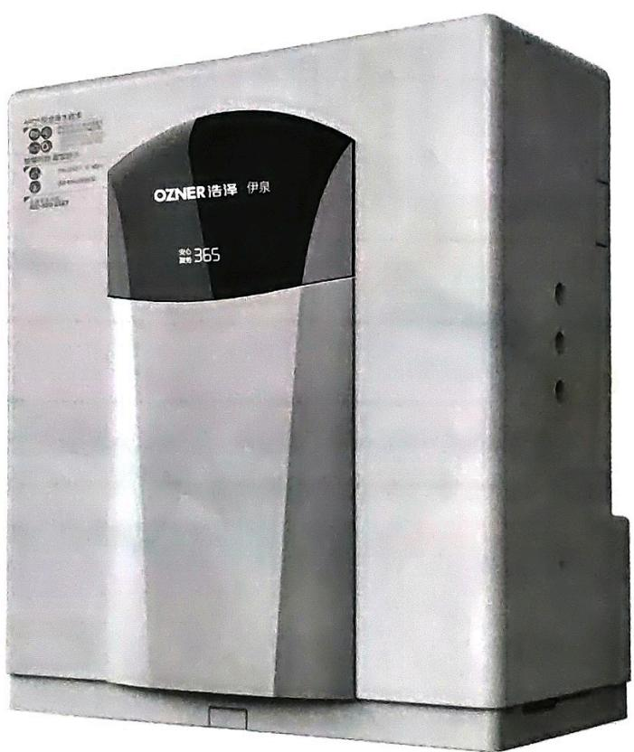

System Tested and Certified by NSF International against NSF/ANSI Standard 58 for the reduction of TDS.

浩泽牌JZY-A2B3型纯水机使用手册

## 目录

一、简介 01
二、净水工艺 01
三、随机附件 02
四、主要技术参数 03
五、主机结构与功能 03
六、功能特征 04
七、调试步骤与使用方法 04
八、使用须知 05
九、售后服务 05
十、常见故障处理方法 06
十一、安全注意事项 06

感谢您选用浩泽净水器，使用前请认真阅读本说明书。浩泽净水器将引领您和您家人、朋友共同步入享用健康鲜活水的新时代。

## 产品简介

“浩泽净水器”是一种终端净水设备。采用APO ^{+} 安全净水技术，0.0001微米美国RO膜逆渗透技术，通过国内外多项权威检测认证。工作原理是连接市政自来水，经过多重净化，最大程度上保证了水质安全健康。

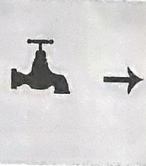  
市政自来水

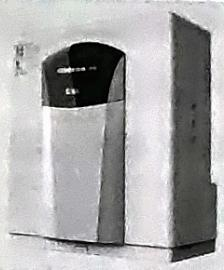  
浩泽净水器

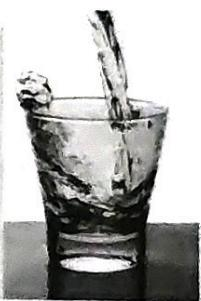  
鲜活好水

## 净水工艺

APO ^{+} 安全净水技术是Absorption, Purification and Ozone的缩写，即优化级吸附、优质过滤、鲜活净化技术，“+”即更优，真正保证水质新鲜、健康和安全。

采用APO ^{+} 安全净水技术有如下优势：

### 吸附更优

采用复合滤芯、压缩活性炭滤芯和专业余氯吸附材料，不仅深层次吸附水中异色、异味、余氯、卤化烃、有机物、重金属离子等有害物质，有效改善水质口感，还能有效去除自来水因采用氯消毒而产生的三氯甲烷、四氯化碳等致癌余氯物。

### 过滤更优

采用0.0001微米美国渗透膜等过滤系统，有效过滤农药、苯酚、溴酸盐等化学污染物，深度滤除重金属。

JZY-A2B3净水器（厨下式）：

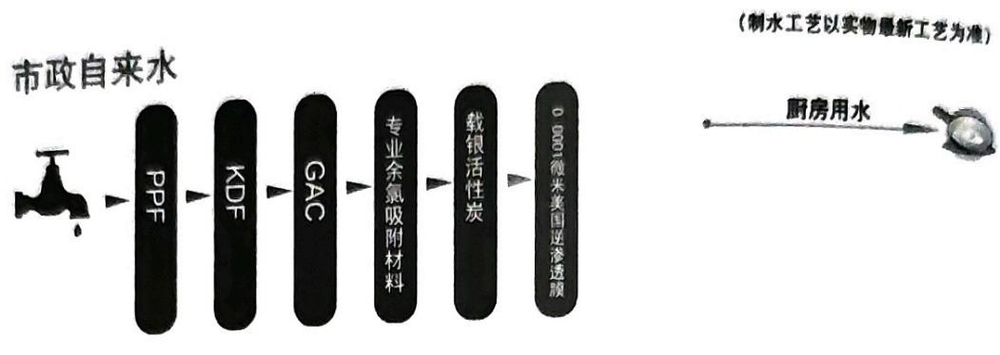

### 六级过滤系统

第一级：PPF

对自来水进行预处理，拦截水中泥沙、颗粒和胶体等杂质。

第二级：KDF

初步拦截重金属和控制结垢。

第三级：GAC

吸附水中异色、异味、余氯、卤化、有机物等有害物质。

第四级：专业余氯吸附材料

高效去除自来水中因采用氯消毒而产生的三氯甲烷、四氯化碳等致癌氯化合物。

第五级：载银活性碳

增强抑菌功能，进一步提升口感及水质安全等级。

第六级：0.0001微米美国逆渗透膜

采用微米级逆渗透膜，有效过滤农药、苯酚、溴酸盐等化学污染物，深度滤除重金属。

## 随机附件

您在使用本公司产品时，打开包装，内配有以下附件：

JZY-A2B3净水器（厨下式）：

\- RO膜（50G）1支

\- 三叉全银水龙头1个

● 安装卡1张

● 安装确认单1套

● 产品说明书1本

\- 进水三通1个

\- 进水球阀1个

\- PE管1根（白色）

\- PE管1根（蓝色）

\- 水质保障服务卡一张

开箱后请仔细检查，如有疑问请拨打全国服务热线：400-820-2667。

## 主要技术参数

<table><tr><td>设备类型</td><td>JZY-A2B3净水器(厨下式)</td></tr><tr><td>额定电压</td><td>220VAC</td></tr><tr><td>额定频率</td><td>50Hz</td></tr><tr><td>额定功率</td><td>40W</td></tr><tr><td>额定总净水量</td><td>2000L</td></tr><tr><td>压力桶储水量</td><td>7L</td></tr><tr><td>纯水产量</td><td>6L/H</td></tr><tr><td>适用水压</td><td>0.06MPa-0.3MPa</td></tr><tr><td>工作压力反渗透膜</td><td>0.5-0.7 MPa</td></tr><tr><td>适用自来水水温</td><td>5-40°C</td></tr><tr><td>适合水质</td><td>市政自来水</td></tr><tr><td>出水水质</td><td>符合《生活饮用水水质处理器卫生安全与功能评价规范-反渗透处理装置》(2001)</td></tr><tr><td>重量/尺寸</td><td>9.5kg/440mm*230mm*412mm</td></tr><tr><td>压力桶尺寸</td><td>高400mm直径290mm</td></tr><tr><td>总溶解性固体去除率</td><td>进水浓度:750±40mg/L 最大出水允许浓度:187mg/L</td></tr><tr><td colspan="2">This system has been tested according to NSF/ANSFI 58 for reduction of the substances listed below. The concentration of the indicated substances in water entering the system was reduced to a concentration less than or equal to the permissible limit for water leaving the system as specified in NSF/ANSI 58.</td></tr><tr><td>回收率</td><td>20%-30%</td></tr><tr><td colspan="2">Recovery Rating means the percentage of the influent water to the membrane portion of the system that is available to the user as reverse osmosis treated water when the system is operated without a storage tank or when the storage tank is bypassed.</td></tr></table>

## 主机结构与功能

JZY-A2B3净水器（厨下式）

感应区域⑥
电子显示屏①

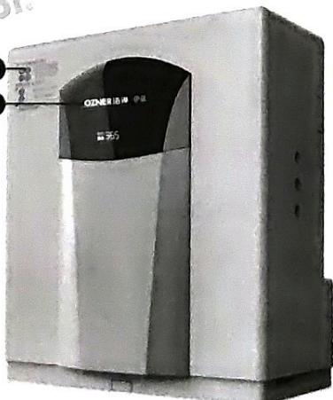

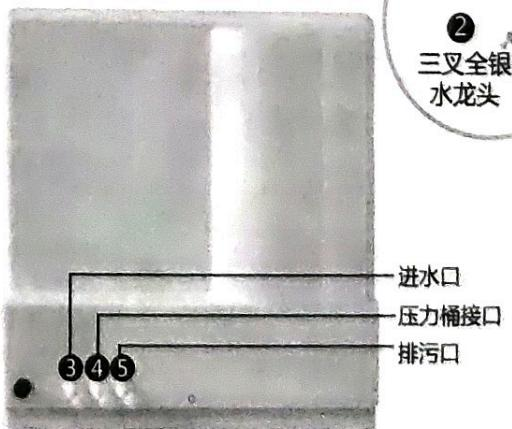

① 电子显示屏：详见《功能特征》。

② 三叉全银水龙头：出常温净水。

③ 进水口：连接自来水管。

④ 压力桶接口：连接压力桶和水龙头。

⑤ 排污口：接排污管，排放废水。

⑥ 感应区域：机器安装完成，将浩泽水质安全保障卡放置感应区域，听到“嘀”的蜂鸣声，屏幕显示“安心服务365”即激活完成。

## 功能特征

电子显示屏

安心 365 服务

滤芯状态指示

智能监控滤芯更换时间，自动提示用户更换滤芯及耗材，保证水质安全新鲜，当此图标闪烁或机器蜂鸣时，表示滤芯需要更换。

温馨提示：为保证您及家人的饮水安全，请及时更换滤芯！

自动滤芯清洗

设备运行过程中将自动冲洗滤芯。

The company's Ozner JZY - A2B3 (XD) pure water machine is made of the principle of reverse osmosis technology is adopted to filter pure water equipment. Using the reverse osmosis membrane (RO membrane), using reverse osmosis water treatment technology make pure water, and can effectively remove tiny impurity in raw water, colloid, organics, heavy metals, soluble solids, bacteria, viruses and other harmful impurities. The RO system is NSF Certified for TDS reduction only. And not Performance Tested or Certified by NSF.

## 调试与使用方法

JZY-A2B3净水器（厨下式）

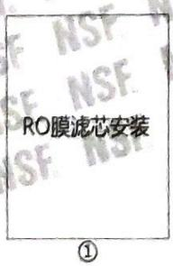

自来水接进水口，压力桶接口连接压力桶（压力桶阀门需关闭）和水龙头，排污口接排污管

将电源插头插入插座，水源小球阀打开

③

出水口开始出水，开启后30分钟无漏水表示水机正常运作

④

TDS测试达标后打开压力桶阀门，正常使用

### 管路安装

先断开用户自来水总阀，安装方法如图所示，将进水三通连接在自来水管上，将进水小球阀下端的螺纹处缠生料带8-10圈与进水三通相连接，剪一段合适长度的PE管套进水小球阀所附螺帽，与进水小球阀相连接，并用扳手将各连接处拧紧。

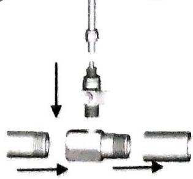

### 外管路连接

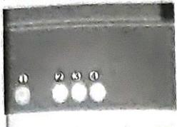

②接进水管
压力桶接口通过快插三通与储水罐和水龙头连接。开箱
③接压力桶和水龙头
后请仔细检查，如有疑问请拨打全国服务热线。

## 使用须知

① 出故障后请不要自行处理，拨打浩泽全国服务热线报修：400-820-2667。

② 在正常使用过程中请不要任意把电源插头从插座拔出，保证每天系统正常工作。在遇到雷电交加的异常气候时，请拔掉电源插头，以防雷击，待天气正常，再插上电源，保证产品使用安全。

③ 擦洗机身时，请不要使用腐蚀性的化学剂擦洗机身，必须用干净柔软的湿布和中性的清洁液清洗。

④ 本机内有高压，非本公司专业人员严禁拆装。

⑤首次使用或长时间不用时（2天以上），应关闭本机电源，进行排空清洁，使用水箱内胆排空一次。如使用时出水仍有异味，可反复操作几次，直至异味消除。

⑥ 请保持出水口区域的清洁，出水口可用含75%的酒精棉进行清洁擦洗，确保出水不会因空气对水龙头污染而影响水质。

## 售后服务

★ 替换滤芯型号：RO逆渗透滤芯：KFT-1812-50

PPF滤芯：KFT- PP- 252

四合一滤芯

如您购买的产品出现故障，请致电浩泽服务热线：400-820-2667

感谢您购买浩泽产品，为了您能够享受完善的售后服务，请妥善保管此卡。

1、自购机之日起7天内发生性能故障，可选择退货或换货；自购机之日起15天内发生性能故障，可换货；超过15天，我司提供保修服务；

2、自购机之日起一年内，我司提供免费保修服务（提供有效购买凭证及保修卡）；

3、保修方式为我司指派服务工程师提供上门服务；

4、RO膜、滤芯等易耗品不在免费保修范围内；

5、以下情况不在保修范围之内：

\- 用户因使用、维护、保管不当造成的损坏与故障；

\- 非我司授权维修点拆动、维修造成的损坏（包括客户擅自拆卸、改装、修理该产品而造成的损坏与故障）；

\- 因不适当使用、保养、不按说明书使用、及不适当保存而造成的损坏与故障。

\- 超出免费保修范围的，我司提供收费维修服务，请致电服务热线400-820-2667.

水质保障服务卡为买断式水机专用卡，主要用于首次装机激活机器，充值及首年的售后服务。次年购买水质保障服务卡相当于使用浩泽延保服务。一张服务卡延保一年。卡一经使用，不退不换。

## 常见故障处理

<table><tr><td>症状</td><td>处理方法</td></tr><tr><td>通电无任何显示</td><td>检查电源是否插好。电源插座是否有交流220V电压。检查保险丝是否损坏。</td></tr><tr><td>显示屏滤芯更换显示闪烁</td><td>在浩泽官方商场购买“水质保障服务卡”找专业售后人员上门更换滤芯</td></tr><tr><td>净水器上按键失效</td><td>切断电源再重启净水器。</td></tr><tr><td>净水器出水口不出水</td><td>检查自来水供水情况,如果自来水正常供水,请拨打全国服务热线,找专业人员维修。</td></tr></table>

## 安全注意事项

必须阅读并切记这些安全注意事项

\- 为了避免对您或他人造成可能的伤害或财产损失，请务必注意以下安全事项。

警告

如果忽视这个标志所述的内容，则可能会造成机器永久性损坏或导致严重财务损失，人身伤害，甚至死亡。

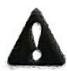

**📌 注意**

如果忽视这个标志所述的内容，则可能会造成机器某些部件损坏或导致部分财物损失，甚至人身伤害。

\- 使用器具附带的新软管，旧软管组件不能重复利用。

\- 器具应固定安装。

\- 如果电源线损坏，为了避免危险，必须由制造商、其维修部专业人员更换。

备注：如整机因工艺和质量改进，不影响操作时，不另行通知。

**⚠️ 警告**

- 切勿擅自拆开或改装本机器！

否则可能会导致故障火灾或漏水事故，如发现异常情况请与本公司专业人员联系，处理后方可使用。

\- 在安装调试、维修、保养产品和更换部件时需断开电源！有发生触电的危险。

- 切勿弄湿机身！

否则可能会导致因短路而发生火灾和触电事故。

\- 切勿使用超出机器规定值的电源。可用220V交流电源！否则可能会导致因短路而发生火灾和触电事故。

\- 切勿将机器放置在高温高湿的地方！可能损坏机器外观或导致触电、短路或火灾事故。

- 切勿使用已损坏的电源线或受损的插座！

\- 切勿拉拽电源线或用湿手接触电源插头！有发生触电或火灾的危险。

\- 切勿用力弯曲电源线或将重物放在电源线上，使电源线破损或变形！有发生触电或火灾的危险。

\- 长时间不使用产品时，关闭三通球阀，拔下电源插头！有发生触电或火灾的危险。

\- 切勿将自来水进水口连接到热水管（40°C以上）上！有可能发生故障或事故（务必连接到冷水管上）。

\- 产品出现异常声响、焦味或冒烟时，请先拔下电源插头，并与服务中心联系！有发生火灾的危险。

- 切勿在机器上方覆盖东西！

阻碍散热将可能导致机器损坏或火灾事故。

\- 切勿将机器靠近火源或具有加热装置的地方！可能损导致机器损坏或火灾事故。

- 切勿在高水压条件下使用本机器！

过高的水压条件下运行可能会导致机器爆管，造成机器漏水，而无法正常工作，甚至造成严重的财产损失。建议进水压力在0.06MPa-0.3MPa。

**📌 注意**

浩泽安装净水器可以任意放置位置，但要注意以下几点：

\- 下水道堵塞时请勿使用本机器！
下水道堵塞时使用，有可能造成废水的回吸，从而污染机器纯水部分。

\- 废水排水管及废水比不能堵塞！

容易造成机器纯水TDS值较高，反渗透膜堵塞或机器不制纯水。

\- 必须使用自来水为源水且水温不得大于 40^{\circ} {C} ！当进水水温大于 40^{\circ} {C} 时，会损坏反渗透膜，使反渗透膜失效。

\- 勿将本机器放置在阳光直射的地方使用！

在阳光直射下使用一段时间后，可能会造成微生物的大量滋生，使机器纯水水质下降，污染机器内部的过水部件。

- 勿将本机器放置在室外使用！

放在室外使用，会造成机器纯水管路和一些部件的加速老化，使机器内部漏水或不能制纯水。

**📌 注意**

当有以下任何情况出现时，请立即断开水电，并拨打全国服务热线报修！

\- 如果机器的管路或相关部件漏水。

\- 如果机器的相关部件失去作用。

·如果有其他任何异常现象或故障。

建议：长时间不用该机，请拔掉电源插头。

**📌 注意**

勿在温度低于5°C环境下使用！

当环境温度低于 5^{\circ} {C} 时, 请务必采取防冻措施, 如开暖气或空调等, 防止由于温度过低, 机器内的水结冰造成机器管件开裂而发生漏水漏电事故。

使用本产品前请您仔细阅读使用说明书，并妥善保管

浩泽直饮净水器

上海浩泽净水科技发展有限公司

地址：上海市浦东新区民冬路635号4幢101室

邮编：201209

批件号：陕卫水字【2015】第0147号

企业标准：Q/SXHZ 08-2015

生产厂商：陕西浩泽环保科技发展有限公司

地址：陕西省咸阳市乾县靖庄路工业园区

邮编：712000

全国服务热线：400-820-2667

网址：http://www.ozner.net

<!-- 标题改动：删除中文序号（一~十一），精简标题文字；吸附更优/过滤更优降为###；六级过滤系统改为###；警告子项取消##降为正文；删除■伪标题符号；合并重复的安心365服务标题 -->