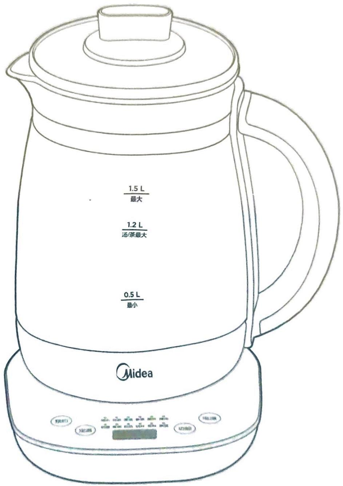

## 安全提示

· 本节描述了安全事项的内容及重要性，以防止对使用者或他人造成人身伤害或财产损失。请在充分理解下面内容的基础上阅读正文，并请务必遵守所描述的安全事项。

· 本产品未考虑无人照看的幼儿和残疾人对产品的使用或幼儿玩耍产品的情况。

\- 禁止让儿童单独操作使用，确保不会将产品当成玩具，要放在婴儿接触不到的地方。

\- 老年人或残障人士以及无使用经验的人应该在监护和指导下使用本产品。

**⚠️ 警告**表示可能会导致死亡或重伤的安全事项

**⚠️ 注意**表示可能会导致轻伤或财产损害的安全事项

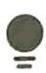

【温馨提示】表示可能影响使用体验的其他事项

## 【警告】重点安全注意事项

禁止将电热水壶、电源线、电源插头或电源底座浸入水中或其它液体中，以免发生危险。

禁止将电源线悬挂于桌边，产品勿接触到高温物体（如炉具）。

禁止使用劣质插排。

▲ 禁止在无人看管的情况下运行本产品。

禁止向电热水壶、底座任何缝隙或开口处插入大头针、铁丝或其它物品，以避免触电伤害。

禁止将壶盖作为安全提手将水壶提起及使用。

▲ 电热水壶应和电源底座配套使用，禁止用其它电源底座配套。

在将电热水壶移开前请先关掉电源开关。

请将电热水壶移离底座后再做加水操作，放置到电源底座前必须擦干电热水壶底部的水迹。

▲ 烧水时，须盖上壶盖，烧水过程中禁止打开壶盖及接触蒸汽，以免烫伤。

如果电热水壶注水太满，沸水可能喷出。产品不能干烧。

▲ 加水 / 不使用 / 清洁 / 移动电热水壶时，必须保证电源是断开的。

▲要单独使用额定电流10A以上，额定电压220V\~带接地线的插座，如果与其它电器合用，插座可能会因发生异常而引起火灾等危险。

## 安全提示 (2)

## 【警告】重点安全注意事项 (2)

如果电源软线损坏，为了避免危险，必须由制造商、其维修部或类似部门的专业人员更换。

▲ 除维修技术人员以外，其他人不得进行拆解、维修，以免造成火灾、触电、受伤。维修时，禁止使用其它外延电源线，且不得使用非本公司指定的零部件。

▲ 清洁电热水壶前请确认电源插头拔离插座，待壶身冷却后进行。

## 【注意】正确使用注意事项

产品必须在平稳台面上使用，不可靠近或置于任何电器上。以免产品损坏或发生意外。

操作时，请使用安全手柄（对有安全手柄的产品）。电热水壶长期不使用时，请将电源线储存在电源底座的藏线槽中（对有藏线槽的产品），或将电源线收纳并储存好。

为延长电热水壶使用寿命，应定期清洁壶内的沉淀物。

如水垢严重，需要重复除垢操作。

长时间不使用，请将电源插头拔离插座，并做好防潮、防尘、防虫保护。

禁止用钢丝球及任何化学的或研磨粉状的清洁剂清洗。

## 【温馨提示】其他安全事项

产品放置的桌台需定时清洁、清理油污。

● 产品与其它厨房电器的最佳距离请保持 30cm 以上。

## 产品底部图标说明

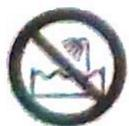

禁止淋浴。

请勿将本产品当作一般垃圾丢弃！用户应在本产品使用期结束后将其和家庭垃圾分开处理；分类收集和处理将有助于节约自然资源与减少环境污染。请依照您所在地区有关废弃电子电器产品的处理方式处理。

## 产品简介

部件展示

● 下图仅供参考，具体以包装箱内实物为准。

壶嘴

滤网

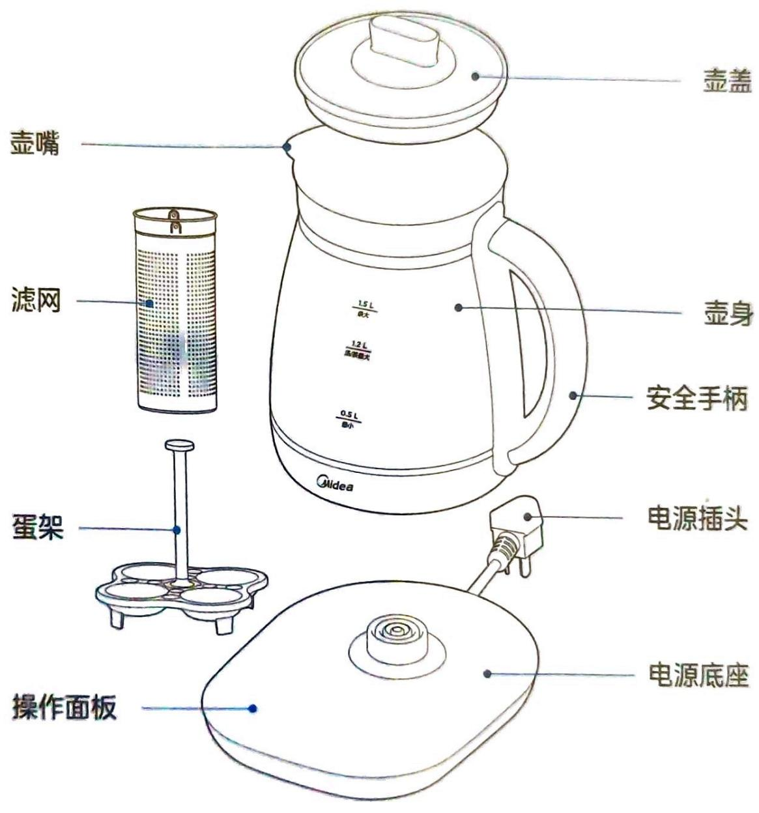

操作面板

壶盖

壶身

安全手柄

电源插头

## 产品参数

<table><tr><td>型号</td><td>额定容量</td><td>额定电压</td><td>额定频率</td><td>额定功率</td></tr><tr><td>MK-YSNC1501</td><td>1.5L</td><td>220V~</td><td>50Hz</td><td>800W</td></tr><tr><td>MK-YSNC1501Pro</td><td>1.5L</td><td>220V~</td><td>50Hz</td><td>800W</td></tr></table>

## 产品简介 (2)

## 操作面板

下图仅供参考，具体以包装箱内实物为准。

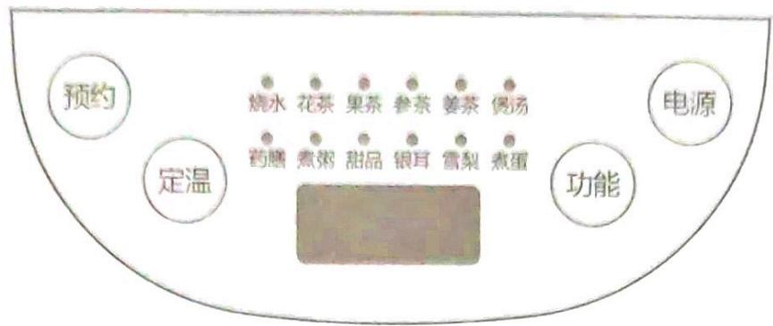

## 产品功能描述

## 待机状态:

· 产品接通电源后长鸣 1 声提示，所有工作指示灯全亮 1 次，然后工作指示灯熄灭，点击【电源】键后，显示屏显示当前水温，此状态为待机状态。

\- 待机状态 30 秒内无操作，产品显示屏熄灭。点击【电源】键可点亮显示屏，产品恢复到待机状态。

## 烹煮功能：

\- 待机状态下，连续点击【功能】键，循环选择烧水、花茶、果茶、参茶、姜茶、煲汤、药膳、煮粥、甜品、银耳、雪梨、煮蛋功能。选定功能后产品响起提示音，并开始选定的烹煮工作。

\- 选定功能后，若未设置预约时间，则进入到工作状态，若设置了预约时间，则进入到预约状态。

## 保温功能：

· 连续点击【定温】键可循环选择保温温度，选定温度后，开始保温工作，保温时间 12 小时。

\- 保温过程中双击【定温】键可切换选定的保温温度，其余工作过程按【定温】键无效。

## 预约功能：

\- 选定烹煮功能或者选定保温温度后，连续点击【预约】键，可以选择预约时间。选定预约时间后，产品进入预约状态。

· 产品在预约结束后同时完成烹煮功能。(烧水功能在预约结束前完成工作)

## 产品简介 (3)

## 产品功能描述 (2)

## 温馨提示：

· 请勿使用“烧水”功能烹煮或再加热养生汤。

\- 预约过程中，食材可能发生变质，请您根据食材特点和环境温度情况，选择合理的预约时间。

· 在工作状态中，按下【电源】键，产品将停止工作，显示屏熄灭。

\- 使用过程中食材和水的总量请勿超过对应最大水位线，否则可能造成溢出，损坏产品。

· 产品工作时，内胆外壁有空气中的水蒸气冷凝起雾均属正常现象，放置一段时间后水雾会自然消失。

\- 第一次使用前或者长时间没有使用后，应加水至最大水位，烧开 1\~2 次，以便清洁壶体内部。此时的开水不宜饮用！

· 熬煮食材过程中不建议加糖，加糖可能造成溢出或糊底。

\- 煮茶或者其它食材时，可能会在壶体底部留下茶垢或者其他痕迹，均属正常现象。

## 双重防干烧功能：

\- 当电热水壶在无水状态下加热时，产品的双重防干烧保护功能将自动停止加热，防止产品损坏。

\- 当出现上述情况时，请将电源插头从插座中拔出，待产品自然冷却后（约10分钟）才能正常使用。请勿直接使用冷水来冷却，以免降低发热系统使用寿命。

## 滤网安装操作步骤

如下图所示，将滤网对准壶盖内侧卡扣处，向上推即可安装滤网

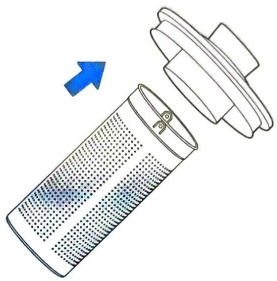

## 烹煮操作步骤

1 把壶身移离电源底座。打开壶盖，往水壶内加入清水和食材

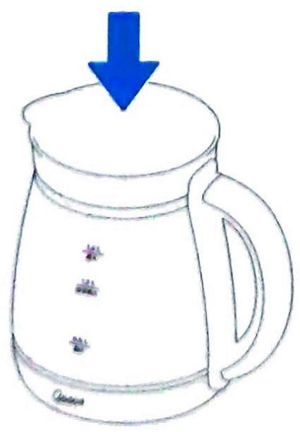

2 盖好壶盖，将壶身放在电源底座上。底座接通电源

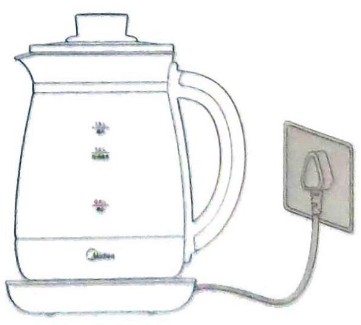

## 烹煮操作步骤 (2)

3 点击【电源】键, 产品进入待机状态

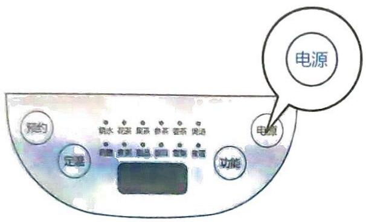

4 连续点击【功能】键，选择所需的功能档位，完成后进入保温状态

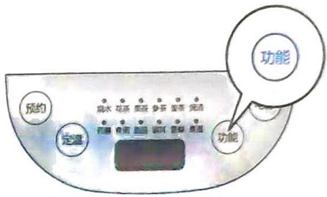

## 食谱推荐

<table><tr><td>功能</td><td>食谱名称</td><td>食材配方</td></tr><tr><td>花茶</td><td>枸杞菊花茶</td><td>菊花 5g、枸杞 10g</td></tr><tr><td>果茶</td><td>柠檬茶</td><td>柠檬 10g(干柠檬片)</td></tr><tr><td>甜品</td><td>莲子百合汤</td><td>莲子 30g、百合 10g、红枣 20g、冰糖 10g</td></tr><tr><td>银耳</td><td>银耳羹</td><td>银耳(鲜)70g、枸杞 5g (若使用干银耳,需提前用清水浸泡6-8小时)</td></tr><tr><td>参茶</td><td>人参大枣茶</td><td>红枣 16 颗、党参 6g、生姜 5g、蜂蜜 5g</td></tr><tr><td>姜茶</td><td>红糖姜茶</td><td>生姜 50g (切片)、红糖 30g</td></tr><tr><td>雪梨</td><td>冰糖炖雪梨</td><td>雪梨 150g (切片)、冰糖 20g</td></tr><tr><td>煲汤</td><td>山药炖鸡汤</td><td>鸡腿 100g、山药 20g、食盐适量</td></tr><tr><td>药膳</td><td>党参茶</td><td>党参10g、红枣15颗、红茶5g、五味子20g、干桂圆肉5g</td></tr><tr><td>煮粥</td><td>煮粥</td><td>大米 60g</td></tr></table>

<table><tr><td colspan="3">功能熬煮时间及水量参照</td></tr><tr><td>功能</td><td>熬煮时间(分钟)</td><td>额定水量(L)</td></tr><tr><td>烧水</td><td>--</td><td>1.5L</td></tr><tr><td>花茶</td><td>25</td><td>1.2L</td></tr><tr><td>果茶</td><td>30</td><td>1.2L</td></tr><tr><td>甜品</td><td>80</td><td>1.2L</td></tr><tr><td>银耳</td><td>80</td><td>1.2L</td></tr><tr><td>参茶</td><td>25</td><td>1.2L</td></tr><tr><td>姜茶</td><td>40</td><td>1.2L</td></tr><tr><td>雪梨</td><td>75</td><td>1.2L</td></tr><tr><td>煲汤</td><td>90</td><td>1.2L</td></tr><tr><td>药膳</td><td>85</td><td>1.2L</td></tr><tr><td>煮粥</td><td>120</td><td>1.2L</td></tr><tr><td>煮蛋</td><td>--</td><td>不低于0.5L</td></tr></table>

## 清洁保养

## 注意事项

清洁前请确认电源插头拔离插座，待壶身冷却后进行。为延长电热水壶使用寿命，应定期清洁壶内的沉淀物。如水垢严重，请重复除垢操作。长时间不使用，请将电源插头拔离插座，并做好防潮、防尘、防虫保护。切勿用钢丝球及任何化学的或研磨粉状的清洁剂清洗。

1 断开电源，向水壶加入除垢剂和清水。

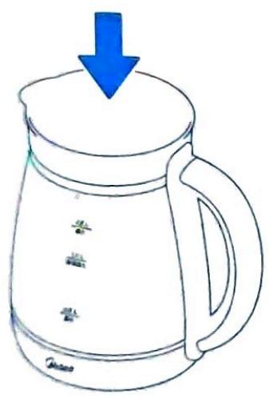

3 静置一段时间后倒掉除垢剂溶液。

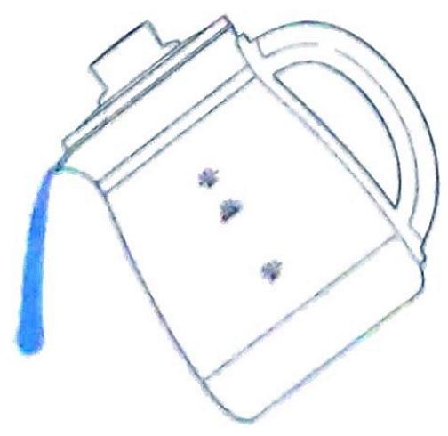

2 接通电源，选择开水功能，将除垢剂溶液烧开。

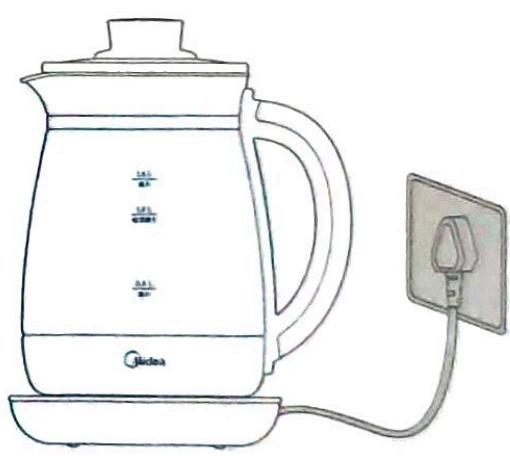

4 用清水将内胆冲洗干净，并用干净的软布擦干。

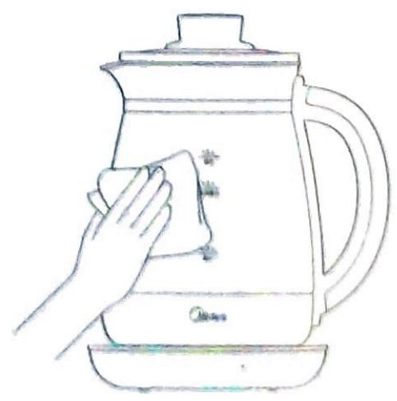

## 服务指南

<table><tr><td colspan="3">异常现象解决方法</td></tr><tr><td>异常现象</td><td>可能的原因</td><td>处理方法</td></tr><tr><td rowspan="2">指示灯不亮</td><td>插头未插好</td><td>检查电源插头是否插好</td></tr><tr><td>灯线故障</td><td>送售后服务点检修</td></tr><tr><td rowspan="3">不加热</td><td>开关按钮未按到位</td><td>送售后服务点检修</td></tr><tr><td>发热管故障</td><td>送售后服务点检修</td></tr><tr><td>温控器故障</td><td>送售后服务点检修</td></tr><tr><td rowspan="2">烧水加热慢</td><td>壶底水垢严重</td><td>按除垢步骤清洁水垢</td></tr><tr><td>机器自身故障</td><td>送售后服务点检修</td></tr></table>

显示屏异常显示解决方法

<table><tr><td>异常显示</td><td>可能的原因</td><td>处理方法</td></tr><tr><td>---</td><td>传感器开路</td><td>提壶重新放置或送售后维修</td></tr><tr><td>C1</td><td>传感器检测温度大于120°C</td><td>冷却重新上电或者送售后维修</td></tr><tr><td>E0</td><td>过零异常</td><td>重新上电或者送售后维修</td></tr><tr><td>E2</td><td>传感器短路</td><td>重新上电或送售后维修</td></tr></table>

当显示屏出现异常显示时，可用以上列表进行判断和处理。若问题无法解决，可联系售后服务进行维修

## 服务指南 (2)

<table><tr><td colspan="7">环保清单 产品中有毒有害物质或元素的名称及含量</td></tr><tr><td rowspan="2">部件名称</td><td colspan="6">有毒有害物质或元素</td></tr><tr><td>铅(Pb)</td><td>汞(Hg)</td><td>镉(Cd)</td><td>六价铬 (Cr(VI))</td><td>多溴联苯 (PBB)</td><td>多溴二苯醚(PBDE)</td></tr><tr><td>壶盖组件</td><td>○</td><td>○</td><td>○</td><td>○</td><td>○</td><td>○</td></tr><tr><td>玻璃壶身</td><td>○</td><td>○</td><td>○</td><td>○</td><td>○</td><td>○</td></tr><tr><td>手柄组件</td><td>○</td><td>○</td><td>○</td><td>○</td><td>○</td><td>○</td></tr><tr><td>发热盘组件</td><td>○</td><td>○</td><td>○</td><td>○</td><td>○</td><td>○</td></tr><tr><td>底盖</td><td>○</td><td>○</td><td>○</td><td>○</td><td>○</td><td>○</td></tr><tr><td>底座组件</td><td>○</td><td>○</td><td>○</td><td>○</td><td>○</td><td>○</td></tr><tr><td>蒸笼</td><td>○</td><td>○</td><td>○</td><td>○</td><td>○</td><td>○</td></tr><tr><td>滤网</td><td>○</td><td>○</td><td>○</td><td>○</td><td>○</td><td>○</td></tr><tr><td>炖盅</td><td>○</td><td>○</td><td>○</td><td>○</td><td>○</td><td>○</td></tr><tr><td>蛋架</td><td>○</td><td>○</td><td>○</td><td>○</td><td>○</td><td>○</td></tr><tr><td>紧固件</td><td>X</td><td>○</td><td>○</td><td>X</td><td>○</td><td>○</td></tr><tr><td>电源线组件</td><td>X</td><td>○</td><td>○</td><td>○</td><td>X</td><td>X</td></tr><tr><td>PCB组件</td><td>X</td><td>○</td><td>○</td><td>○</td><td>X</td><td>X</td></tr></table>

## 产品合格证

检查结论：合格

检查员号： 检验员A1

检查日期： 见生产批号

广东美的生活电器制造有限公司

生产日期见生产批号前6位（年/月/日）

## 声明

本资料上所有内容均经过认真核对，如有任何印刷错漏或内容上的误解，可向本公司咨询。产品若有技术改进，会编进新版说明书中，恕不另行通知。产品外观、颜色如有改动，以实物为准。

产品执行标准：GB4706.1-2005

GB4706.19-2008

## 以换代修原则

4、产品被拆卸过：购买的产品被未被授权服务商或用户等人拆卸过；  
5、非家庭用户：本服务只针对个人及家庭用户，商用产品/工程类/团购礼品类产品不享受以换代修服务。

有效发票、电商产品签收记录、连锁超市购物小票、美云销用户销售单、以换代修金卡等可查实凭证。无以上有效凭证，按产品出厂日期延后六个月作为购买时间点，开始计算365天以换代修时间。

## 有效凭证

2021年1月1日后购买的美的生活家电正常使用一年内出现性能故障(非人为因素导致)，经授权服务商/电商客服鉴定属实，凭有效凭证直接以换代修。

## 服务内容