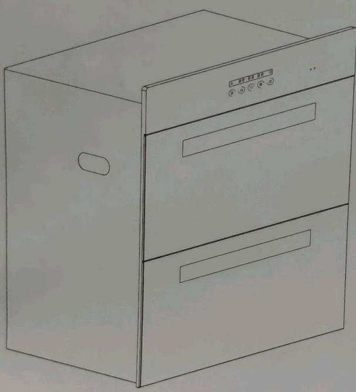

ZTD100C-817

食具消毒柜

使用产品前请仔细阅读本使用说明书，并妥善保管

本产品执行标准 GB 17988 GB 4706.1

老板厨房电器 为世界构建更多幸福的家

## 目录

安全注意事项....1
重要信息....3
主要技术参数....4
产品结构示意图....4
使用说明....5
安装方法....7
常见故障识别与处理....8
清洁保养注意事项....3
装箱单....9
电气接线图....9
回收处理提示性说明....10
客户服务....11
全国电码电话防伪查询使用说明....12
产品包修卡....13

★生产企业卫生许可证号：浙卫消证字(2012)第0049号

承蒙您的厚爱，购买了老板食具消毒柜，借此机会，向您表示深深的谢意。

在使用本产品前，请您仔细阅读本说明书，并妥善保存，以备将来参考。

\*本说明书中的图片为示意图，仅供参考，若图片与实物不符，以实物为准。本公司产品外观结构不断改进，对于产品改进所引起的内容更改，恕不另行通知。

## 安全注意事项

为了避免给使用者及其他人员造成危害或者财产损害，特作如下区分及标志。均为有关安全的重要事项，敬请严格遵守，并在充分理解内容的基础上正确使用。

## 根据危害、损害程度进行的内容区分

<table><tr><td colspan="2">危险</td><td>若忽视这一标志,并进行错误操作,极有可能导致人员危险、重伤或引起火灾。</td></tr><tr><td></td><td>警告</td><td>若忽视这一标志,并进行错误操作,有可能导致人员危险、重伤或引起火灾。</td></tr><tr><td>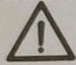</td><td>注意</td><td>若忽视这一标志,并进行错误操作,有可能导致人员受伤或造成物品的损害。</td></tr></table>

## 注意、禁止内容的图标

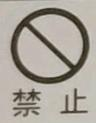  
禁止明火

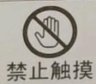  
禁止用潮湿的手操作

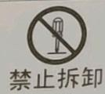  
禁止拆卸

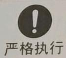  
严格执行

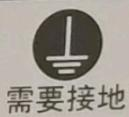  
需要接地

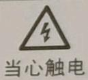

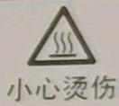

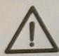

警告 请严格按照本说明书规定使用，由于本产品使用不当造成的任何财产损失、人身损害本公司不承担责任。

**🚨 危险**

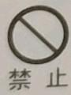

请不要让儿童、幼儿及无人监护的体弱者单独使用消毒柜，否则有可能导致触电或其他意外伤害。

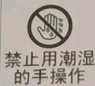

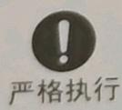

下层碗架上切勿放入塑料等不耐高温材料的食具，以防止底部工作中的红外线灯管加热温度过高而造成食具损坏或自燃。

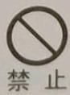

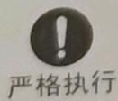

在使用过程中发现可以不经过任何透光体（如玻璃等）直接看到紫外线灯管发出的光线时，应马上停止使用，并通知专业人员维修。

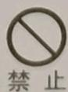

请不要用潮湿的手触摸电源插头、电器部件以及操作电源开关，否则易发生触电事故。

请不要对电源线进行改制、拉伸、结扣以及施加重物、挤压等，否则易导致电源线破损而发生触电和火灾事故。

禁止私自改动消毒柜内部布线；否则有可能会发生异常动作导致人体受伤；修理不妥还可能发生触电、火灾等危险。

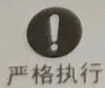

在消毒柜清洗、提供安装或维修服务之前，必须切断电源，以免触电。

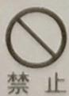  
禁止

严禁在无保护条件下，直视正在工作中的紫外线灯管，以免人身受到伤害。

**⚠️ 警告**

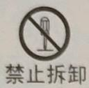

非专业人员不得擅自拆机修理或更换零件。

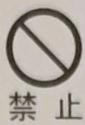

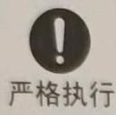

“如果电源软线损坏，为了避免危险，必须由制造商、其维修部或类似部门的专业人员更换。”

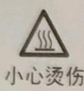

消毒柜在使用工作中和工作结束后，切勿打开柜门。在消毒柜工作结束10分钟后，才能把门打开，以免臭氧泄漏或烫伤。

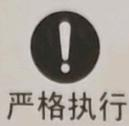

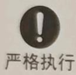

关好门后，才能使消毒柜工作，否则会有臭氧泄漏或紫外线辐射。

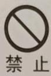

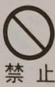

在使用过程中，如发现臭氧泄漏（腥臭味），应马上停止使用，由专业人员维修。

清洗时必须切断电源，请不要将消毒柜浸泡在水中或对其喷、洒水，否则有短路或触电的危险。

本产品设有制动门锁装置，消毒柜工作中柜门已被自锁。请勿用蛮力打开柜门，若用蛮力打开将造成产品永久性损坏。

请不要使用松动或接触不良的电源插座。否则易导致触电、短路、起火。

**📌 注意**

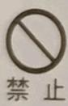

不能将毛巾、鞋等非食具放入柜内。

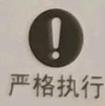

消毒柜清洗时，请注意使用中性清洗剂和柔软抹布擦洗，防止表面褪色或划伤。

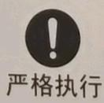

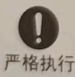

本产品为嵌入式安装方式。消毒柜应平稳、牢固安装在干燥、通风、周围无腐蚀性及有害气体的环境中，不得倾斜安置。

把食具上的水倒净后才能放入柜内。

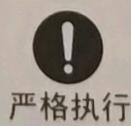

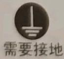

插座必须有可靠的接地线，以确保使用安全。

食具放置不得超出规定承载量。食具在碗架上应逐格竖放，不宜重叠放置，食具之间要留一定的空隙，这样消毒效果更佳及更有利于食具消毒与烘干。

消毒柜工作中遇突然断电时，请不要打开柜门，应待供电恢复正常并重新开启消毒柜完成整个消毒周期方可打开。

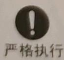

严格执行

若紫外线灯管损坏，必须更换相同功率和波长的紫外线光管。

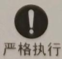

消毒柜安装远离热源，燃气等易燃品，尽可能避免安装在灶具下方。

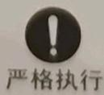

拔出插座上的插头时，必须手握插头的端部拔出，请不要手拿电源线拔插头，否则易导致触电、短路、起火等事故。

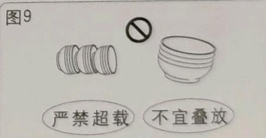

**📌 注意**

## 严格执行

对疑似病毒污染的食饮具，消毒前应先彻底清洗，将食饮具正面朝上平放于碗架上消毒150分钟，然后将食饮具另一面朝上平放于碗架上消毒150分钟，进行二次消毒即可。

## 严格执行

存放食具时，不能长时间停机，需2-3天开机消毒、烘干一次，以防霉菌生长。

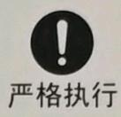

图1

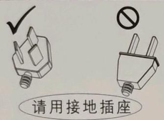

请用接地插座

图2

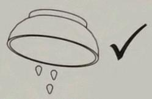

倒净水

图4

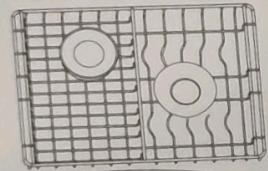

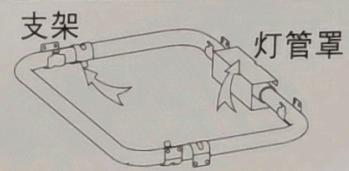

对疑似病毒污染后食具放法

按箭头方向着力，翻开灯管罩，拔出灯管插脚，再翻开支架，取出灯管。

图7

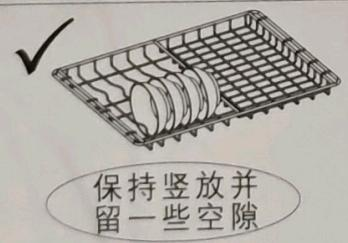

保持竖放并留一些空隙

图8

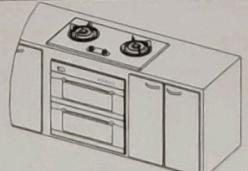

若这样安装时，在灶具与消毒柜之间隔置防火板，以免灶具热量传导

## 重要信息

请单独使用额定电流10A或以上的插座。交流电压必须在187-242V之间，否则会导致消毒柜无法正常使用或其它意外情况。

控制按键操作时，应注意留有1秒以上的操作间隔时间，用以延长整机寿命。

图3

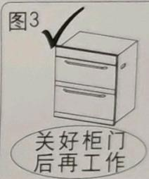

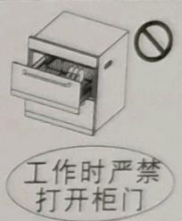

图6

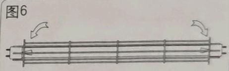

按箭头方向着力，向外取出灯罩旋转灯管90°，并取出灯管。

图9

严禁超载 不宜叠放

## 新消毒柜的包装

请以环保的态度处置这些包装材料，以保持一个良好的环境。

请勿让儿童玩耍塑料薄膜和包装箱，这可能会产生窒息事故，所以请让包装材料远离儿童，包装材料不是玩具。

## 主要技术参数

<table><tr><td>型号</td><td>ZTD100C-817</td></tr><tr><td>电源电压</td><td>220V~(50Hz)</td></tr><tr><td>额定功率</td><td>320W</td></tr><tr><td>容积</td><td>100L (-5%)</td></tr><tr><td>承载量</td><td>上层: 6kg、下层: 8kg</td></tr><tr><td>消毒方式</td><td>臭氧+紫外线</td></tr><tr><td>臭氧浓度</td><td>≥40mg/m³</td></tr><tr><td>消毒级数</td><td>二星级</td></tr><tr><td>烘干方式</td><td>红外线加热</td></tr><tr><td>烘干温度</td><td>平均温度≤70°C</td></tr><tr><td>紫外线灯管(高臭氧)</td><td>功率: 45W、主波长: 253.7nm、使用寿命: ≥5000h</td></tr><tr><td>净重</td><td>27kg</td></tr><tr><td>外形尺寸</td><td>(宽595×高595×深420)mm</td></tr></table>

## 消毒原理及性能特点

采用紫外线灯管产生的高浓度臭氧和紫外线光子的能量，结合热力作用进行杀菌；可杀灭大肠杆菌、脊髓灰质炎病毒，达到GB 17988规定二星级消毒效果。

## 使用范围

适用于家庭食饮具的消毒。

产品结构示意图  
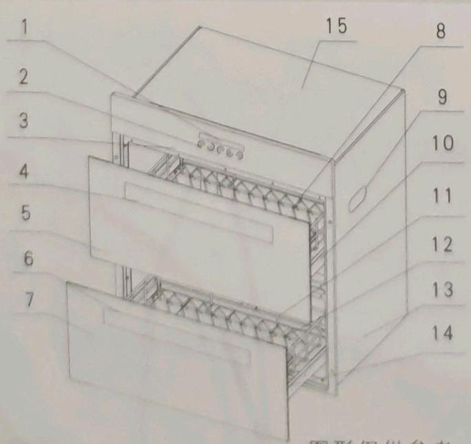

1. 显示区

2. 按键区

3. 控制面板

5. 上门板

6. 下拉手

7. 下门板

8. 上碗架

10.上抽屉架

11. 远红外灯管

14. 下抽屉架

图形仅供参考，具体以实物为准。

## 消毒柜操作步骤

## 1. 开门

柜门只能自然拉开到最大行程后，有定位卡挡，不能用力拉门，以免损坏门体。（使用前去除碗架与抽屉架上的扎带；然后检查内腔内壁、灯罩、门体上是否有保护膜，若有则必须去除清理干净。）

## 2. 放置食具

食具放置时尽量采用竖放，根据食具规格大小放置在碗架不同的区域中，放置时不要重叠堆放并按碗架设计间隔排列，以保证消毒效果；食具不能竖放时可采用平放，但不宜堆叠，否则会影响消毒效果。

注意：将食具洗净沥水后才能放入柜内碗架上，无需擦干，因食具表面水分与臭氧消毒因子结合更具穿透力，杀菌效果更好。

## 3. 关门

放置食具后，把门推入关紧，并检查柜门是否关好。

## 4. 启动功能

控制面板操作说明

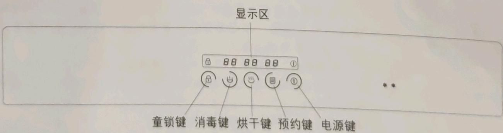

显示区：显示用户设置的工作时间和消毒柜当前工作状态。

电源键：启动或停止消毒柜工作电源。

预约键：设定预约自动消毒功能。

烘干键：启动烘干功能。

消毒键：启动消毒功能。

童锁键：锁定或解锁按键操作功能。

注：本产品装有制动锁开关，在消毒工作过程中会锁紧抽屉柜门，在此种状态下，请勿用蛮力打开，如用蛮力打开将造成产品永久性损坏。

## 功能设置说明

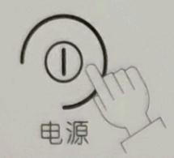

▲通电后按 **电源键**开机，处于待工作状态下，显示屏对应上方图案发亮，此时可进行功能设定，10分钟内无选定工作，将自动关机。在消毒或烘干过程中（无童锁保护状态下），按 **此键**可结束当前工作。

▲本机具有定时预约消毒操作功能，如果您需要外出时，可以选择此项操作，可预先设置时间对食具进行消毒，操作如下：

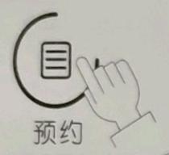

按 **预约键**，对应上方图案显示01，重复按 **此键**选择01到24小时，长按 **此键**进行快速调整，设定完成后预约功能生效，整个消毒过程为150分钟，即消毒70分钟→烘干80分钟，对应数字发亮（在运行过程中按 **此键**可取消预约功能），工作完成后自动关机。

▲当您希望对食具进行烘干时，请使用此功能，此功能以远红外灯管进行烘干。具体操作如下：

按 **烘干键**，对应的上方显示80分钟模式，重复按 **烘干键**，可选择80分钟、60分钟模式，设定完成后进入烘干工作（运行过程中按 **电源键**可取消烘干工作）。

▲当您希望对食具进行消毒时，请使用此功能，它以臭氧和紫外线进行食具消毒，结合远红外灯管加热进行烘干，整个消毒过程为150分钟。具体操作如下：

按 **消毒键**，对应的上方显示70分钟模式，同时烘干上显示80分钟模式。设置完成后自动进入消毒/烘干工作（运行过程中按 **电源键**可取消设定工作）。

设定模式为：消毒70分钟→烘干80分钟

▲当您希望消毒柜在工作过程中不被误操作或被儿童乱按 **功能键**导致错误，避免发生危害身体，这时您可使用童锁键，具体操作如下：

按 **童锁键**，童锁功能启动对应上方图案发亮，此时其它功能键的任何操作全失效，长按 **童锁键**可取消此功能。

若紧急情况下需要打开消毒柜时，无童锁保护状态下，可按 **电源键**结束工作，柜门锁已打开。（此过程有臭氧泄漏或受内腔中物体温度较高影响，会对人体产生伤害，请慎用。）

## 安装说明

## 电源要求：

◆对于永久性安装，电路必须装有相应的切断及保护装置，连接电源插头和插座应为同一个型号并符合当地相关规定；

◆电源线接插必须方便，确保消毒柜安装后可随时断开电源。单独使用10A或以上的插座，请勿与几个电器同时使用同一个电源插座，并确保插座安全有效接地；

◆周边若有其他电器，请确保安装距离大于100mm。

安装要求：

◆消毒柜应平稳安装在操作、保养方便且牢固的地方，不得倾斜安置；

◆禁止把消毒柜及电源插座安装在可能受潮或容易被水淋湿的地方；

◆搬运放置时应从拉手孔或底部抬起，轻搬轻放，切不可通过直接拖拉柜门或拉手来移动消毒柜；
◆安装前去除消毒柜的外包装和保护膜，试机时去除碗架和抽屉架上的扎带；

◆安装时在消毒柜上部留出80mm距离以上的空间，橱柜安装孔底部必须坚固，应能承受50kg以上的重量。

在橱柜的设定位置上，按下面安装图示(单位为mm)设定方孔，将消毒柜平稳嵌入该方孔，然后用随机配备的安装螺钉把消毒柜固定，具体开孔尺寸见下表：

<table><tr><td colspan="2">序号\名称</td><td>A</td><td>B</td><td>C</td></tr><tr><td>1</td><td>全嵌开孔尺寸(宽×高×深)</td><td>600</td><td>600</td><td>500</td></tr><tr><td>2</td><td>半嵌开孔尺寸(宽×高×深)</td><td>565</td><td>594</td><td>500</td></tr></table>

全嵌开孔尺寸安装图示1

  
半嵌开孔尺寸安装图示2

## 常见故障识别与处理

<table><tr><td>故障现象</td><td>原因</td><td>检查或处理方法</td></tr><tr><td>按 **电源键**,显示屏不显示</td><td>未接通电源;电源插头是否插好</td><td>待通电后使用;插好电源插头</td></tr><tr><td>功能差错</td><td>设定状态不正确</td><td>重新正确设定</td></tr><tr><td>试机时,按 **消毒键**闻不到臭氧味</td><td>紫外线灯管未旋转到位门控开关未接通</td><td>检查灯管是否旋转到位检查柜门是否关好</td></tr><tr><td>试机时,按 **烘干键**内腔内无热量</td><td>门控开关未接通</td><td>打开柜门,按下门控开关看红外线灯管是否发红</td></tr><tr><td>若显示屏中显示E1</td><td>抽屉门没关好门控开关未接通</td><td>检查柜门是否关好</td></tr><tr><td>若显示屏中显示E3</td><td>紫外线灯管未接通传感器不良</td><td>检查柜门是否关好通知售后服务处理</td></tr></table>

警告 当上述简易故障排除后，消毒柜仍无法正常工作，请与本公司当地售后服务中心联系维修。

为保障安全和正确使用本产品，必须由本公司指派的专业人员进行维修。若因消费者委托非本公司维修人员或自行维修，而导致产品不能正常使用的，在包修期内不属于免费维修范围，由此造成的财产损失、人身伤害，本公司亦不承担任何责任。

## 清洁保养注意事项

◆清洁消毒柜时，先拔掉电源插头，待机体内部完全冷却后进行清洁保养。

清洁消毒柜时，先搅拌电源插头，将机体内擦到。清洁时请使用中性洗涤剂，请勿使用有机溶剂、硬刷等清洗，需用软洁布擦拭去污。

◆清洁时请使用中性洗涤剂，请勿使用有机溶剂、硬刷等清洗，需用软洁布擦刺。  
◆需要清洗消毒柜内腔和碗架时，先拿出碗架用水冲洗或擦拭干净，再用软洁布轻擦内腔表面污痕。

◆灯管严禁浸水，进水。
◆首次使用时，为防止柜内产生异味，建议空载使用一个消毒或烘干周期，待冷却后放入食具消毒或烘干，这样使用效果更好。

◆必须及时把内腔底部中的积水清理干净，防止溢漏。

◆建议每周定期清洁保养，长期不用，应拔下电源插头。

装箱单

<table><tr><td>序号</td><td>附件名称</td><td>数量</td></tr><tr><td>1</td><td>食具消毒柜</td><td>1台</td></tr><tr><td>2</td><td>使用说明书</td><td>1份</td></tr><tr><td>3</td><td>木螺钉</td><td>4颗</td></tr></table>

注意：请您开箱后逐一检查以上附件是否齐全，若有缺少或损坏：属本公司或销售责任的请与销售商联系处理；属用户自行责任的，请就近与本公司当地售后服务中心联系。

电气接线图  

## 回收处理提示性说明

本产品超过使用期限或者经过维修无法正常工作后，不应随意丢弃，请交由有废弃电器电子产品处理资格的企业处理，正确的处理方法请查阅国家或当地有关废弃电器电子产品处理的规定。

食具消毒柜中有害物质的名称及含量

<table><tr><td rowspan="2">部件名称</td><td colspan="6">有害物质</td></tr><tr><td>铅(Pb)</td><td>汞(Hg)</td><td>镉(Cd)</td><td>六价铬(Cr(VI))</td><td>多溴联苯(PBB)</td><td>多溴二苯醚(PBDE)</td></tr><tr><td>控制器件(PCB板、温控器等)</td><td>×</td><td>○</td><td>○</td><td>○</td><td>○</td><td>○</td></tr><tr><td>电气件(风机、电磁锁、紫外线杀菌灯等)</td><td>×</td><td>○</td><td>×</td><td>○</td><td>○</td><td>○</td></tr><tr><td>线材(电源线、连接线等)</td><td>○</td><td>○</td><td>○</td><td>○</td><td>○</td><td>○</td></tr><tr><td>金属结构件(外壳板、内胆等)</td><td>○</td><td>○</td><td>○</td><td>○</td><td>○</td><td>○</td></tr><tr><td>内饰件(碗架、滑轨、抽屉架等)</td><td>○</td><td>○</td><td>○</td><td>○</td><td>○</td><td>○</td></tr><tr><td>塑料件(拉手、门封条等)</td><td>○</td><td>○</td><td>○</td><td>○</td><td>○</td><td>○</td></tr><tr><td>玻璃</td><td>○</td><td>○</td><td>○</td><td>○</td><td>○</td><td>○</td></tr><tr><td>螺钉及螺母</td><td>○</td><td>○</td><td>○</td><td>○</td><td>○</td><td>○</td></tr><tr><td>保温层*</td><td>○</td><td>○</td><td>○</td><td>○</td><td>○</td><td>○</td></tr><tr><td>照明灯*</td><td>○</td><td>○</td><td>○</td><td>○</td><td>○</td><td>○</td></tr><tr><td>铝合金拉手*</td><td>○</td><td>○</td><td>○</td><td>○</td><td>○</td><td>○</td></tr></table>

本表格依据SJ/T 11364的规定编制。  
○：表示该有害物质在该部件所有均质材料中的含量均在GB/T 26572规定的限量要求以下。  
X: 表示该有害物质至少在该部件的某一均质材料中的含量超出GB/T 26572规定的限量要求。  
\* 表示仅部分型号的消毒柜产品含该部件。  
本产品在说明书所述的正常情况下使用时的“环保使用期限”为15年，该期限引用自中国家用电器协会《关于家用电器环保使用期限的指导意见》。

## 客户服务

尊敬的客户，您好：

感谢您使用我们的产品，我公司将依据《中华人民共和国消费者权益保护法》，《中华人民共和国产品质量法》以及《部分商品修理更换退货责任规定》的有关规定，凭包修卡及有效发票为您提供下列服务：

## 一、整机三包有效期一年，主要部件（电子开关、加热盘、温控、感温探头）三包有效期三年。

1、包修期内外的确定应以用户购机销售凭证的日期为准，如用户丢失凭证的，则以产品编号的生产日期顺延30天为起始日期推算保修期限。

## 二、下列情况不属于包修范围：

1、消费者因使用、维护、保管不当造成损坏的；

2、自行或非厂方特约维修人员拆修的；

3、无包修凭证及有效发票的；

4、产品条码缺损或三包凭证型号与维修产品型号不符或者涂改的；

5、因自然灾害等不可抗拒力造成损坏的；

6、由于产品使用环境条件，例如：电源、水源、温度、湿度等非本公司所能控制的因素引起的一切损坏及损失。

的一切损坏及损失。
注：1、商用、公司集体使用等非家庭使用的产品，整机及主要部件包修三个月。

2、如需延长包修期，以本公司服务政策为准。

## 三、退换机规定（根据国家新三包）

1、自售出之日起7日内，发生性能故障，可以选择退货、换货或修理。

1、自售出之日起7日内，发生性能故障。2、自售出之日起15日内，发生性能故障，可选择换货或者修理。

2、自售出之日起15日内，发生性能故障，可避免使用。
3、三包有效期内，发生同一性能故障，修理两次以上，仍不能正常使用的产品，可免费调换同规格的产品。

备注：
1、性能故障：指对产品的安全性能故障和使用性能故障进行的修理，不包括对其它质量问题的修理或上门。

2、产品退换货时，如符合收取折旧费条件，折旧费的收取费用计算公式为：折旧费 = （购机时间—待修时间）×日折旧率×购机价格。

## 客户服务热线：

特别提醒：全国统一客户服务热线：95105855（未开通地区请拨打：0571-86281080）

注：1. 对各地服务有意见和建议也可直接向我公司客户服务中心反馈。

2. 客户服务中心地址：杭州余杭区余杭经济开发区临平大道592号，服务传真：0571—86281293 邮编：311100 网站地址：www.robam.com