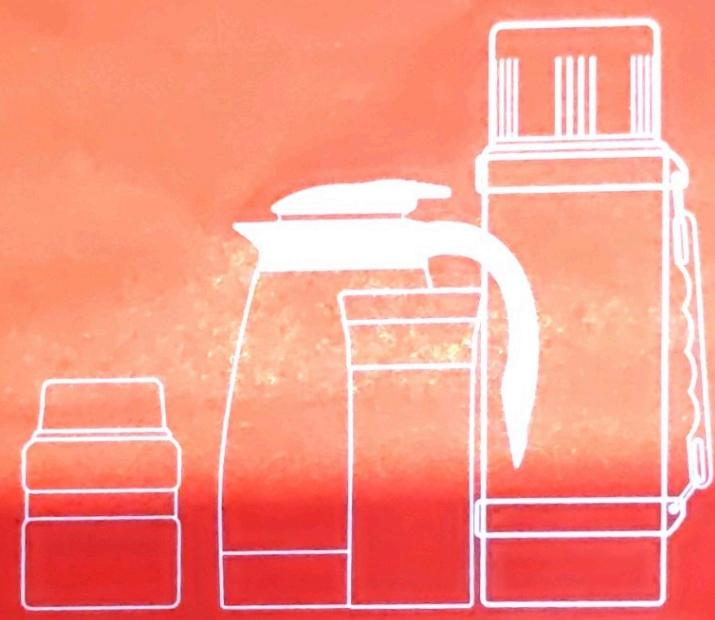
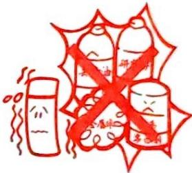

高真空不锈钢保温杯/瓶/壶/罐系列说明书
VACUUM INSULATION STAINLESS STEEL MUG/BOTTLE/POT/JAR MANUAL

感谢您选购膳魔师真空保温杯/瓶/壶/罐。使用前请仔细阅读使用说明书，并将其妥善保管，以便在使用中有任何疑问可作为参考之用。Thank you for purchasing "THERMOS" product. Please read this instruction manual carefully before use, and then keep it in right place for further review.

## 注意事项

① 材质、使用性能等相关信息详见彩盒。

Materials, degrees and other information are detailed in color boxes.

② 请勿使用于保温（保冷）以外的用途。

This THERMOS product is only designed for storing hot or cold liquid, not recommended for other usage.

禁止 PROHIBITION

③ 当装有饮品时，请将产品放置于婴幼儿触摸不到的地方，以免烫伤或碰伤。

Keep out of children's reach when product contains hot liquid to prevent scalding.

禁止 PROHIBITION

4 请勿将产品置于高温物品旁，以免产品变形，变色，烤漆脱落等不良。

Do not put this product beside the goods with high temperature to avoid being deformed, changing color or falling off paint.

禁止 PROHIBITION

⑤ 加入热饮时不宜过满，以免溢出烫伤。

Be caution not to overfill to prevent scalding by hot liquid.

禁止 PROHIBITION

6 当装有热水时，请小心饮用，以免导致烫伤。

Please drink gently to prevent scalding.

禁止 PROHIBITION

⑦ 请勿把瓶塞置于滚烫的沸水中，以免造成变形或漏水。

Do not put Lid/Spout into boiling water, which will lead to deformation or leak.

禁止 PROHIBITION

⑧ 清洗后请确认硅胶圈是否正确安装，安装错误会导致漏水，甚至烫伤。

Please make sure the gaskets are in right position after cleaning, otherwise, it will lead to scald and leak.

9 请勿使用研磨粉、金属清洁球、去渍油或含有氯的清洁剂等以免导致产品表面刮伤、生锈或腐蚀。

Do not use abrasive cleansers, pot scourer, cleaning naphtha or bleach containing chlorine since they may scratch or dull the finish

禁止 PROHIBITION

10 请避免产品掉落或受巨大撞击，以免表面凹陷而导致保温不良。

To prevent dent and maintain good thermal efficiency, do not drop or knock against hard object, which will dent and degrade vacuum thermal rentention efficiency.

禁止 PROHIBITION

11 如果您所购买的产品只适用于保冷,请不要加入热水保温,以免导致烫伤。

Be caution not to fill with hot liquid inside cold liquid only product to prevent scalding.

⑫ 若放入含盐分的食物及汤品，请于12小时内取出，并将产品洗干净。

Foods or soups containing salt ingredient could not be kept into THERMOS product more than 12 hours, and remember to clean the product completely after each use.

13 禁止装入以下各项东西：

\- 干冰，碳酸饮料（避免内压上升，导致瓶塞无法打开或内容物喷出等危险）

\- 酸梅汁，柠檬汁等酸性饮料（可能会造成保温不良）

\- 牛奶，乳制品，果汁，婴幼儿食品等（放置时间过长可能会腐败）

Do not store the following items in this THERMOS product.

\- Dry ice and carbonated beverage. It can cause pressure inside the container to build, possibly leading to the foreful ejection of the stopper or contents.

\- Sweet-sour plum juice, lemon juice or any other acid beverage as it may degrade vacuum thermal efficiency.

\- Milk, dairy, fruit juice, infant foods should not be left in product for long time, they may start to spoil sooner.

禁止 PROHIBITION

14 禁止放入烤箱、微波炉、洗碗机和烘碗机等电器产品内使用。

Do not place this product in oven, microwave oven, dish-washing machine, dish drier etc.

禁止 PROHIBITION

## 使用方法

※为了达到最佳保温效果，使用前请先加入少量热水（冰水）预热（预冷）。加入热水（冰水）后，关紧瓶塞和上盖，放置30秒到1分钟后再将水倒出，即可正常使用。

※ For maximum thermal efficiency, please preheat or prechill the product prior to use about 30 seconds to 1 minute.

## 清洗方法

※ 请使用蘸有中性清洗剂的软布或润湿的海绵擦拭产品表面。

※ Rinse a soft cloth or sponge with natural detergent to wipe the surface.

※ 在每次使用前后都必须将产品彻底清洗干净。

※ Clean all parts thoroughly before and after every use.

## 保修说明

自购买日起，产品本体部分质保两年，塑料以及硅胶等配件部分质保一年。质保期内对产品本身的质量问题（不可抗力除外）本公司将给予免费维修或更换；超过质保期限的本公司将酌情收取维修费。

THERMOS will provide the warranty for two years of the product body part and the warranty for one year of plastic and silicone accessories from the date of purchase. The company will provide free maintenance or replacement in the quality of the warranty period (except for the event of force majeure). And the company will charge maintenance fees as appropriate if exceed warranty period.

## 销售处及制造商

### 上海分公司

膳魔师(中国)家庭制品有限公司上海分公司

联系地址：上海市黄浦区淮海中路138号上海广场1105室

联系电话：021-61672188

### 北京分公司

联系地址：北京市朝阳区东四环中路62号D座（远洋国际中心）804室

联系电话：010-65505563

### 广州分公司

联系地址：广州市越秀区东风东路776号力迅商务中心606-607室

联系电话：020-87339159

### 成都分公司

联系地址：成都市宏济新路5号SOHO商务港313室

联系电话：028-84375933

### 沈阳分公司

联系地址：沈阳市沈河区北站路115号希尔斯联邦大厦9层2号

联系电话：024-31275507

本产品由：膳魔师（中国）家庭制品有限公司 出品

生产商：膳魔师（中国）家庭制品有限公司(TCC)

工业产品生产许可证：苏 XK16-204-00335

地址：江苏省昆山市陆家镇合丰开发区金阳路55号

邮编：215331

生产商：膳魔师（江苏）家庭制品有限公司(TJC)

工业产品生产许可证：苏 XK16-204-00958

地址：江苏淮安经济技术开发区安澜南路7号

邮编：223000

执行标准：GB/T 29606-2013《不锈钢真空杯》

服务热线：400-8282-888

生产商及生产日期：请参考产品底部贴纸

贴纸第二行信息

举例：10 08 17 TCC A

月 日 年 生产商 生产线别

代表此产品为：2017年10月8日，膳魔师（中国）生产

《敬告》为提升品质，膳魔师将持续进行调查、研究、改良，若未及时变更部分图片或规格，请您谅解。

<!-- 标题改动：注意事项14条编号项取消##降为正文；使用方法/清洗方法/保修说明删除英文副标题；销售处及制造商精简；5个分公司降为###；出品/生产商取消##；删除OCR残留乱码 -->