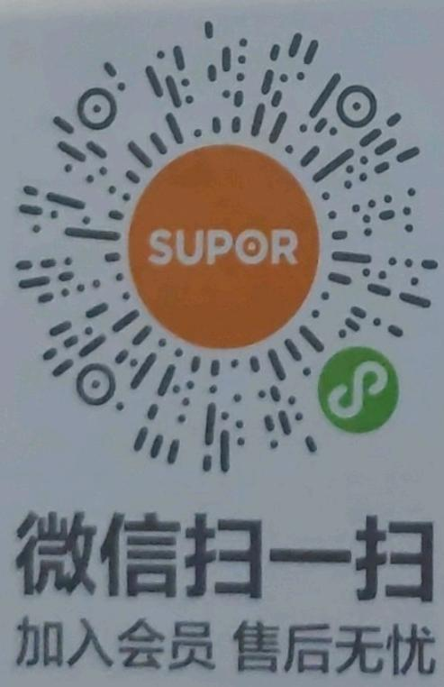
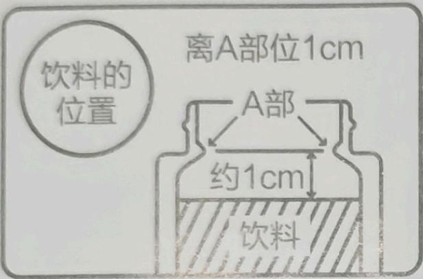
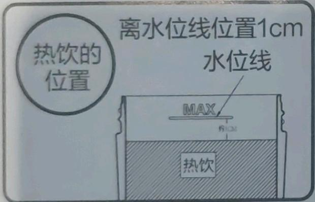
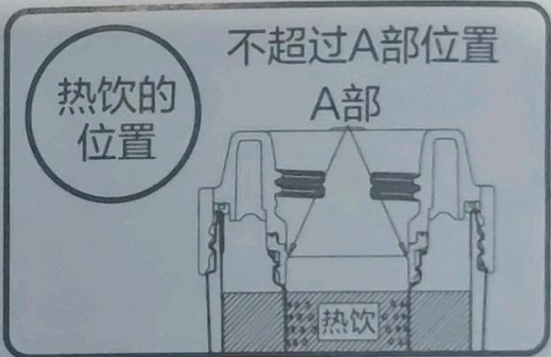
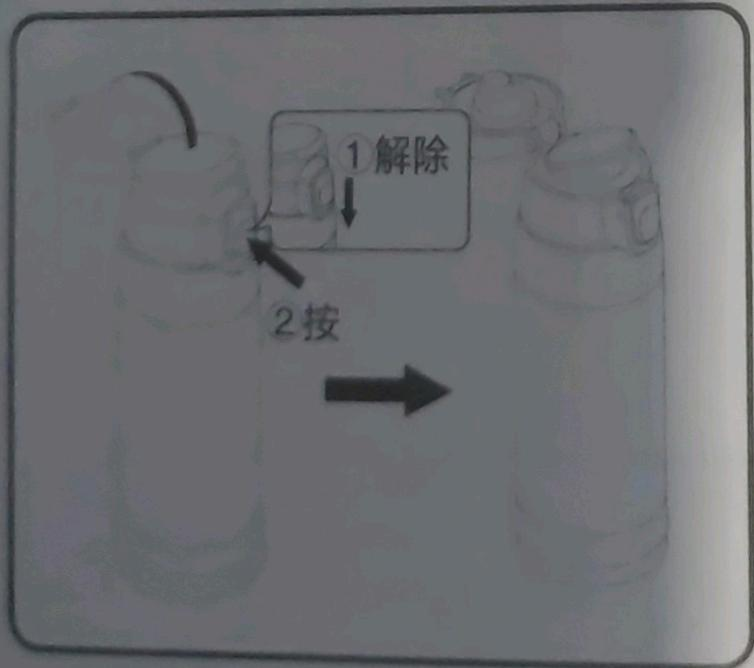
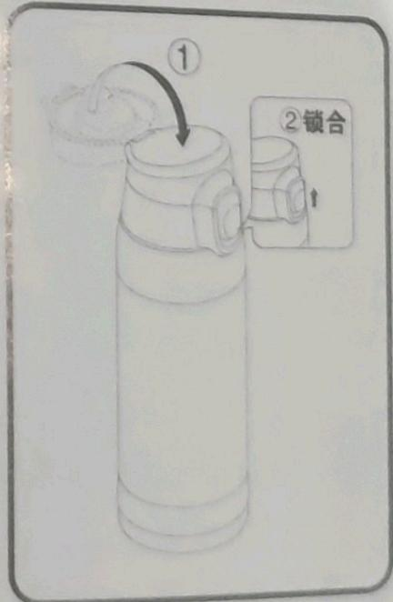
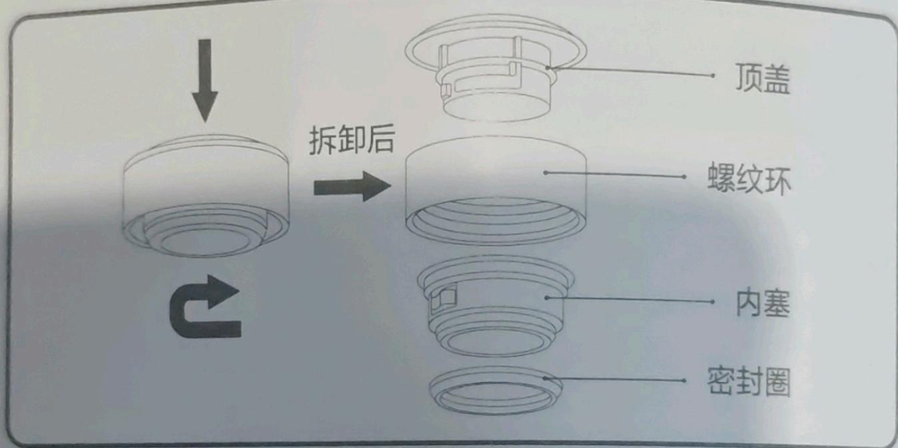
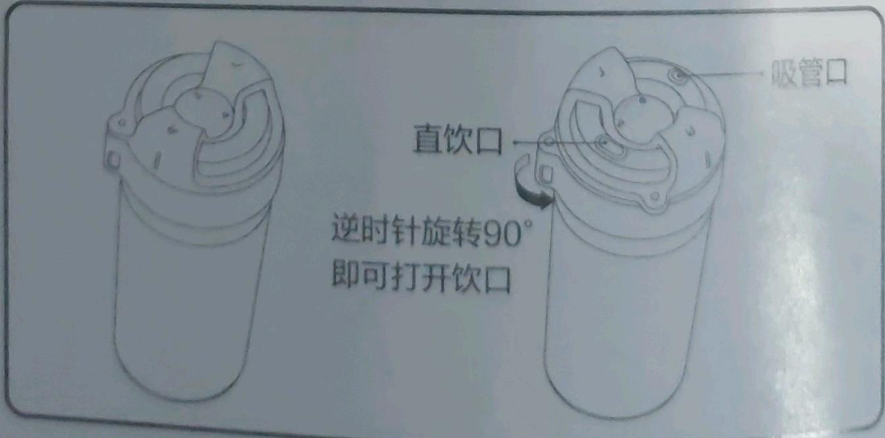
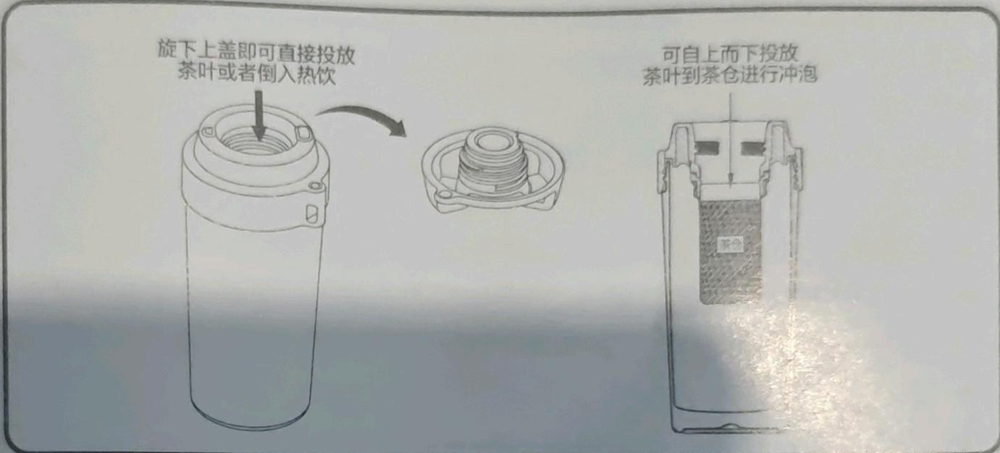

## 真空保温杯（壶）

## 目录

一. 注意事项 01  
二. 警示用语 04  
三. 使用说明 04  
四. 保养和维护 06  
五. 食品接触材料信息表 07  
六. 有害物质清单 08

使用前应仔细阅读使用说明书，并妥善保管。产品以实物为准，如有改型不再另行通知。

## 注意事项！

■ 本产品用于饮品的保冷/保热，请勿用于其他用途。

■ 使用前请先阅览保养和维护，将产品正确洗净后使用。

■ 使用前请检查各部件是否齐备并安装到位。

■ 若希望有更佳的保温效果，使用前请先加入热水或冷水，进行预热或预冷。

■ 装热饮时不宜过满, 请参阅图示位置, 部分带茶滤产品, 视茶滤装冲泡物的量而定, 冲泡物的量较多, 液面的高度也适当降低, 避免溢出烫伤;

■ 喝热饮时请勿突然倾斜，应小口慢饮，突然倾斜会导致热饮极速流出，有烫伤风险；

■ 携带时，请确保产品处于锁定状态，同时避免强烈冲击，即使锁定状态的盖子也会因为强烈的冲击而打开，有漏水或烫伤风险；

■ 放入包内时请确保产品是锁定状态，并立起放入，躺着放容易受外力冲击而打开盖子，造成漏水或烫伤风险；

■ 驾驶汽车时请勿饮用（影响司机的注意力，产生危险）；
■ 若放入含盐分的饮品请于12小时内喝完或倒出，并清洗干净产品；
■ 请勿将保温杯置于高温旁或进行蒸汽消毒或沸水煮烫，以免造成产品变色、烤漆脱落；

形、变色、烤漆脱洁，请避免产品掉落或受到巨大撞击，以免影响保温性能；

■ 请避免产品
■ 请勿装入以下物品：

■ 请勿装入以下物品！
不得在密封状态下，存放干冰和碳酸类饮料；

◆ 不得在血到
◆ 不得用于对乳制品及婴儿食品的长时间保温。（有细菌繁殖的危险）
禁止放入以下各项产品内使用：

■ 禁止放入以下产品
▲ 不得使用微波炉等加热设备对产品进行加热；

◆ 不得使用洗碗机，干燥机等对产品进行清洗或烘干。

## ■ 带内塞（开关）产品

■ 杯（壶）口配有内塞（开关）设计，增强保温性能，完全密封，无需旋开即可倒水，外出时，外盖可以当作杯子使用，方便实用；

■ 饮用时，按逆时针方向旋开盖子，盖子旋下后可用作水杯，保持杯（壶）在直立状态下，打开内塞开关，即可倒水；

■ 倒水完毕，关闭内塞开关即可。

## 家用壶类产品

合盖时：

① 旋合式盖子按顺时针方向旋入瓶口座中并注意盖子的出水口与瓶口座出水口对位。

② 捏合式盖子先与瓶口座对位后再压入瓶口座中，听到“咔哒”一声后即已盖好。

■ 倒水时：

按 **住盖子上的压杆或按一下盖子上的出水按键**并发出“咔哒”一声，水壶倾斜一定角度即可出水。

倒完水后：

松开盖子上的压杆或再次按 **一下盖子上的出水按键**并发出“咔哒”一声即可。

■ 开盖时：

① 旋合式盖子先按 **住盖子上的压杆或按一下盖子上的出水按键**，排出水壶内气压（气体），然后逆时针旋下盖子。

② 捏合式盖子按住盖子上的压杆，排出水壶内气压（气体），然后按 **住盖子上的左右开盖按键**并向上提拎即可。

## 显温类产品

■ 将杯体内注入一定量的水，旋紧杯盖，正置杯体一定时间后，用手触摸顶盖或按钮触摸感应区域即可唤醒显示杯内水温。另，倒置水杯测温会更快更准；

如需连续测温，请一定要确保前一次温显消失后，再进行触摸顶盖或按钮触摸感应区域操作；

因使用环境、地理气候原因各地沸点差异、过程温度损耗等因素，沸水测温时，可能无法达到100℃；

因感温是杯盖内部感应头接触水的表面或水蒸气传导的热源，显示屏幕显示的温度可能与实际水温会有一定的差异；

■ 内含纽扣电池的显温类产品，按照在正常使用情况下，每天点亮数显屏幕25次计算，电池电量约可使用3年；

■ 显示屏幕处用不同颜色来提示杯内液体大概的温度区间。（部分产品只显示温度不显示颜色）

显示蓝色（凉水 小心饮用）

显示绿色（温水 适宜饮用）

显示红色（温度过高 小心烫口）

## ■ 内胆涂层产品

■ 请勿使用坚硬物体搅拌，容易造成内壁破裂。

## 示用语

儿童需要在成人的监护下使用；当装有热饮时，请将产品放置于婴幼儿和儿童触碰不到的地方以免误饮或烫伤。

■ 带电子显温产品请勿置于高温旁、沸水中、阳光下暴晒或使其遭受巨大撞击，以免对显温电子元件造成影响，导致温显失效或者温显与实际温度差异较大，造成烫伤；

■ 请勿自行拆卸杯盖内电子元件，以免损坏电子元件导致温显失效，或者温显与实际温度差异较大，造成烫伤；

■ 带吸管产品使用吸管时，请勿盛装50度以上热饮，防止打开后喷溅或烫伤；

## 产品不锈钢类型

产品内胆、外壳及与液体（食品）直接接触的不锈钢附件材料采用奥氏体型不锈钢。

## 一键开合类产品

  
打开盖子，解除锁定

  
闭合盖子，锁合锁定

## ■ 杯盖为轻音易旋合可拆洗结构

如下图所示，一只手握住顶盖不让其转动，另一只手握住内塞露出部分，逆时针方向稍微用力转动听到“咔哒”声后，便可将顶盖、螺纹环和内塞拆卸，密封圈也可从内塞部件上进行拆卸，反之可以将杯盖所有部件组装。

## ■ 杯盖为旋合开盖结构

逆时针旋转90°即可开启饮口，用户可根据个人喜好选择直饮口或吸管口饮用；反之，顺时针旋转，当听到“咔哒”声后，即可关闭饮口。

■ 投放茶叶冲泡，请参阅示图。

注：图示产品外形非对应产品实物，仅用于使用功能说明。

## 保养和维护

■ 为避免产品表面刮伤、变色，请勿使用研磨粉、金属清洁球、去渍油或含有氯的清洁剂等清洗产品。

■ 请勿沸煮，请勿使用漂白剂，请勿使用洗碗机、餐具干燥机等。清洗杯体外侧可用软布清洁，避免用指甲及坚硬的物品刮搓杯体的图案部分，否则会导致图案刮花、脱落。

■ 清洗后请务必擦干水分，避免细菌滋生。若长时间不使用产品，请充分洗净，完全晾干后放在远离高温和高湿度的环境存放。

■ 使用过程中由于水质、异物等原因，可能导致杯体内侧出现红色锈斑或水垢。此种状况出现时，请在热水中加入约10%的醋，并将其倒入杯体内，不盖杯盖，放置约30分钟\~60分钟之后再将杯体充分洗净。

## 五 食品接触材料信息表 材

本产品食品接触用材料及部件符合GB 4806.1-2016以及相应食品安全国家标准要求，具体信息如下：

<table><tr><td colspan="2">材质</td><td>用途</td><td>执行标准</td><td>备注</td></tr><tr><td rowspan="4">塑料</td><td>丙烯均聚物;聚丙烯(PP)</td><td>盖、饮水嘴、内塞、手柄等</td><td rowspan="4">GB 4806.7-2023</td><td></td></tr><tr><td>丙烯与乙烯的聚合物(PP)</td><td>盖、饮水嘴、内塞、手柄等</td><td></td></tr><tr><td>对苯二甲酸二甲酯与1,4-环己烷二甲醇和2,2,4,4-四甲基-1,3-环丁二醇的聚合物(PCT)</td><td>盖、饮水嘴、手柄等</td><td rowspan="2">使用温度不得高于100°C</td></tr><tr><td>99%对苯二甲酸二甲酯与1,4-环己烷二甲醇和2,2,4,4-四甲基-1,3-环丁二醇的聚合物(PCT)+1%聚对苯二甲酸乙二醇酯(PET)</td><td>盖、饮水嘴、手柄等</td></tr><tr><td rowspan="4">金属</td><td>不锈钢06Cr19Ni10</td><td>杯(壶)身外壳(内胆)、餐勺、杯盖内金属、滤网、感温探头外壳等</td><td rowspan="4">GB 4806.9-2023</td><td></td></tr><tr><td>不锈钢022Cr17Ni12Mo2</td><td>杯(壶)身内胆、杯盖内金属、滤网、感温探头外壳等</td><td rowspan="2"></td></tr><tr><td>抗菌不锈钢06Cr19Ni10Cu3</td><td>杯(壶)身内胆、杯盖内金属、滤网、感温探头外壳等</td></tr><tr><td>钛TA1</td><td>外壳、内胆、内胆表面、杯盖内金属、滤网、感温探头外壳等</td><td></td></tr><tr><td rowspan="2">涂层</td><td>不锈钢为基材 四氟乙烯六氟丙烯共聚物涂层</td><td>内胆表面等</td><td rowspan="2">GB 4806.10-2016</td><td rowspan="3"></td></tr><tr><td>不锈钢为基材 聚甲基硅氧烷涂层</td><td>内胆表面等</td></tr><tr><td colspan="2">硅橡胶</td><td>吸嘴、吸管、密封件、滤网固定圈、泄压阀、排气硅胶等</td><td>GB 4806.11-2016</td></tr></table>

注意：产品不宜作为容器长期存储食品。  
本系列产品包含以上食品接触材料，部分产品可能不含个别部材料，以实际产品为准！

## 六 有害物质清单

<table><tr><td rowspan="2">部件名称</td><td colspan="6">有害物质</td></tr><tr><td>铅(Pb)</td><td>汞(Hg)</td><td>镉(Cd)</td><td>六价铬(Cr(VI))</td><td>多溴联苯(PBB)</td><td>多溴二苯醚(PBDE)</td></tr><tr><td>线材</td><td>O</td><td>O</td><td>O</td><td>O</td><td>O</td><td>O</td></tr><tr><td>电池组件</td><td>O</td><td>O</td><td>O</td><td>O</td><td>O</td><td>O</td></tr><tr><td>PCBA组件</td><td>O</td><td>O</td><td>O</td><td>O</td><td>O</td><td>O</td></tr><tr><td>显示屏组件</td><td>O</td><td>O</td><td>O</td><td>O</td><td>O</td><td>O</td></tr><tr><td>温度传感器</td><td>O</td><td>O</td><td>O</td><td>O</td><td>O</td><td>O</td></tr><tr><td colspan="7">本表格依据SJ/T 11364的规定编制。O:表示该有害物质在该部件所有均质材料中的含量均在GB/T 26572规定的限量要求以下。X:表示该有害物质至少在该部件的某一均质材料中的含量超出GB/T 26572规定的限量要求。说明:1.有害物质中铅(Pb)、汞(Hg)、镉(Cd)、六价铬(Cr(VI))均代表金属及其化合物。2.某些型号产品可能不包含表中部分部件,具体以实物为准。3.标记“X”部件,皆因行业技术发展水平限制而无法实现有害物质的替代。4.该符号中的数字表示上述产品在按照说明书要求下使用条件下的环保使用期限</td></tr></table>