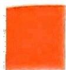
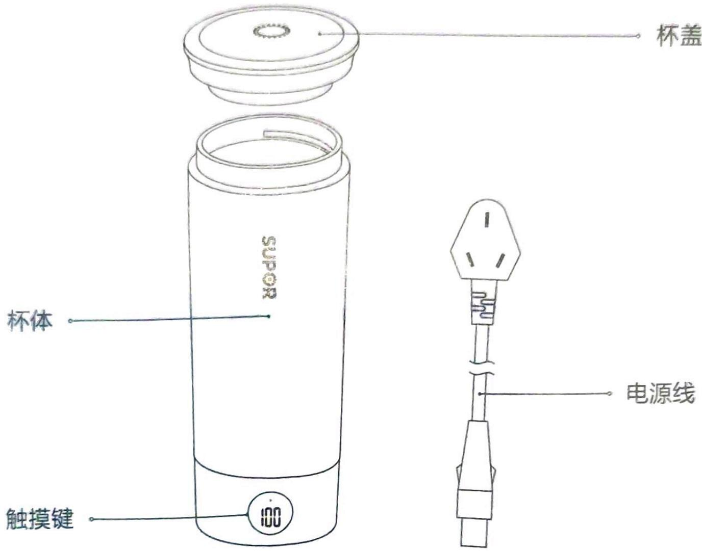
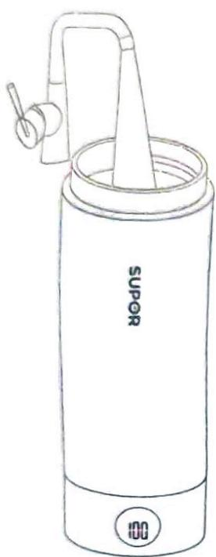
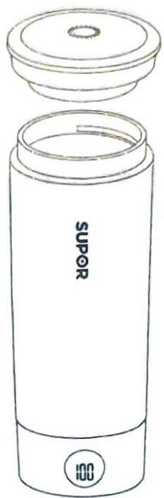
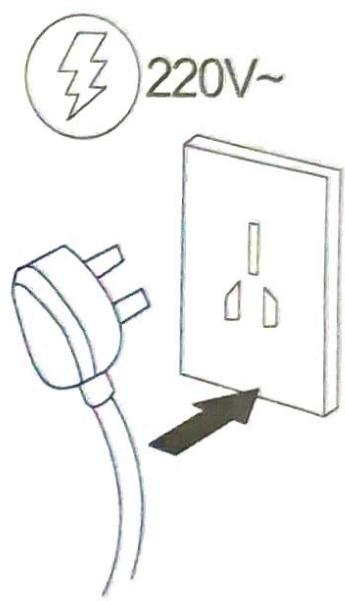

## 液体加热器（电热水杯）

型号：SW-03T01A

SW-03T01B

SW-03T01C

## 目录

一. 注意事项 02  
二. 使用说明  
产品结构 03  
产品规格 03  
操作使用说明 04  
三. 保养和维护 06  
四. 有害物质清单 06  
五. 食品接触材料信息表 07  
六. 常见问题及解决办法 08  
七. 售后服务 08

## 一、注意事项

1. 烧水结束，请放置1分钟后再打开杯盖。当海拔≥1500米时，必须开盖烧水。

2. 产品不能用来加热豆浆、牛奶、米糊、咖啡、麦片等高浓度的饮品。

3. 使用产品之前,请仔细阅读本使用说明书,并妥善保管以备日后参考。

4. 切勿将底座浸入水中，也不要放在水龙头下冲洗。

5. 在将产品连接电源之前，请先检查产品所标电压与当地的供电电压是否相符。

6. 产品必须插入有接地的插座，且务必确保其已稳固插入。

7. 电热水杯在正常工作时，请不要打开杯盖，以免烫伤。

8.请在平坦面上放置本产品，以确保电热水杯不会翻倒。

9.本产品在工作过程中必须放置在小孩触及不到的地方，以防烫伤。

10. 拔插头时，千万不可用电源线拉拽电源线插头。

11. 不要让电源线悬挂于台面边缘，同时避免电源线接触到产品热的表面或打结。

12. 如产品发生故障或者损坏，请到本公司指定的服务站修理。

13.如果电源软线损坏, 为了避免危险, 必须由制造商、其维修部或类似部门的专业人员更换。

14.不要试图自行改装、分解或维修本机器,否则可能会引起火灾、触电或伤害事故。

## 防干烧保护

如果意外地让水杯在无水情况下干烧时，干烧保护装置会自动切断电源。出现这种情况时，若需要煮水，请先待水杯冷却后在注入冷水。

## 二、使用说明

## 产品结构

## 产品规格

<table><tr><td>名称</td><td>型号</td><td>最大容量</td><td>额定功率</td><td>额定电压/频率</td></tr><tr><td>液体加热器(电热水杯)</td><td>SW-03T01ASW-03T01BSW-03T01C</td><td>0.3L</td><td>300W</td><td>220V/50Hz</td></tr><tr><td>执行标准</td><td colspan="4">GB 4706.1-2005 GB4706.19-2008</td></tr></table>

## 操作使用说明

首次使用前，应将本产品装水至其最大水位线，把水烧开、倒掉，重复一至两次，以清除生产、储存过程中可能产生的灰尘。产品不能浸入水中，加水不能超过最大水位（本产品容量为 300ML），以防止水从杯口喷出来。

## 使用步骤如下：

1. 旋开杯盖，向杯内加入清水

2. 旋上杯盖

3. 接通电源

注意: 注入水的容量必须在最大刻度线范围内, 如果水量超过刻度,煮水时, 水可能会从杯口喷出。(产品不盖杯盖也可正常煮水, 建议煮水时不盖杯盖)

## 煮水功能：

1. 插上电源，提示“滴”一声，显示水杯内实际温度；

2.插上电源时,按一下“触摸键”,数码显示100,3秒内没有选择默认为当前显示温度工作；当水煮开后，提示“滴、滴、滴”三声，数码显示熄灭，工作结束；

3. 在100指示闪烁状态下，按一下“触摸键”，85指示闪烁3下后水杯进入 85^{\circ} C煮水状态，当水煮好后，提示“滴、滴、滴”三声，数码显示熄灭，工作结束；

4. 在85指示闪烁状态下，按一下“触摸键”，75指示闪烁3下后水杯进入75℃煮水状态，当水煮好后，提示“滴、滴、滴”三声，数码显示熄灭，工作结束；

5. 在75指示闪烁状态下，按一下“触摸键”，65指示闪烁3下后水杯进入 65^{\circ} \mathrm{C} 煮水状态，当水煮好后，提示“滴、滴、滴”三声，数码显示熄灭，工作结束；

6. 在65指示闪烁状态下，按一下“触摸键”，55指示闪烁3下后水杯进入55℃煮水状态，当水煮好后，提示“滴、滴、滴”三声，数码显示熄灭，工作结束；

7. 在55指示闪烁状态下，按一下“触摸键”，45指示闪烁3下后水杯进入45℃煮水状态，当水煮好后，提示“滴、滴、滴”三声，数码显示熄灭，工作结束；

## 关掉电源

在任何煮水状态下，长按“触摸键”2秒，都可以结束工作；未接上电源时，按一下“触摸键”，显示实时温度3秒钟。

拔下电源插头，扭开杯盖，提起水杯，然后可以倒水到相应容器内。当杯内还有开水时，请盖上杯盖。

注意：倒开水时,要十分小心,以免烫伤。不使用本机时,可以将本机的电源线从杯底座上取下收藏。

## 煮水、保温时间

在海拔1500米以下，25℃室温下，煮开300ml水，约需要6-8分钟，关盖保温4小时，水温在55℃左右。

## 三、保养和维护

清洁之前一定要把水杯的电源插头从电源插座上拔下。

1. 切不可把水杯浸入水中或打湿，以防出现漏电现象。

2.用湿软布清洁水杯外表面,再用干布擦干。不可用腐蚀性的清洁剂清洗。

3. 当不使用或存放时，电源线可从水杯底座取下收藏。

4. 自来水或非蒸馏水中的矿物质, 可能会沉积在水杯底部导致污垢, 从而影响水杯的使用性能。所以请定期对水杯进行除垢操作。请使用除垢剂并参照其使用说明进行除垢操作。也可以按下面的方法使用白醋进行除垢: 在水杯内加入3:1白醋和水, 直至醋水混合物完全浸没水杯内的沉淀物, 浸泡一整晚。倒出水杯内的混合物, 再往水杯内注入纯净水到最大刻度处, 煮开后将水倒掉。再重复几次煮水操作, 直到水杯内没有醋味。

## 四、有害物质清单

<table><tr><td></td><td colspan="6">有毒物质</td></tr><tr><td>部件名称</td><td>铅(Pb)</td><td>汞(Hg)</td><td>镉(Cd)</td><td>六价铬(Cr(VI))</td><td>多溴联苯(PBB)</td><td>多溴二苯醚(PBDE)</td></tr><tr><td>不锈钢</td><td>○</td><td>○</td><td>○</td><td>○</td><td>○</td><td>○</td></tr><tr><td>螺钉及螺母</td><td>○</td><td>○</td><td>○</td><td>○</td><td>○</td><td>○</td></tr><tr><td>塑料件</td><td>○</td><td>○</td><td>○</td><td>○</td><td>○</td><td>○</td></tr><tr><td>硅胶圈(杯体密封圈、底部胶垫等)</td><td>○</td><td>○</td><td>○</td><td>○</td><td>○</td><td>○</td></tr><tr><td>包装件(纸箱、泡沫、说明书等)</td><td>○</td><td>○</td><td>○</td><td>○</td><td>○</td><td>○</td></tr><tr><td>发热盘组件</td><td>×</td><td>○</td><td>○</td><td>○</td><td>○</td><td>○</td></tr><tr><td>电源线</td><td>×</td><td>○</td><td>○</td><td>○</td><td>×</td><td>×</td></tr><tr><td>PCB板</td><td>×</td><td>○</td><td>○</td><td>○</td><td>×</td><td>×</td></tr><tr><td>线材(内部连接线)</td><td>×</td><td>○</td><td>○</td><td>○</td><td>×</td><td>×</td></tr></table>

本表格依据 SJ/T11364 的规定编制。

O: 表示该有害物质在该部件所有均质材料中的含量均在 GB/T26572 规定的限量要求以下。

X: 表示该有害物质至少在该部件的某一均质材料中含量超出 GB/T26572 规定的限量要求。“X”的部件表明，由于目前全球技术和工艺水平限制而无法实现非环保类物质或元素的完全替代，后续随着技术上的改进将逐步改进。其中，铅(Pb)、汞(Hg)、镉(Cd)、六价铬(Cr6+)均代表金属及其化合物。

说明：\*表示该部件仅适用于部分型号，以实际产品为准。

有害物质限制使用标志

环保使用期限10年:表示本产品中含有的有害物质不会发生外泄或突变，用户在产品说明书所述情况下正常使用本产品不会对环境造成严重污染或对其人身、财产造成严重损害的期限。箭头循环标志:表示本产品可回收利用。超过使用期限或经过维修无法正常工作后，不应被随意丢弃，请交由正规回收渠道以及有废弃电器电子产品处理资格的企业处理，正确的处理方法请查阅国家或当地有关旧电器电子产品的处理规定。

## 五、食品接触材料信息表

本产品适用于接触食品，请根据说明书要求正常使用本产品。本产品食品接触用材料及部件符合 GB 4806.1-2016 和相应食品安全国家标准要求，具体信息如下：

<table><tr><td colspan="2">食品接触用材料</td><td>用途</td><td>执行标准</td><td>备注</td></tr><tr><td rowspan="2">金属</td><td>不锈钢06Cr19Ni10</td><td>外壳、顶部透气盖等</td><td>GB 4806.9-2016</td><td>不锈钢 SUS304</td></tr><tr><td>不锈钢06Cr17Ni12Mo2</td><td>内胆、底部透气盖等</td><td>GB 4806.9-2016</td><td>不锈钢 SUS316</td></tr><tr><td rowspan="4">塑料件</td><td>PP</td><td>内杯盖</td><td>GB 4806.7-2016</td><td></td></tr><tr><td>ABS</td><td>装饰圈、透视窗、底座</td><td>GB 4806.7-2016</td><td></td></tr><tr><td>PC+ABS</td><td>外杯盖</td><td>GB 4806.7-2016</td><td></td></tr><tr><td>PA66</td><td>连接支架</td><td>GB 4806.7-2016</td><td></td></tr><tr><td colspan="2">硅橡胶</td><td>密封圈、底部胶垫等</td><td>GB 4806.11-2016</td><td></td></tr></table>

注1:产品不宜作为容器长期存储开水，上述部件仅限与本品牌对应整机配套使用。

注2:本系列产品包含以上食品接触材料, 部分机型可能不含个别材料, 以实际产品为准!

## 六、常见问题及解决办法

<table><tr><td>故障现象</td><td>原因分析</td><td>解决方法</td></tr><tr><td>产品不工作</td><td>机器未通电</td><td>将电源线插头插入接地插座中</td></tr><tr><td>显示屏显示E1</td><td>传感器开路</td><td>送至指定维修点维修</td></tr><tr><td>显示屏显示E2</td><td>传感器短路</td><td>送至指定维修点维修</td></tr><tr><td>显示屏显示E3</td><td>传感器高温</td><td>整机冷却后,加水重新上电,如未恢复送至指定维修点维修</td></tr><tr><td>显示屏显示E4</td><td>传感器失效</td><td>不加热,需重新上电,如未恢复送至指定维修点维修</td></tr></table>

## 七、售后服务

## 提供一年的保修

## 产品保修期的认定：

自消费者收到产品之日起（网购凭证、有效电子保修卡、有效购买发票作为证明实际收到产品日期的凭证）开始计算包修期。

注:购买发票和收到产品日期不一致的，以消费者实际收到产品日期为准计算包修期；消费者无法提供收货时间凭证的，按订单支付时间顺延两天计算；

产品用于商业用途包修期为6个月；

三包期内，在家庭使用情况下，非人为导致的产品故障，消费者带上包修证明（网购凭证，有效电子保修卡、有效购买发票）、故障产品到苏泊尔特约售后服务商处免费维修。

## 下列情况之一者，不属于保修范围：

1. 消费者因使用、运输、维护、保管不当等原因造成损坏的；

2. 非我公司特约服务网点维修造成损坏的；

3. 消费者自行拆卸造成损坏的；

4. 自行购买、更换非产品原装零配件造成损坏的；

5.无有效包修证明（网购凭证,有效电子保修卡、有效购买发票），且无法证明属于包修期内的；

6. 三包凭证与维修产品型号不符或有涂改的；

7. 因地震、火灾、水灾等不可抗力造成损坏的；

8.超出包修期的；

9. 产品使用环境（包括但不限于如电压、湿度、温度、海拔、虫害等）明显超出产品使用说明书要求的；

注：产品制造商有改型的权利，恕不另行通知。

不属于包修范围的产品，将提供收费维修服务，苏泊尔特约售后服务商将热情为您服务。

## 用户反馈

承蒙惠顾苏泊尔产品，谨此致以谢意！我们本着"用户满意"的宗旨，为更及时的为您提供维修、咨询等服务，帮助您处理在使用过程中遇到的问题，请拨打全国服务热线：400- 8899- 717，或者关注官方微信公众号：SUPOR苏泊尔，我们将给予您满意的答复。

全国服务热线：400-8899-717

服务商联系方式如有变动，敬请查询www.supor.com.cn苏泊尔官方网站或官方微信公众号：SUPOR苏泊尔。