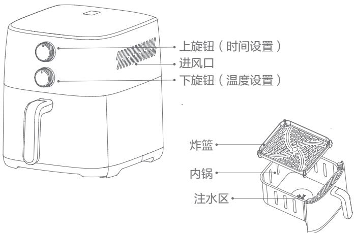
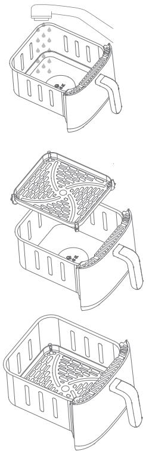
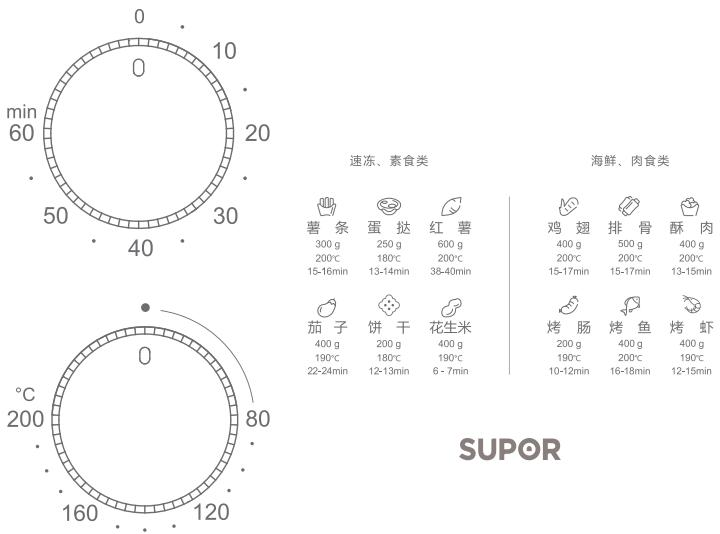
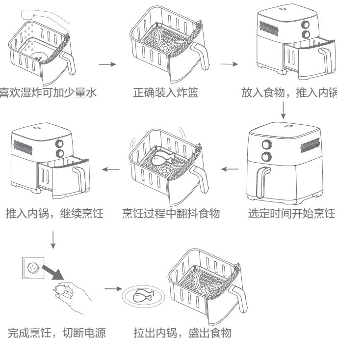
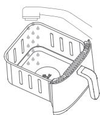
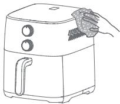
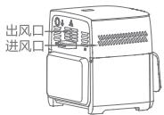
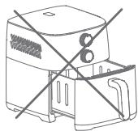

## 电烤炉（空气炸锅）

KJ60Y807

KJ60Y103

KJ60Y613

一. 使用注意事项 …… 01
二. 使用说明 …… 03
三. 保养和维护 …… 08
四. 环保清单 …… 12
五. 食品接触材料信息表 …… 13
六. 售后服务 …… 14

## 使用注意事项

当您使用本产品时，特别提醒禁止以下内容：

01、本产品严禁放在潮湿或靠近火源、热源（如炉具）的地方，防止意外引燃导致火灾或产品损坏。

02、清洗时严禁直接用水冲洗整机产品，或直接浸入水中或其他液体中，防止触电或产品短路。

03、禁止把内锅直接放到明火或电磁炉等非空气炸锅配套环境使用。

04、禁止把内锅放到洗碗机等带有碱性清洗及活性剂的自动清洗设备清洗。

05、禁止在出风口处插入和堵塞任何异物，以免触电或工作异常。

06、烹饪过程中，出风口、进风口禁止物品遮挡。

07、本产品切勿让儿童、行动不便者、精神上有障碍或不会使用的人独自操作；老年人和残障人士以及无使用经验的人应该在监护和指导下使用。

08、本产品适用于家庭使用，请勿户外使用或工业使用。

09、请勿将电源线强行弯折、靠近高温、捆绑、承载重物等，若电源线发生损坏，必须由制造商、其维修部或类似部门的专业人员更换。

10、拔插头时请捏住插头拔下，请勿拉拽电源线，请勿湿手去插、拔电源插头。

11、本产品在使用前请检查电源线、插头以及其他部件是否损坏，如有损坏请停止使用，并联系客服部门或者指定维修点的专业人员来更换，请勿自行拆卸修理，以免发生危险。

12、请勿使用劣质插排，插头需彻底插入插座，以免发生危险。

13、非专业人士不可随意拆卸，否则有引起触电受伤、火灾、机器损坏等危险状况。若产品有故障或损坏，请到指定维修点维修。

14、请勿将本产品在外接定时器或独立的遥控控制系统的方式下运行。

15、本产品在没有装入内锅时请勿开启通电。

16、工作过程中，请勿将任何物品靠近出风口，避免烫伤以及损坏机器。

当您使用本产品时，特别提醒注意以下内容：

01、供应电源的电压必须与铭牌上所标注的一致。

02、使用本产品时，必须使用额定电流10A以上带接地线的插座，请勿与其他电器同时使用一个插座。

03、装有心脏起搏器以及使用其他医疗仪器的用户在使用本产品时，请咨询授权医疗人员。

04、本产品在使用前注意除去所有包装材料。

05、本产品在使用时，请勿触摸带有警示“注意：高温表面”提示语区域，防止烫伤。

06、产品不使用时，需拔掉电源线插头，以免发生故障和危险。

07、请将本产品置于平稳、耐热的台面上使用，与其他物品保留20cm以上的距离。

08、首次使用或长时间未使用，需空锅工作10分钟清洁，干烧过程中可能出现少量白烟或气味，属于正常现象，请勿惊慌。

09、在产品工作前，请检查导风炸篮或炸板、内锅放置是否到位，以免引起故障。

10、导风炸篮或炸板与内锅一起在整机内使用，避免单独使用。

11、产品重量受运输、外部环境（温度、湿度）等影响，可能会出现变化。

12、食物烹饪完成后，请将内锅取出，并放在隔热垫上。

13、在烹饪过程中，中途翻动食材可以提高最终的烹饪效果，并有助于让食材获得均匀的烹饪。

14、顶部菜单为建议烹饪温度、时间，仅供参考。另外，食物本身薄厚大小不同以及地区电压变化，可能导致烹饪效果存在差异，可根据个人口感喜好，适当调节时间、温度。

15、若产品内含有导风炸篮，在亨饪过程中，请注意食材不可堵住导风炸篮与内锅壁的热循环风道，以免影响食物烹饪效果。

16、使用锡箔纸或吸油纸，会影响热风循环以及食物烹饪效果。

  
1. 本产品按中国国标生产，所提供的质保及售后维修服务仅限于中国境内。  
2.不同国家在电源、电压、电流以及使用环境等方面存在差异，将按中国标准生产的电器带至境处使用，可能合导致产品无法正常工作或损坏  
温馨提示

请勿将纸类（烘焙用纸除外）、塑料或易燃物品等放入本产品进行烘烤。

无食物状态下，请勿直接放入吸油纸运行，防止锅内起火。

烹饪过程中或烹饪结束后请勿立即移动或晃动本产品，以免发生危险。

警告:烹饪过程中或烹饪结束后，请勿立即触碰本产品底部、背部以及加热内腔，以免烫伤。

产品结构 | 产品图以实物为准

## 产品规格

<table><tr><td>名称</td><td>型号</td><td>容量</td><td>额定电压</td><td>额定频率</td><td>额定功率</td></tr><tr><td rowspan="3">空气炸锅</td><td>KJ60Y807</td><td rowspan="3">6L</td><td rowspan="3">220V~</td><td rowspan="3">50Hz</td><td rowspan="3">1500W</td></tr><tr><td>KJ60Y103</td></tr><tr><td>KJ60Y613</td></tr></table>

## 用前准备

1、该机器使用前注意除去所有包装材料。

2、拿取机器时，请用手水平托住机器外壳底部两侧。

3、使用干净的布、洗涤液、热水彻底清洁内锅、炸篮。

4、该机器通过产生热空气来工作，不要在内锅装满食用油煎炸食物。

炸篮安装示意图

a.在内锅注水区放入适量水，不可超过注水区范围。（是否加水嫩炸请自行决定）

b.将炸篮水平放入内锅。

c.按压炸篮到锅底至水平，安装完成。

## 操作说明：

## ●上旋钮（时间设置）

时间可调范围0\~60分钟，将定时旋钮顺时针旋转至所需时间，机器开始工作。当设定到“0”时，空气炸锅将处于断电状态。

●下旋钮（温度设置）

温度可调节范围：80\~200℃，将温控旋钮顺时针旋转至所需温度。当设定到“0\~80℃”为无效控温区间，此区间内发热管不工作。

●当设定工作时间结束时，机器发出“叮”的提示音。

●当设定时间或温度大于所需时间或温度，将旋钮逆时针旋转进行调整，或旋转至起始点重新设定。

## 操作示意图

## 操作介绍

1、请把产品放置于平稳的台面，请勿将产品放在不耐热的台面。

2、将食物放入内锅中。

◆本产品可进行脆炸和蒸汽嫩炸。喜欢酥嫩口味可进行蒸汽嫩炸，在内锅注水区加适量水，不要超出中心注水区台阶。

◆正确装入炸篮，放入食材。

◆食材不可装太多，以免食材顶住发热管护罩，导致食材顶部烤焦，底部不熟。

3、放入内锅，将电源插头插入插座，即可根据食材的种类和大小，按照食谱和个人喜好设置合适的时间、温度开始烹饪。

◆烹饪板栗，必须把板栗破一条开口，不然烹饪过程中板栗会炸裂。

4、产品有记忆功能及断电保护，在烹饪过程中，如需进行食物翻面，可直接把内锅拉出，产品停止工作，食物翻面后推入内锅继续运行。

◆在高温状态下取出内锅后，禁止触碰产品内部和内锅，禁止将内锅放在不耐高温的台面上，以免高温余热烫伤。

5、听到“叮”响一声时，即烹饪完毕，可拉出内锅确认食物是否烹饪好。

◆若食物没有烹饪好，可重新设定时间、温度继续烹饪。

6、食物烹饪完成，将内锅取出放于隔热垫上，取出食物。

## 烹饪小技巧

1、为了获得最佳的效果，建议您使用预烘焙（例如冻薯条）。

2、如果要自制炸薯条，请按照以下步骤执行操作：

将土豆削皮并切成小条。在碗中浸泡土豆条至少30分钟，然后将它们取出放在厨房用纸上沥干。在碗中倒入一汤匙的橄榄油，放入土豆条并充分搅拌，直到所有土豆条都均匀上油，土豆条会更松脆。放置几分钟，将土豆条从碗中拿出来，让多余的油份留在碗里。然后再将土豆条倒入内锅中。

注意：不要一次性将所有土豆条从碗中倒入内锅，这样可以防止最后在内锅底部存留过多的油份。按照本章中的说明烹饪土豆条。

注意：由于食材的来源、大小、形状和品牌各有不同，我们无法保证为您的食材提供最佳设置。

## 提示

1、与体积较大的食材相比，体积较小的食材需要的亨饪时间会稍短一点如烤鸡，食材的总高度不可接近或接触发热管保护罩，避免烤糊。烹饪时建议在鸡身和鸡腿等肉厚处用刀划开，并在鸡身上用牙签扎孔，以防肉厚热量难穿透。

2、食材量较多时，仅需要稍微增加烹饪时间，当食材量较少时，只需要稍微缩短烹饪时间。

3、在烹饪过程中，中途翻动食材可以提高最终的烹饪效果，并有助于让食材获得均匀的烹饪。

4、切勿在空气炸锅中烹饪含油量较高的食材。

5、能够在烤箱中烹饪的点心同样可以在空气炸锅中烹饪。

6、使用预发酵面团可以方便快捷地烹饪出夹心食品。与自制面团相比，预发酵面团需要的烹饪时间更短。

7、由于食物的薄厚、大小不同，也可根据自己的烹饪要求调节时间、温度（时间、温度仅供参考）。

8、食物不要太大，顶住或太靠近发热管护罩会导致食物烤焦。

9、内锅可取掉炸篮，根据个人需求进行食材解冻。

## 保养和维护

● 不得使用钢丝刷、硬刷或其他腐蚀性液体清洗产品，以免损坏产品内、外表面及内锅、炸篮的不粘涂层。

● 不得使用汽油、香蕉水、抛光剂等有毒或腐蚀性清洁剂进行清洁。

● 不得用水冲洗产品，更不应将产品浸入水中。

1、烹饪完毕后，请从电源插座中拔下电源插头，待产品完全冷却后再进行清洁。

2、产品内外表面可用于软布或海绵沾上中性清洁剂擦拭。

3、每次使用后都应清洁产品。内锅、炸篮均覆有涂层，切勿使用金属厨具或研磨性的清洁材料进行清洁，以免破坏涂层。

4、如果内锅、炸篮、硅胶支撑柱附上污垢，请在内锅中放入热水，使这些部件充分浸泡后，再添加一些洗涤剂和非研磨性的海绵清洗。

炸篮、内锅的清洗

食物拿出后应及时清洗，不宜长时间浸泡。

·清洗时，宜用温清水或温清水加清洗剂清洗，不要使用香蕉水、汽油、酒精、去污粉、硬质刷等擦洗为了不损伤涂层，请不要敲打或摩擦炸篮和内锅，不要把坚硬的餐具放进炸篮和内锅。

温馨提示：炸篮和内锅不建议用洗碗机清洗。

## 产品的清洗

不得用水冲洗产品，可用软布擦拭机身外部的脏污、水珠。

## 烹饪提示

烹饪过程中，出风口、进风口禁止物品遮挡。

## 温馨提示

食物烹饪完成，请勿将内锅拉出一半停留机器内，需将内锅完全放于隔热垫上。

■ 电子食谱

①下载App:手机扫描右侧二维码下载、安装App。

  
安装苏泊尔APP美食妙招码上来

②添加设备

打开App首页，点击“ 添加”按钮，选择设备型号添加设备，或点击“扫一扫”按钮扫描机身微信二维码添加设备。

添加完成后，解锁更多美食体验。

## 常用食材烹饪建议

<table><tr><td>功能</td><td>食物重量/g</td><td>建议时间/min</td><td>建议温度/°C</td><td>备注</td></tr><tr><td>薯条</td><td>300</td><td>15-16</td><td>200</td><td></td></tr><tr><td>蛋挞</td><td>250</td><td>13-14</td><td>180</td><td></td></tr><tr><td>红薯</td><td>600</td><td>38-40</td><td>200</td><td></td></tr><tr><td>茄子</td><td>400</td><td>22-24</td><td>190</td><td>整只烤好剖开后放调料,再次烘烤</td></tr><tr><td>饼干</td><td>200</td><td>12-13</td><td>180</td><td></td></tr><tr><td>花生米</td><td>400</td><td>6-7</td><td>190</td><td></td></tr><tr><td>鸡翅</td><td>400</td><td>15-17</td><td>200</td><td>需解冻切口</td></tr><tr><td>排骨</td><td>500</td><td>15-17</td><td>200</td><td>切断+腌渍</td></tr><tr><td>酥肉</td><td>400</td><td>13-15</td><td>200</td><td></td></tr><tr><td>烤肠</td><td>200</td><td>10-12</td><td>190</td><td></td></tr><tr><td>烤鱼</td><td>400</td><td>16-18</td><td>200</td><td>网纹改刀+腌渍</td></tr><tr><td>烤虾</td><td>400</td><td>12-15</td><td>190</td><td>腌渍</td></tr></table>

烹饪时间会随着食材的份量和选择的温度而变化，可根据个人口感适当调整时间和温度，以实际烹饪效果为准，如有升级，不再另行通知。

注：烹饪较大食材、较多食材时，可中途适当翻面，使食材烹饪更均匀！

## 产品特点

可视窗配合锅内炉灯 实时掌握烹饪动态

6.0L大容量 满足一家人轻食生活

1500W大功率 劲风高效

多向热风循环系统 均匀烹饪

耐磨不粘层 清洗便捷

蒸汽嫩炸 食物更酥嫩

## 常见故障的排除方法

<table><tr><td>常见故障</td><td>原因分析</td><td>解决方案</td></tr><tr><td rowspan="6">不通电不加热灯不亮</td><td>电源线插头未插到位</td><td>重新插好插头或更换插座</td></tr><tr><td>内锅组件未装配到位</td><td>听到咔哒声,确保装配到位</td></tr><tr><td>未旋转定时器旋钮</td><td>旋转定时器旋钮</td></tr><tr><td>发热管损坏发热管未接好</td><td>送苏泊尔售后维修</td></tr><tr><td>未旋转温控旋钮</td><td>旋转温控旋钮</td></tr><tr><td>炉灯损坏</td><td>送苏泊尔售后维修</td></tr><tr><td rowspan="2">风机不转</td><td>电机连接线脱落/电机损坏</td><td>送苏泊尔售后维修</td></tr><tr><td>内锅未装配到位</td><td>听到咔哒声,确保装配到位</td></tr><tr><td rowspan="2">冒出白烟</td><td>正在烤制油腻的食材</td><td>烤制油腻的食材将有大量白烟渗漏,属于正常现象</td></tr><tr><td>内锅中残留上次烹饪后的油脂残渣</td><td>请务必每次烹饪完成后清洗内锅</td></tr><tr><td rowspan="2">食物没熟</td><td>烹饪时间、温度不对</td><td>按菜谱调整设定时间、温度</td></tr><tr><td>内锅食物过多</td><td>分批烹饪或适当减少食物</td></tr><tr><td>食物烹饪不均匀</td><td>烹饪过程没有翻动食物</td><td>烹饪到适当时间翻动锅内食物</td></tr><tr><td>内锅组件无法装入</td><td>内锅食物过多</td><td>取出部分食物</td></tr><tr><td>内锅组件无法取出</td><td>有异物卡在内锅与机器之间</td><td>送苏泊尔售后维修</td></tr></table>

<table><tr><td colspan="11">产品中有害物质的名称及含有的信息表</td></tr><tr><td rowspan="2">部件名称</td><td colspan="10">有害物质</td></tr><tr><td>铅(Pb)</td><td>汞(Hg)</td><td>镉(Cd)</td><td>六价铬(Cr(VI))</td><td>多溴联苯(PBBs)</td><td>多溴二苯醚(PBDEs)</td><td>邻苯二甲酸二(2-乙基)己酯(DEHP)</td><td>邻苯二甲酸丁苄酯(BBP)</td><td>邻苯二甲酸二正丁酯(DBP)</td><td>邻苯二甲酸二异丁酯(DIBP)</td></tr><tr><td>内锅组件(内锅、炸篮、把手等)</td><td>○</td><td>○</td><td>○</td><td>○</td><td>○</td><td>○</td><td>○</td><td>○</td><td>○</td><td>○</td></tr><tr><td>外壳组件(控制面板、外壳、底壳、排气窗、旋钮等)</td><td>○</td><td>○</td><td>○</td><td>○</td><td>○</td><td>○</td><td>○</td><td>○</td><td>○</td><td>○</td></tr><tr><td>发热管组件(发热管等)</td><td>○</td><td>○</td><td>○</td><td>○</td><td>○</td><td>○</td><td>○</td><td>○</td><td>○</td><td>○</td></tr><tr><td>内腔组件(上下内衬、发热管护罩、底板等)</td><td>○</td><td>○</td><td>○</td><td>○</td><td>○</td><td>○</td><td>○</td><td>○</td><td>○</td><td>○</td></tr><tr><td>标签、贴纸、铭牌</td><td>○</td><td>○</td><td>○</td><td>○</td><td>○</td><td>○</td><td>○</td><td>○</td><td>○</td><td>○</td></tr><tr><td>电源线组件、电机组件、炉灯组件*、NTC*、定时器*等</td><td>×</td><td>○</td><td>○</td><td>○</td><td>○</td><td>○</td><td>○</td><td>○</td><td>○</td><td>○</td></tr><tr><td>PCBA控制板*(蜂鸣器、二极管等)、温控器*</td><td>×</td><td>○</td><td>×</td><td>○</td><td>○</td><td>○</td><td>○</td><td>○</td><td>○</td><td>○</td></tr><tr><td colspan="11">注1:○:表示该有害物质在该部件所有均质材料中的含量均不超出电器电子产品有害物质限制使用国家标准要求。×:表示该有害物质至少在该部件的某一均质材料中的含量超出电器电子产品有害物质限制使用国家标准要求。注2:以上未列出的部件,表明其有害物质含量均不超出电器电子产品有害物质限制使用国家标准要求。注3:*表示该部件仅适用于部分型号,以实际产品为准。</td></tr><tr><td colspan="2">有害物质限制使用标志</td><td colspan="9">环保使用期限10年:表示本产品中含有的有害物质不会发生外泄或突变,用户在产品说明书所述情况下正常使用本产品不会对环境造成严重污染或对其人身、财产造成严重损害的期限。箭头循环标志:表示本产品可回收利用。超过使用期限或经过维修无法正常工作后,不应被随意丢弃,请交由正规回收渠道以及有废弃电器电子产品处理资格的企业处理,正确的处理方法请查阅国家或当地有关旧电器电子产品的处理规定。</td></tr></table>

## 食品接触材料信息表

本产品适用于接触食品，请根据说明书要求正常使用本产品。本产品食品接触用材料及部件符合GB 4806.1-2016和相应食品安全国家标准要求，具体信息如下：

<table><tr><td colspan="2">食品接触用材料</td><td>用途</td><td>执行标准</td><td>备注</td></tr><tr><td rowspan="4">金属</td><td>不锈钢06Cr19Ni10</td><td>水杯等</td><td>GB 4806.9-2023</td><td>不锈钢SUS304</td></tr><tr><td>镀铝冷轧钢板</td><td>内锅、炸篮、烤盘等</td><td>GB 4806.9-2023</td><td>不得直接接触pH&lt;5的酸性食品</td></tr><tr><td>冷轧钢板</td><td>炸篮、内锅等</td><td>GB 4806.9-2023</td><td>不得直接接触pH&lt;5的酸性食品</td></tr><tr><td>铝合金3103A</td><td>导风炸篮等</td><td>GB 4806.9-2023</td><td>不得直接接触pH&lt;5的酸性食品</td></tr><tr><td rowspan="5">涂层</td><td>聚四氟乙烯涂层(镀铝冷轧钢板基材)</td><td>内锅、炸篮、烤盘等</td><td>GB 4806.10-2016</td><td>如涂层脱落,建议更换,使用温度不得高于250°C,不得直接接触pH&lt;5的酸性食品</td></tr><tr><td>4,4&#x27;-磺酰基二苯酚与1,1&#x27;-磺酰基二(4-氯苯)的聚合物涂层(镀铝冷轧钢板基材)</td><td>内锅等</td><td>GB 4806.10-2016</td><td>如涂层脱落,建议更换,不得直接接触pH&lt;5的酸性食品</td></tr><tr><td>聚甲基硅氧烷涂层(镀铝冷轧钢板基材)</td><td>炸篮等</td><td>GB 4806.10-2016</td><td>如涂层脱落,建议更换,不得直接接触pH&lt;5的酸性食品</td></tr><tr><td>聚甲基硅氧烷涂层(铝合金3103A基材)</td><td>导风炸篮等</td><td>GB 4806.10-2016</td><td>如涂层脱落,建议更换,不得直接接触pH&lt;5的酸性食品</td></tr><tr><td>聚甲基硅氧烷涂层(冷轧钢板基材)</td><td>炸篮、内锅等</td><td>GB 4806.10-2016</td><td>如涂层脱落,建议更换,不得直接接触pH&lt;5的酸性食品</td></tr><tr><td colspan="2">玻璃</td><td>视窗玻璃等</td><td>GB 4806.5-2016</td><td></td></tr><tr><td colspan="2">硅胶</td><td>挡块等</td><td>GB 4806.11-2016</td><td></td></tr></table>

注1：产品不宜作为容器长期存储食品，上述部件仅限与本品牌对应整机配套使用。  
注2：本系列产品包含以上食品接触材料，部分机型可能不含个别材料，以实际产品为准！  
注3：镀铝冷轧钢板（wt.%):C＜0.5%，Si＜0.5%，Mn＜3%，P＜0.1%, S＜0.1%  
注4：冷轧钢板(wt%)：C＜0.5%，Mn＜1%，P＜0.1%，S＜0.1%

## 售后服务

## 本产品提供一年的包修

产品包修期的认定：

自消费者收到产品之日起（网购凭证、有效电子保修卡、有效购买发票作为证明实际收到产品日期的凭证）开始计算包修期。

注:购买发票和收到产品日期不一致的，以消费者实际收到产品日期为准计算包修期；消费者无法提供收货时间凭证的，按订单支付时间顺延两天计算；

产品用于商业用途包修期为6个月；

三包期内，在家庭使用情况下，非人为导致的产品故障，消费者带上包修证明（网购凭证,有效电子保修卡、有效购买发票）、故障产品到苏泊尔特约售后服务商处免费维修。

## 下列情况之一者，不属于包修范围：

01. 消费者因使用、运输、维护、保管不当等原因造成损坏的；

02.非我公司特约服务网点维修造成损坏的；

03.消费者自行拆卸造成损坏的；

04.自行购买、更换非产品原装零配件造成损坏的；

05.无有效包修证明（网购凭证,有效电子保修卡、有效购买发票 )，且无法证明属于包修期内的；

06.三包凭证与维修产品型号不符或有涂改的；

07.因地震、火灾、水灾等不可抗力造成损坏的；

08.超出包修期的；

09.产品使用环境（包括但不限于如电压、湿度、温度、海拔、虫害等）明显超出产品使用说明书要求的；

注：产品制造商有改型的权利，恕不另行通知

不属于包修范围的产品，将提供收费维修服务，苏泊尔特约售后服务商将热情为您服务。

## 用户反馈

承蒙惠顾苏泊尔产品，谨此致以谢意！我们本着“用户满意”的宗旨，为更及时的为您提供维修、咨询等服务，帮助您处理在使用过程中遇到的问题，请拨打全国服务热线：400-8899-717或者关注官方微信公众号：SUPOR苏泊尔，我们将给予您满意的答复。

全国服务热线：400-8899-717

服务商联系方式如有变动，敬请查询www.supor.com.cn 苏泊尔官方网站或官方微信公众号：SUPOR苏泊尔。

## 苏泊尔产品保修卡

产品名称 产品型号

出厂日期

发票号码

购买日期

购买者姓名 电话

地址 邮编

商场名称 商场盖章

地址 邮编 电话

## 维修状况登记栏

<table><tr><td>维修日期</td><td></td><td></td><td></td></tr><tr><td>维修情况</td><td></td><td></td><td></td></tr><tr><td>经手人</td><td></td><td></td><td></td></tr></table>

商标持有人：浙江苏泊尔股份有限公司

制造商：浙江绍兴苏泊尔生活电器有限公司

地 址 ：浙江省绍兴市世纪西街3号

全国服务热线：400-8899-717

网址：http://www.supor.com.cn

版本号：KJ60Y807:VER2.0

执行标准号: GB 4706.1- 2005 GB 4706.14-2008