## 电热水瓶

使用说明书

使用前请仔细阅读本手册并妥善保管

更多使用指引请【扫描机身二维码】查看电子版

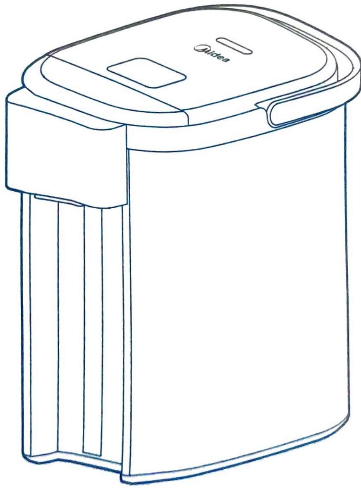

## 安全提示

· 本节描述了安全事项的内容及重要性，以防止对使用者或他人造成人身伤害或财产损失。请在充分理解下面内容的基础上阅读正文，并请务必遵守所描述的安全事项。

· 本产品未考虑无人照看的幼儿和残疾人对产品的使用或幼儿玩耍产品的情况。

\- 禁止让儿童单独操作使用，确保不会将产品当成玩具，要放在婴儿接触不到的地方。

\- 老年人或残障人士以及无使用经验的人应该在监护和指导下使用本产品。

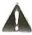

**⚠️ 警告**表示可能会导致死亡或重伤的安全事项

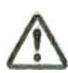

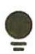

**⚠️ 注意**表示可能会导致轻伤或财产损害的安全事项

【温馨提示】表示可能影响使用体验的其他事项

## 【警告】重点安全注意事项

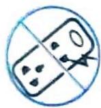

严禁劣质插排禁止使用劣质插排。

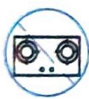

请勿自行改造

禁止靠近高温物体禁止湿手触摸请勿用湿手拔插插头，以免触电。

禁止将电源线悬挂于桌边，产品勿接触到高温物体（如炉具）。

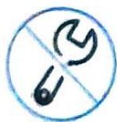

除维修人员以外，其他人不得进行分解维修，以免造成火灾、触电、受伤。

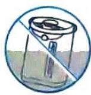

严禁机身浸水

禁止将电热水瓶、电源线、电源插头浸入水中或其它液体中，以免发生危险

禁止向机身插入其他物品
禁止向电热水瓶的任何缝隙或开口处插入大头针、铁丝或其它物品，避免触电伤害。

## 【警告】重点安全注意事项 (2)

操作时，请勿触摸热瓶体或从出水嘴和蒸汽口中溢出的热蒸汽。使用时，须盖好上盖，过程中不可打开上盖，以免烫伤。

▲ 禁止用户自行拆开电热水瓶底盖。

▲瓶内无水时，加水时，不使用时，清洁或移动电热水瓶时，当电热水瓶出现问题时必须保证电源是断开的。

## 安全提示 (2)

## 【警告】重点安全注意事项 (3)

如果电源软线损坏，为了避免危险，必须由制造商、其维修部或类似部门的专业人员更换。

▲ 维修时禁止使用其它外延电源线，且不得使用非本公司指定的零部件。

▲ 瓶内无水时，加水时，不使用时，清洁或移动电热水瓶时，当电热水瓶出现问题时必须保证电源是断开的。

▲ 需单独使用额定电流 10A 以上，额定电压 220V\~ 的接地插座，切勿使用万用插座与其它电器同时使用。

加水时请勿超过满水标，否则热水会溢出或喷出导致产品漏水。烧水时，不能干烧。

## 【注意】可能造成轻伤或者财产损失的事项

产品必须在平稳台面上使用，不可靠近或置于任何电器上。以免产品损坏或发生意外。

本产品只能用于烧水，不能加热除水以外的其它物体（如：紫菜、鸡蛋、豆浆、茶叶、奶、面条等），否则产品可能出现功能失效。

搬动产品时，请使用产品提手进行移动；请不要拉住开盖按钮提起，不要抱在怀里。

## 【温馨提示】其他安全事项

● 产品放置的桌台需定时清洁、清理油污。

\- 产品与其它厨房电器的最佳距离请保持 30{cm} 以上。

## 产品简介

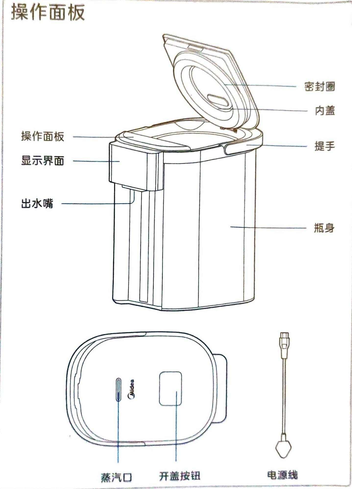

## 产品简介 (2)

操作面板

<table><tr><td>电源</td><td>点击“电源”按键,进入开机状态,再次点击“电源”按键关机。</td></tr><tr><td>定温</td><td>设定保温温度,连续点击击可以选40°C-45°C-55°C-65°C-75°C-85°C共6个挡位温度。</td></tr><tr><td>长按出水</td><td>解锁后,长按“长按出水”按键产品出水,松开按键后停止出水。</td></tr><tr><td>烧水 长按除氯</td><td>单击“烧水/长按除氯”按键,听到“嘀”1声提示音,进入烧水状态。长按“烧水/长按除氯”按键,听到“嘀嘀”2声提示音,进入沸腾除氯状态。</td></tr><tr><td>解锁</td><td>单击“解锁”按键,指示灯亮起,产品为解锁状态;在解锁状态下长按 **出水按键**可以出水。</td></tr><tr><td>一+</td><td>单击“-&quot;/“+”,温度调节幅度为1°C,调节范围为35-85°C。</td></tr></table>

## 产品参数

<table><tr><td>产品型号</td><td>容量</td><td>额定电压</td><td>额定频率</td><td>额定功率</td></tr><tr><td>MK-SP1A</td><td>5.0L</td><td>220V~</td><td>50Hz</td><td>1600W</td></tr></table>

## 温馨提示

·第一次使用前或者长时间没有使用后，应加水至内胆容量2-3L后烧开1\~2次，以便清洁内胆，此时的开水不宜饮用！

·本产品适用于海拔3000米以下使用。

· 加水时请注意不要淋湿瓶身。

·保温设定可以在煮水时进行，也可以水开后进行。

\- 防止干烧: 在产品通电时, 若水瓶内水量低于加水刻度或无水, 为防止机器干烧故障, 请及时加水。

·拔掉电源线不能出水。关机、待机等其它状态，按下解锁后，按下“长按出水”键可出水。

· 产品保温过程中，如果 48 小时用户无按键操作，为保证安全，产品将自动断电，用户重新按“开关”键启动产品即可使用。

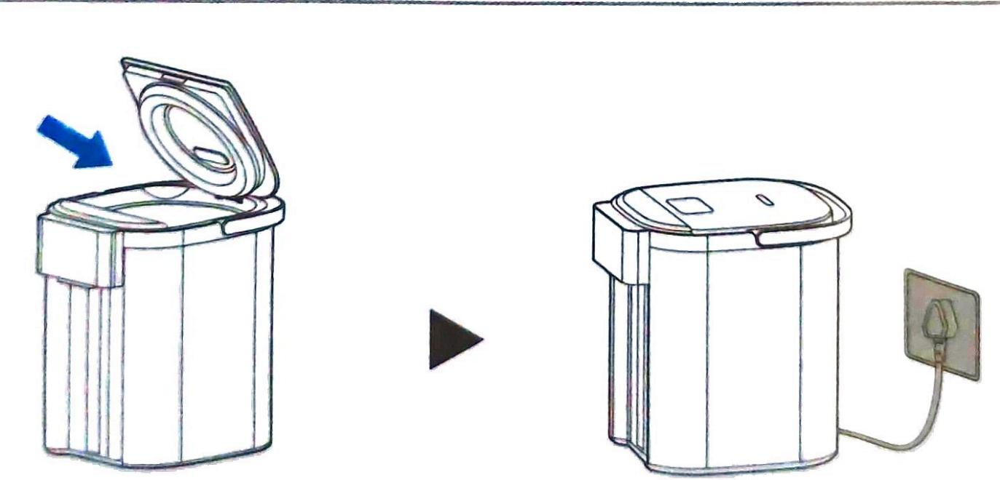

向瓶内加水，（加水量不得超过最大水位线）关闭上盖，接通电源。接通电源后，显示屏灯全亮1秒后（峰鸣一声），然后进入待机状态。

## 凉白开

按“电源”键，按“烧水/长按除氯”按键，水沸腾后自然冷却。

电源烧水
长按除氯

## 纯净水保温

此功能仅适用于纯净水、过滤水等净水。

按 “电源” 键，选择 “定温”，水不烧开，水温直接达到设定温度。连续单击 “定温” 可以选择保温温度 (40-45-55-65-75-85 ℃)。

电源 ▶ 定温

## 沸腾后保温

按“电源”健，长按“烧水/长按除氯”按键，再选择“定温”水沸腾后，自然冷却到设定温度后保温。

## 饮用

通电后，在开机状态下，按“解锁”键，解锁指示灯常亮，再按“长按出水”，可出水饮用。

解锁

长按
出水

## 清洁保养操作步骤

## 温馨提示 (2)

\- 清洁前请确认电源插头拔离插座，待电热水瓶冷却后进行。

·为延长电热水瓶使用寿命，应定期清洁水瓶内的矿物沉淀物（水垢），可用除垢剂（如醋、柠檬酸）清洗。

·除垢清洁后会有少量异味，加入清水，将内胆冲洗几次，可除去残留的除垢剂异味。

· 瓶体外部严禁用水冲洗，切勿用钢丝球及任何化学的或研磨粉状的清洁剂来清洗。

·内胆用含水的塑料海绵擦拭，不要使用去污粉、草刷、尼龙刷。不可用洗碗机或烘干机烘烤，否则，水瓶会变形损坏。

## 日常清洁

1 拔下电源插头，排净瓶内的水，用干毛巾擦干水迹。瓶身外部用拧干水的湿毛巾擦干净，以备下次使用。

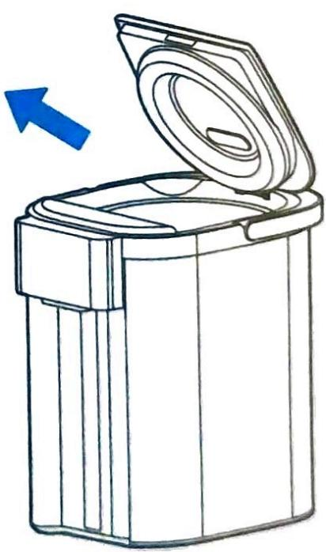

<table><tr><td colspan="2">除垢清洁</td></tr><tr><td>1 放入除垢剂,加入冷水至最大水位线并充分搅拌。除垢剂一次用量约100克。</td><td>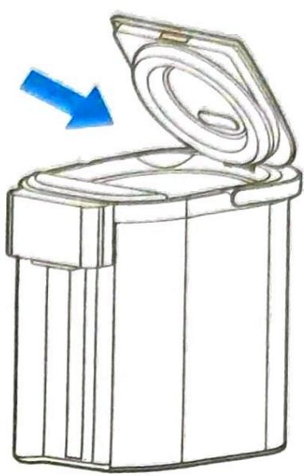</td></tr><tr><td>2 接通电源,单击“电源”键,再单击“烧水/长按除氯”键。如瓶内污垢未去净,再按“烧水/长按除氯”键,重复加热。</td><td>电源  \frac{{烧水}}{{长按除氯}} </td></tr><tr><td>3 断开电源,待电热水瓶冷却,排净瓶内的水,用毛巾擦干。瓶身外部用拧干水的湿毛巾擦干净,以备下次使用。</td><td>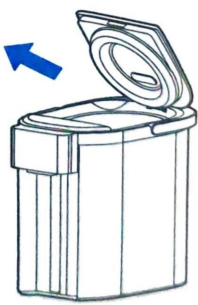</td></tr></table>

## 服务指南

当您认为产品有故障的时候，在送到维修网点修理之前请检查以下情况，进行确认。

## 异常现象解决方法

<table><tr><td>异常现象</td><td>可能的原因</td><td>处理方法</td></tr><tr><td>热水中有白色或闪光的悬浮物</td><td>脱落的水垢,矿物质多的水(矿泉水、离子净水器处理的水)易产生水垢,附在内胆上或浮于水中</td><td>请按除垢清洁步骤清除水垢</td></tr><tr><td rowspan="2">热水有异味</td><td>自来水中含有较多的消毒用氯,会产生氯味</td><td>按下“烧水/长按除氯”键</td></tr><tr><td>首次使用时产品有少量塑料的异味,使用几次后异味会消失</td><td>非异常情况</td></tr><tr><td rowspan="2">出水不畅</td><td>过滤网网孔被水垢堵塞</td><td>加入柠檬酸煮沸清洗。用刷子清洗网孔,让网孔通畅</td></tr><tr><td>水烧开后一段时间内,产生的气泡进入泵中,有时难以压出热水</td><td>先打开上盖,约1分钟不再冒泡后,再操作出水</td></tr><tr><td>不出水</td><td>锁定状态</td><td>按“解锁”键,锁定解除后,再按“长按出水”键</td></tr><tr><td>瓶内水自然流出</td><td>瓶内水量超过最大水位线</td><td>将瓶内水量降至最大水位线以下</td></tr><tr><td>本体外侧发热</td><td>由于在高温下保温,室温高时本体外侧可达60°C</td><td>非异常情况</td></tr></table>

## 服务指南 (2)

当显示屏出现异常代码时，可根据以下列表进行判断和处理。若问题无法解决，可联系售后服务进行维修

## 显示屏异常显示解决方法

<table><tr><td>故障</td><td>原因说明</td><td>解决对策</td></tr><tr><td>E1</td><td>传感器开路保护</td><td rowspan="2">断电1分钟后重新通电排除故障,如无法消除故障送指定维修点维修</td></tr><tr><td>E2</td><td>传感器短路保护</td></tr></table>

## 产品合格证

检查结论：合格

检查员号：检验员A1

检查日期：见生产批号

广东美的生活电器制造有限公司

生产日期见生产批号前6位（年/月/日）

## 声明

本资料上所有内容均经过认真核对，如有任何印刷错漏或内容上的误解，可向本公司咨询。产品若有技术改进，会编进新版说明书中，恕不另行通知。产品外观、颜色如有改动，以实物为准。

产品执行标准：GB4706.1-2005

GB4706.19-2008

## 服务指南 (3)

<table><tr><td colspan="7">环保清单 产品中有毒有害物质或元素的名称及含量</td></tr><tr><td rowspan="2">部件名称</td><td colspan="6">有毒有害物质或元素</td></tr><tr><td>铅(Pb)</td><td>汞(Hg)</td><td>镉(Cd)</td><td>六价铬 (Cr(VI))</td><td>多溴联苯 (PBB)</td><td>多溴二苯醚(PBDE)</td></tr><tr><td>上盖总成</td><td>○</td><td>○</td><td>○</td><td>○</td><td>○</td><td>○</td></tr><tr><td>外壳组件</td><td>○</td><td>○</td><td>○</td><td>○</td><td>○</td><td>○</td></tr><tr><td>内胆组件</td><td>○</td><td>○</td><td>○</td><td>○</td><td>○</td><td>○</td></tr><tr><td>水泵组件</td><td>○</td><td>○</td><td>○</td><td>○</td><td>○</td><td>○</td></tr><tr><td>电气组件</td><td>○</td><td>○</td><td>○</td><td>○</td><td>○</td><td>○</td></tr><tr><td>底壳</td><td>○</td><td>○</td><td>○</td><td>○</td><td>○</td><td>○</td></tr><tr><td>电源线</td><td>×</td><td>○</td><td>○</td><td>○</td><td>×</td><td>×</td></tr><tr><td>PCB组件</td><td>×</td><td>○</td><td>×</td><td>○</td><td>×</td><td>×</td></tr></table>

本表格依据SJ/T 11364的规定编制。  
○表示该有害物质在该部件所有均质材料中的含量均在GB/T 26572规定的限量要求以下。  
X 表示该有害物质至少在该部件的某一均质材料中的含量超出GB/T 26572规定的限量要求。