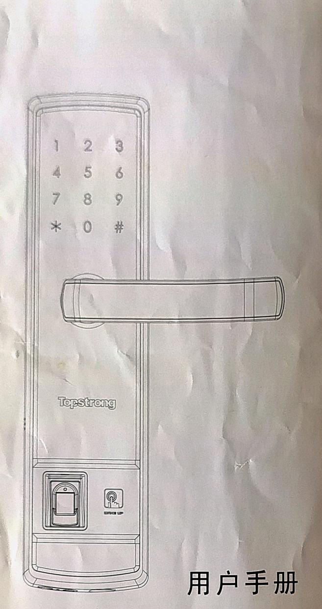

15系列智能锁 

## 使用须知与产品图示

尊敬的用户您好！感谢您使用本智能锁，在您安装使用本产品之前请仔细核对产品清单，阅读安装说明，并按本安装说明安装产品，若因未按本安装说明安装，导致的直接或间接的产品问题，及其他危害和损失，我公司概不承担任何责任。 

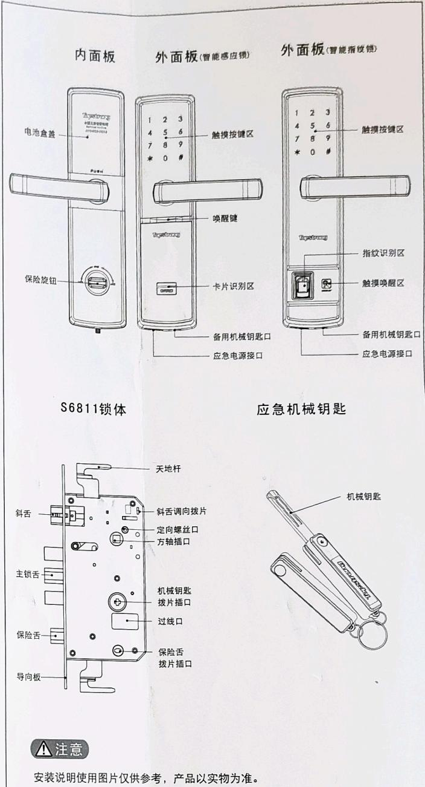

**📌 注意**

安装说明使用图片仅供参考，产品以实物为准。 

### 产品清单

请在拆开包装箱后按以下清单仔细核对，如发现有缺漏，请及时向我们或代理商索取。 

<table><tr><td>序号</td><td>名称</td><td>每套锁具数量</td><td>备注</td></tr><tr><td>1</td><td>外面板(含硅胶垫)</td><td>1</td><td></td></tr><tr><td>2</td><td>内面板(含硅胶垫)</td><td>1</td><td></td></tr><tr><td>3</td><td>锁体</td><td>1</td><td></td></tr><tr><td>4</td><td>安装配件包</td><td>1</td><td></td></tr><tr><td>5</td><td>用户手册</td><td>1</td><td></td></tr><tr><td>6</td><td>百洁布</td><td>1</td><td></td></tr><tr><td>7</td><td>合格证</td><td>1</td><td></td></tr><tr><td>8</td><td>产品质量保修卡</td><td>1</td><td></td></tr><tr><td>9</td><td>钥匙盒</td><td>1</td><td></td></tr><tr><td>10</td><td>电池包</td><td>1</td><td></td></tr><tr><td>11</td><td>侧扣板</td><td>1</td><td></td></tr><tr><td>12</td><td>侧扣盒</td><td>1</td><td></td></tr><tr><td>13</td><td>用户卡片</td><td>3</td><td>智能指纹锁无此项</td></tr><tr><td>14</td><td>管理卡片</td><td>1</td><td>智能指纹锁无此项</td></tr><tr><td>15</td><td>开孔模板</td><td>1</td><td></td></tr><tr><td></td><td></td><td></td><td></td></tr></table>

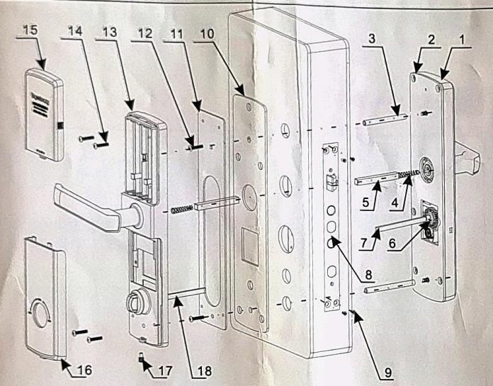

1.外面板（1只）  
2.外面板硅胶垫（1片）  
3.连接螺栓（2枚）  
4.方轴压簧（2枚）  
5.方轴（2个）  
6.开口销（2个）  
7.机械钥匙拨片（1个）  
8.锁体（1个） 

9.锁体固定螺丝（4枚）  
10.内面板硅胶垫（1片）  
11.固定板（1片）  
12.固定板固定螺丝（2枚）  
13.内面板（1只）  
14.内面板固定螺丝（4枚）  
15.电池盒盖（1个）  
16.内面板下盖（1个） 

17.下盖固定螺丝（1枚）  
18.保险旋钮拨片（1个） 

## 安装准备

**📌 注意**

2.默认出厂配置的配件包适用60-90mm门厚，如果是其它规格的门请联系我们。

1. 根据门的厚度选择不同规格的配件包。

### 门向确认

本智能锁可以适用于左外开、左内开、右外开、右内开，四种开向的门。 

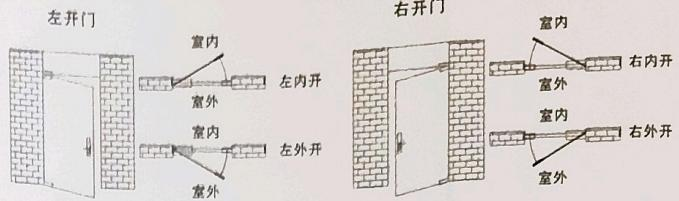

### 执手换向

1. 用22mm套筒扳手拧下执手固定螺丝。 

2.适度拉出执手，旋转 180° 至正确位置，再拧回螺丝。 

3.将执手螺母包片向上扳起，以限定螺丝。 

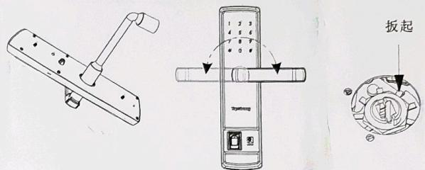

### 斜舌换向

改变斜舌方向来选择不同的锁体。 

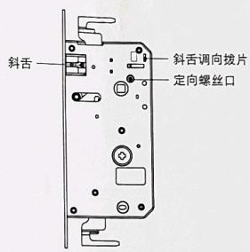

1.将"斜舌调向拨片"上推至顶。 

2. 按进斜舌并转动180度，再拉出斜舌。 

3.再将"斜舌调向拨片"下推至底。 

4.根据内外开门需求，更改定向螺丝方向。（定向螺丝一定要装在门的内侧，即哪面装定向螺丝，哪面必须是内面板） 

## 安装步骤

### 安装锁体

根据开孔模板在门上开好孔，将锁体放入门框内。

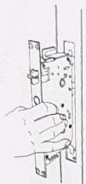

旋紧锁体上的四颗固定螺丝。

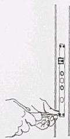

4.2 锁体插入时勾好上下天地杆（安装木门时无此步骤）。

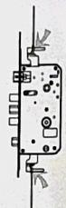

### 安装外面板

4.4 

在外面板上装上连接螺栓以及机械钥匙拨片，执手孔中放上压簧和方轴。

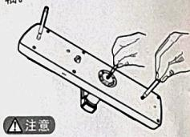

根据门的厚度适度裁剪机械钥匙拨片，选择适当长度的方轴和连接螺栓。

将连接线穿过锁体过线口。外面板上的机械钥匙拨片与方轴对准锁体上的两个转动口插入，使外面板紧贴门外面。

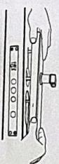

### 安装内面板

4.6 将固定板放入硅胶垫中，紧贴门内面，旋紧两颗固定螺丝。

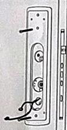

旋紧四颗固定螺丝。将内外面板连接线及电机线插入内面板相应的插座中。

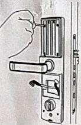

4.7 在内面板上依次放入压簧和方轴，并插好保险旋钮拨片。将内外面板连接线及电机线穿过内面板。

将内面板上的拨片与方轴对准锁体上的两个转动口插入，内面板紧贴门内面。

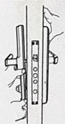

### 安装收尾与检查

4.9 装上电池，盖上电池盒盖和内面板下盖，智能锁安装完成。

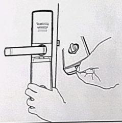

4.10 拧动内外执手、保险旋钮、机械钥匙，检查各部件是否连接完好。

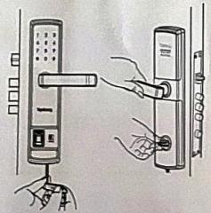

## 使用方法

### 常用开锁模式

5.1.1 密码开锁 

1 唤醒键 

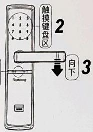

1、轻按 **唤醒键**，键盘灯点亮。  
2、输入已添加的密码，按【#】确认，语音提示："验证成功"。  
3、向下转动执手开锁。 

5.1.2 卡片开锁（智能感应锁） 

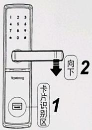

1、将已添加的卡片靠近卡片识别区直到"嘀"声响，语音提示："验证成功"。  
2、向下转动执手开锁。 

5.1.3 指纹开锁（智能指纹锁） 

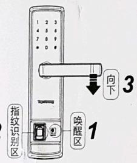

1、触摸唤醒区，键盘灯点亮。 

2、将手指（已添加的）以正确的方式放在指纹采集器上，嘀声后语音提示："验证成功"。  
3、向下转动执手开锁。 

### 安全模式

在安全模式下，需双重验证方可开锁。 

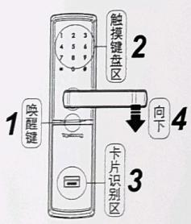

(1) 密码+卡片（智能感应锁） 

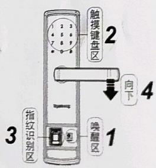

(2) 密码+指纹（智能指纹图） 

若出现忘记密码，电池电量耗尽或系统无法运作等紧急情况，可使用备用机械钥匙开锁。 

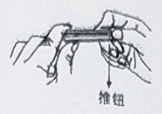

1、剪开钥匙盒，取出机械钥匙，推开推钮划出钥匙。 

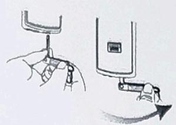

2、把机械钥匙插入锁孔，钥匙套与钥匙成垂直90°，钥匙套向执手方向转动90°，直至靠近门面。 

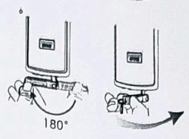

3、将钥匙套向下转动180°，使钥匙套平行于水平面。向执手方向水平转动钥匙套，即可开锁。 

### 门锁定

5.4.1 外部锁定 

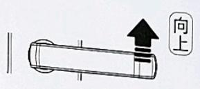

室外执手向上旋转锁定 

5.4.2 内部锁定 

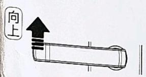

室内执手向上旋转锁定 

5.4.3. 内部反锁 

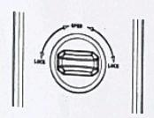

旋转旋钮，进行反锁，此时从室外无法正常开启，需室内解锁。 

**📌 注意**

1、在正常通电环境下，使用机械钥匙开锁警报声即刻响起，并将持续一分钟。
2、出于安全考虑，验证成功后5s，用户未转动执手开锁，系统将重新上锁。
3、在常用模式下，连续输入10次错误密码时，触摸键盘区将被锁定五分钟。
在锁定情况下，断电后重新上电不能解除锁定，只能验证正确的卡片或指纹才能解除锁定。 

4、在安全模式下，密码连续10次输入错误时，系统锁定5分钟。在锁定情况下，断电后重新上电不能解除锁定。 

## 管理模式

### 进入管理模式

智能感应锁 

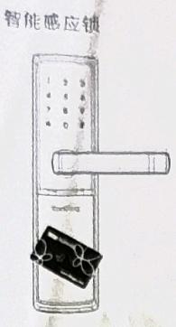

1、将管理卡靠近卡片识别区。
2、语音提示："已进入管理模式"。 

智能指纹锁 

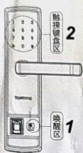

1、轻触唤醒区：按键指示灯点亮。
2、连续按【*】两次，输入正确的管理密码，再按【#】结束。
3、语音提示："已进入管理模式"。 

 
### 智能感应锁设置

### 设置/修改开门密码 

（1）进入管理模式，按【1】进入到用户密码设置。 

（2）输入6位开门密码，按【#】确认；再次输入开门密码，按【#】确认，语音提示：设置成功。 

### 关闭开门密码 

（1）进入管理模式，按【1】进入到用户密码设置。 

（2）直接按【#】确认；此时开门密码功能停用，用户只能通过其他方式开锁。 

### 添加用户卡片

（1）进入管理模式，按【2】进入添加用户卡片。 

（2）输入2位用户编号（编号范围：01~99），按【#】确认。 

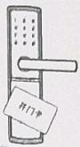

将要添加的卡片靠近卡片识别区直到"嘀"声响，语音提示：添加成功。 

**📌 注意**

管理卡无法添加为用户卡，已经添加过的卡片删除后才能重新添加。 

### 删除用户卡片

（1）进入管理模式，按【3】进入删除用户卡片。 

（2）按【1】进入到单个删除。 

（3）输入要删除的2位用户编号，按【#】确认或将要删除的卡片靠近卡片识别区直到"嘀"声响，语音提示：删除成功。 

（4）按【2】进入到全部删除，语音提示：删除成功。 

### 修改开门模式 

（1）进入管理模式，按【4】进入修改开门模式。  

（2）按【1】选择常用模式，密码或卡片验证开锁。 

（3）按【2】选择安全模式，密码+卡片双重验证开锁。 

**📌 注意**

1、上述操作过程中，全程语音提示，您可以按照语音提示操作。 

2、在设置菜单中，按【*】可返回上一级菜单。 

3、用户密码为6位，并且只有一个。所以在设置用户密码时，新输入的密码将覆盖原密码，使原密码失效。 

4、如果要退出管理模式，只需再刷一次管理卡即可；10s无任何操作，系统将自动退出管理模式。 

5、如果本智能锁只有一种开门方式存在时，如只有密码开门或者只有卡片开门时，无法设置为安全模式。 

### 智能指纹锁设置

### 设置/修改开门密码 

进入管理模式，按【1】进入到用户密码设置。 

输入6位开门密码，按【#】确认；再次输入开门密码，按【#】确认，语音提示：设置成功。 

### 关闭开门密码 

进入管理模式，按【1】进入到用户密码设置。 

直接按【#】确认；此时开门密码功能停用，用户只能通过其他方式开锁。 

### 添加用户指纹

进入管理模式，按【2】进入添加用户指纹。 

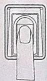

输入2位用户编号（编号范围：01~99），按【#】确认。 

将要添加的指纹放在指纹采集器上，待听到"请拿开手指，再放一次"时，拿开手指重新放回指纹区，待听到"添加成功"，表示用户指纹添加成功。 

### 删除用户指纹

进入管理模式，按【3】进入删除用户指纹。 

按【1】进入到单个删除。 

输入要删除的2位用户编号，按【#】确认或将要删除的指纹放在指纹识别区直到"嘀"声响，语音提示：删除成功。 

按【2】进入到全部删除，语音提示要删除成功。 

### 修改开门模式 

进入管理模式，按【4】进入修改开门模式。 

按【1】选择常用模式，密码或指纹验证开锁。 

按【2】选择安全模式，密码+指纹双重验证开锁。 

### 修改管理密码

进入管理模式，按【5】进入到修改管理密码。 

输入新的管理密码（密码长度：4~20位），按【#】键确认，再次输入新的管理密码，按【#】确认，语音提示：设置成功。 

**📌 注意**

1、上述操作过程中，全程语音提示，您可以按照语音提示操作。 

2、在设置菜单中，按【*】可返回上一级菜单。 

3、用户密码为6位，并且只有一个。所以在设置用户密码时，新输入的密码将覆盖原密码，使原密码失效。 

管理密码4~20位，出厂管理密码为12345678。 

4、10s无任何操作，系统将自动退出管理模式。 

5、如果本智能锁只有一种开门方式存在时，如只有密码开门或者只有指纹开门时，无法设置为安全模式。 

### 恢复出厂与应急供电

<table><tr><td colspan="2">[20W74] 恢复出厂设置如果您不慎遗忘管理密码或遗失管理卡,可以拆下锁具,在通电的情况下初始化系统,重新设置管理密码或重新添加管理卡,步骤如下:</td></tr><tr><td>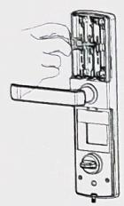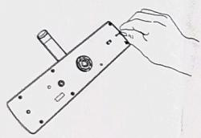</td><td>1、拆下内外面板,重新通上电。2、用细木条按 **住初始化按键**并持续3秒以上,待语音提示:"已恢复出厂设置,请添加管理密码(请添加管理卡)",即表示本锁已初始化成功。</td></tr><tr><td colspan="2">注意 恢复出厂设置后,之前设置的所有开门密码/指纹/卡片将被清空。</td></tr><tr><td colspan="2">[20WK] 应急供电方法</td></tr><tr><td>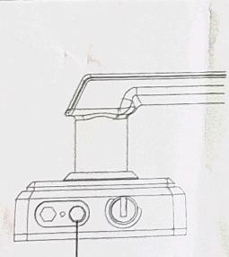应急电源口</td><td>如果电池没电,可外接9V叠层电池作为应急电源。将电池两极接到外面板下方的应急电源口,然后以正常方式开锁。</td></tr><tr><td colspan="2">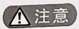 电池电量低于4.5V时,系统在每次成功开锁后,语音提示:"电量低,请更换电池"。此时,请及时更换电池。(请勿将不同型号、新旧电池混用。)</td></tr></table>

<!-- 标题改动：原文件10个h2平级无层次，安装步骤编号4.1→4.5→4.7→4.9→4.2→4.4→4.6→4.10乱序。现重组为7个h2父标题+20个h3子标题的两级结构，安装步骤重排为正确顺序4.1→4.2→4.4→4.5→4.6→4.7→4.9→4.10，相关内容归入统一父标题下。 -->