SAMSUNG

液晶电视用户手册 QLED 液晶电视 | Q7F

在使用本机之前, 请仔细阅读使用说明并妥善保管以备日后参考查阅
感谢您购买三星产品。请在三星网站注册您的产品，以获得更全面的服务：
www.samsung.com/register
型号\_\_\_\_\_\_序列号\_\_\_\_\_\_

预约三星上门安装请致电：400-810-5858

挂架及收费项目请登录官网查询：www.samsung.com

非授权安装服务可能对您的产品造成损坏，且存在安全隐患。为保证产品使用安全，建议选择三星授权安装服务及安装配件（挂架等）

非授权安装服务及配件造成产品损坏，不属三星产品/服务质量问题，您将无法享受三星公司的售后服务

更多产品安装注意事项及安装信息说明，请参考用户手册

## 阅读须知

本电视附带该用户手册以及内嵌的电子手册。

在阅读本用户手册之前，请查看以下内容：

<table><tr><td>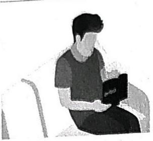</td><td>用户手册</td><td>请阅读本随附的用户手册,了解有关产品安全、安装、配件、初始配置和产品规格方面的信息。</td></tr><tr><td>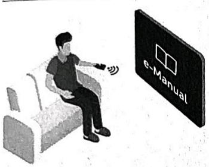</td><td>说明书</td><td>有关本电视的更多信息,请阅读本产品内嵌的电子手册。打开电子手册设置 &gt; 支持 &gt; 打开说明书</td></tr></table>

在网站上, 您可下载用户手册, 并在您的电脑或移动设备上查看其内容。

**了解电子手册的辅助功能**

\- 有些菜单屏幕无法通过电子手册访问。

<table><tr><td>Q</td><td>(搜索)</td><td>从搜索结果中选择一项以加载相应页面。</td></tr><tr><td>A-Z</td><td>(索引)</td><td>选择一个关键字可导航到相关页面。</td></tr><tr><td>➊</td><td>(已打开的页面)</td><td>从最近查看的主题列表中选择一个主题。</td></tr></table>

**电子手册页面按钮功能**

<table><tr><td></td><td>(立即尝试)</td><td>访问相关菜单项并直接试用相关功能。</td></tr><tr><td></td><td>(链接)</td><td>访问电子手册主题页面上引用的主题。</td></tr></table>

## 重要安全说明

**⚠️ 警告**

在您安装和使用产品之前,请仔细阅读您所购买的三星产品上标记的对应内容

<table><tr><td colspan="2">注意事项</td><td rowspan="2"></td><td rowspan="2">II 类产品:该符号表示它不要求进行安全接地(连接地线)。</td></tr><tr><td colspan="2">有触电的危险,请勿打开</td></tr><tr><td colspan="2">注意:为减少触电的危险,请勿卸下机盖(或后盖)。内部没有用户可维修的部件。请让合格的维修人员进行维修。</td><td>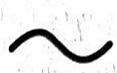</td><td>交流电压:这个符号表示与该符号一起显示的额定电压是交流电压。</td></tr><tr><td>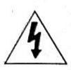</td><td>此符号表示内部存在高压电。以任何方式接触产品内部的任何部件都非常危险。</td><td>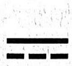</td><td>直流电压:这个符号表示与该符号一起显示的额定电压是直流电压。</td></tr><tr><td>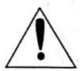</td><td>此符号提醒您本产品随附有关于操作和保养的重要说明。</td><td></td><td>注意,参考使用说明:此符号指示用户参考使用说明上的更多安全相关信息。</td></tr></table>

\- 机箱内及后部或底部的开槽和洞孔是为了提供必要的通风而设计。为了确保本机器的正常运行和防止过热，切勿堵塞或遮盖这些开槽和洞孔。
- 不要将本设备安装在受限制的空间，如：书柜或嵌入的橱柜，除非有适当的通风条件。
- 不要将本机器放置在电暖炉或暖气片附近或上方，或阳光可直射的地方。
- 不要将盛有水的容器（例如花瓶等）放置在本机器上，因为这样可能导致火灾或触电。

\- 不要将本机器暴露在雨中或安装在靠近水的地方（例如靠近浴缸，水盆，厨房水槽，或洗衣池，潮湿的地下室，或靠近游泳池等）。如果本设备被意外弄湿，请立即拔下电源插头然后联系授权经销商。在进行清洁之前，请确保拔掉电源线。

\- 本设备使用电池。基于环境的考虑，您的社区可能会规定您必须正确处置这些电池。请联系您当地的机构以了解关于处理或回收电池的信息。用错误型号电池更换会有爆炸危险，务必按照说明处置用完的电池。

\- 勿使墙上插座，延长电线或便利插座超载，因为这样可能导致火灾或触电。

\- 电源线应布置在不会被踩到或被上方或旁边物体挤压的位置。应特别注意插头处，便利插座处以及机器接出处的电线。

\- 在雷电天气下或无人看管或长时间不用的情况下, 为了更好地保护本机器, 请拔下其插头, 并断开天线或电缆系统的连接。这样可以预防机器在雷电期间或电源线路出现电涌的情况下被损坏。

\- 将交流电源线连接到电源适配器插座前，请确定电源适配器的电压参数符合您当地的电源供应。

\- 切勿将任何金属物件插入本机器的洞孔，否则可能导致触电。

\- 为防止触电，切勿触碰本机器内部的任何部件。只有合格的技术人员才可以打开本机器。

\- 请确保将电源线牢固地插入插座。在断开电源线连接时，请确保抓住电源插头，然后将插头从插座拔出。请勿用湿手触碰电源线。

\- 如果本设备工作不正常, 特别是当其发出任何不寻常的声音或气味时, 请立即拔下电源插头, 然后联系授权经销商或服务中心。

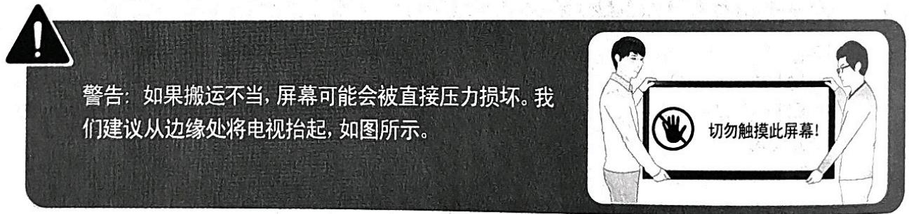

## 包装内容

请确保电视包装箱中随附有下列物品。如果缺少任何物品，请与经销商联系。

\- 三星智能遥控器（Samsung Smart Remote）和电池（2节7号电池）
- 保修卡/规范
- 电视电源线清洁布

\- 用户手册

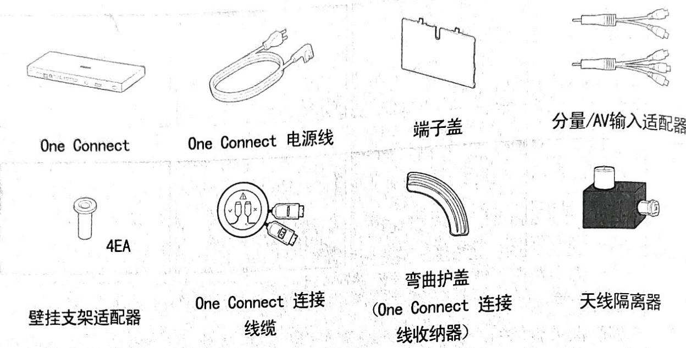

\- 物品的颜色和形状因型号而异。

\- 未随附的电缆可单独购买。

\- 打开包装箱时，请检查包装材料后面或当中是否藏有附件。

**📌 注意**：电源线请牢固插入，以防从电视中松脱。

如果出现下列情况, 可能需要收取手续费:

(a) 您要求工程师上门服务, 但并未发现产品存在任何缺陷 (即表示您未阅读本用户手册)。

(b) 您将产品带到维修中心, 但并未发现产品存在任何缺陷 (即表示您未阅读本用户手册)。技术人员上门服务之前, 会先通知您手续费的金额。

**⚠️ 警告**：如果搬运不当，屏幕可能会被直接压力损坏。我们建议从边缘处将电视抬起，如图所示。

## One Connect 连接

请参阅下图并在电视和 One Connect 之间连接 One Connect 连接线缆，该装置作为附件提供。务必先解开连接至电视的 One Connect 连接线缆的电缆(☐)。如果您解开将连接至 One Connect 的 One Connect 连接线缆的电缆(—)，电缆可能会缠绕或损坏。

1. 将 One Connect 连接线缆的接头(四)连接至电视, 然后将接头(一)连接至 One Connect。

2. 在电视和 One Connect 之间连接 One Connect 连接线缆之后，将其电源插头连接至电源插座。

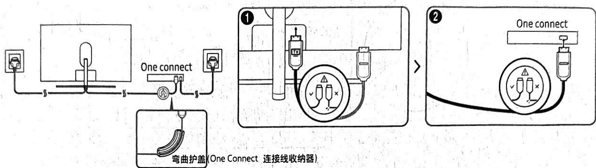

\- 在连接 One Connect 连接线缆时, 使用弯曲护盖 (One Connect 连接线收纳器) 防止 One Connect 连接线缆的电缆以 90 度角弯曲。否则, 可能会损坏电缆。

\- 在连接 One Connect 连接线缆时, 注意其接头的形状, 从而使其正确连接。否则, 可能会导致产品故障。

\- 在连接 One Connect 连接线缆之后, 将剩余电缆缠绕在 One Connect 连接线缆周围。直接缠绕或让电缆保持原样可导致电缆受损。

\- 在连接 One Connect 连接线缆时, 小心不要扭曲 One Connect 连接线缆的电缆。否则, 可能会导致性能降低或损坏电缆。

\- 请注意不要进行以下操作, 以防 One Connect 连接线缆受损:

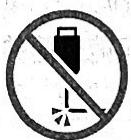  
弯曲

  
扭曲

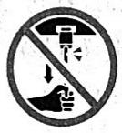  
拉动

  
脚踩

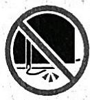  
重压

### 激光安全

**一类激光产品**

\- 小心

\- 在打开时有不可见的激光辐射。请勿直视光束。

\- 请勿过度弯曲或切割电缆。

\- 请勿将重物置于电缆上。

\- 请勿拆卸电缆接头。

\- 小心

\- 使用本手册规定以外的控制、调整方法或程序可能导致危险的辐射曝露。

## 电视安装

### 壁挂式安装

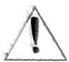

式安装
如果要将本电视安装到墙壁上, 则须谨遵制造商说明。如果安装不正确, 电视可能会下滑或跌落, 则从高或减造成严重伤害, 并且严重损坏电视本身。

落，对儿童或成人造成严重伤害，并且严重损坏电视本身。

\- 参阅 Samsung 壁挂支架套件随附的安装手册。

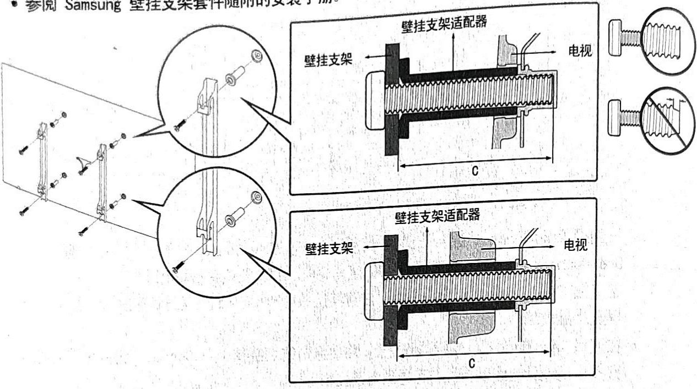

\- 如果您选择自行安装壁挂支架, 则对于由此造成的任何产品损坏或者对您自己或他人造成的伤害, 三星电子概不负责。

\- 将壁挂支架安装到与地板垂直的实心墙上。在将壁挂支架安装到非灰泥板的表面之前，请联系距您最近的经销商以了解更多信息。如果将电视安装到天花板或倾斜的墙上，电视可能跌落并导致严重的人身伤害。

\- 下表中列出了壁挂支架套件的标准尺寸。

\- 如果您安装第三方壁挂支架，注意下面表格 C 列中列出的您可用于将电视连接至壁挂支架的螺钉的长度。

\- 在安装壁挂支架套件时，我们建议将四颗 VESA 螺钉都拧紧。

\- 如果您想仅用两颗顶部螺钉安装附接至墙壁的壁挂支架套件, 则务必使用支持这种安装方式的 Samsung 壁挂支架套件。(您可能无法购买这种类型壁挂支架套件, 具体取决于您所在的地理区域。)

<table><tr><td>电视尺寸(英寸)</td><td>VESA 螺孔规格(A*B),单位:毫米</td><td>C(毫米)</td><td>标准螺钉</td><td>数量</td><td rowspan="2">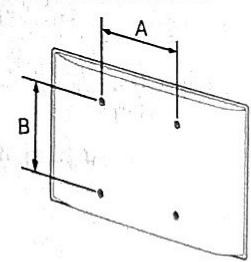</td></tr><tr><td>65</td><td>400×400</td><td>43-45</td><td>M8</td><td>4</td></tr></table>

简体中文 - 8

\- 请勿使用超出标准尺寸或不符合 VESA 标准螺钉规格的螺钉。太长的螺钉可能会对电视内部造成损坏。

\- 对于不符合 VESA 标准螺钉规格的壁挂支架，螺钉长度可能因壁挂支架规格而异。

\- 请勿过度拧紧螺钉。这可能会损坏产品或造成产品跌落，导致人身伤害。Samsung 对此类事故概不负责。

\- 对因使用不符合 VESA 标准或非指定的壁挂支架, 或消费者未遵循本产品的安装说明而造成的产品损坏或人身伤害, Samsung 概不负责。

\- 电视的安装倾斜角度不得大于 15 度。

\- 务必由两人将电视安装到墙壁上。

### 通风要求

安装电视时，使电视距离其他物体（墙壁、电视柜壁等）至少 10 厘米，确保适当的通风。通风不当可能会使电视内部温度升高，从而导致火灾或使电视出现故障。

不管您使用底座支架还是壁挂支架安装电视，我们强烈建议仅使用三星电子提供的零件。使用其他制造商提供的零件可能引发产品故障，或导致产品坠落，造成人身伤害。

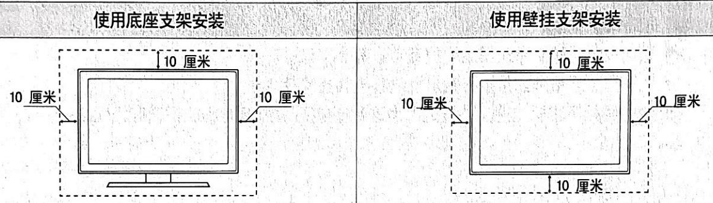

**其他警告**

\- 电视的实际外观可能与本手册中的图像有所不同，具体视型号而定。

\- 接触电视时请小心谨慎。某些零部件可能会发烫。

从电视上取下端子盖板支架。

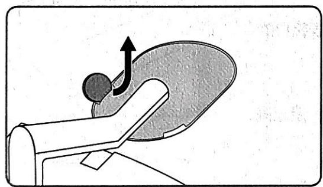

从电视上取下背部端子防尘盖。

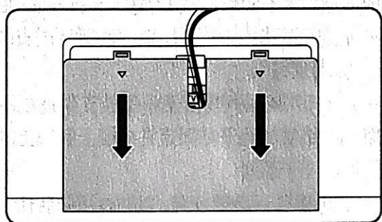

\- 图中圆形工具为示例，不随产品提供。

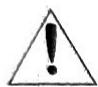

### 支架安装

确保所有配件齐全，并按照随附的安装说明安装支架。

**⚠️ 安全注意事项**: 将电视固定到墙上, 防止掉落注意事项: 推拉或攀爬电视可能会造成电视跌落。请特别注意不要让儿童爬到电视上或摇晃电视。否则可能导致电视倾翻, 造成严重的人身伤害甚至死亡。请遵循随电视所附的用户手册中提供的所有安全注意事项。为增强稳定性和安全性, 您可以购买防跌落装置并按照如下所述进行安装。

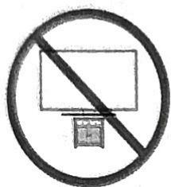

**⚠️ 警告**: 切勿将电视放置在不稳定的位置。否则可能会掉落, 造成严重的人身伤害或死亡。采取简单预防措施即可避免许多伤害事故, 尤其是对儿童, 例如

\- 使用电视制造商推荐的柜子或支架。

\- 只选用能安全支撑电视的家具。

\- 确保电视不会悬放在支撑家具的外缘。

\- 。
- 在尚未锚固家具和电视, 使其具备合适的支撑之前, 不得将电视放置在较高的家具上 (如碗橱或书架)。

\- 切勿在电视和支撑家具之间放置布或其他材料。

\- 让孩子了解攀爬家具以接触电视或其控制器的危险。

如果您要保留和搬移电视, 并且更换为这款新电视, 对于旧电视机请遵守相同的安全注意事项。

### 防跌落固定

1. 使用适当的螺钉，将一组支架牢固固定至墙壁。确保螺钉牢固地连接在墙壁上。

\- 根据墙壁类型的不同, 您可能还需要其他材料, 如墙壁锚固螺钉。

2. 使用适当大小的螺钉，将一组支架牢固固定至电视。

\- 有关螺钉规格的信息, 请参阅壁挂式安装部分的表格中的"标准螺钉"。

\- QA65Q7FAM系列需要使用壁挂支架适配器。

3. 用一根结实的绳子将固定在电视上和墙上的固定夹连接起来，然后将绳子系紧。

\- 将电视靠近墙壁安装，以防电视向后倒。

\- 连接绳子时，应确保固定在墙上的固定夹的高度等同或低于固定在电视上的固定夹。

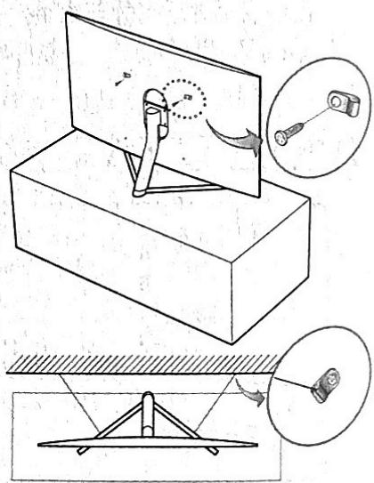

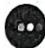

## 遥控器使用

### 按键功能

**(电源)**：按下以打开或关闭电视。

**(数字键盘)**：按下该按钮，屏幕底部将显示一个数字条。选择数字，然后选择完成以输入数值。用于更改频道、输入PIN、输入邮政编码等。

**方向板**（向上/向下/向左/向右）：移动焦点，并更改电视菜单上所显示的值。

**(返回)**：返回上一级菜单。按住 1 秒以上可停止当前运行的功能。在观看节目时按下该按钮可显示上一个频道。

**(播放/暂停)**：如果按下，将显示播放控件。利用这些控件，您可以控制正在播放的媒体内容。

**(Smart Hub)**：回到主屏幕。

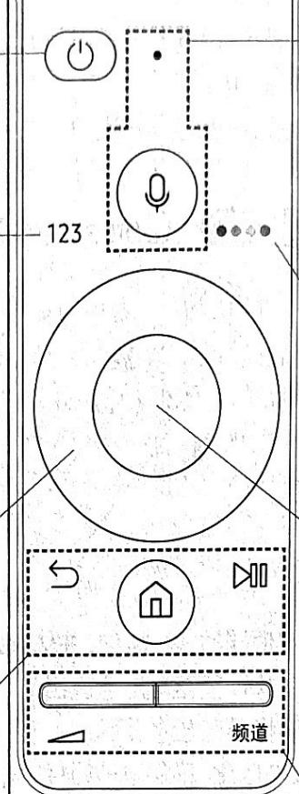

**(频道)**：向上/下移动按钮可更改频道。按下该按钮可显示指南屏幕。

**(语音交互)**：运行 语音交互。按下该按钮，说出语音命令，然后松开该按钮以运行"语音交互"。再次按下此按钮，即可显示语音交互指南。

**(4 个彩色按钮)**：使用这些彩色按钮可访问正在使用的功能所特有的其他选项。

**(选择)**：选择或运行聚焦的项目。在观看内容时按下该按钮可显示详细的节目信息。

**(音量)**：向上/下移动按钮可调节音量。按住该按钮可让伴音静音。按住1秒以上可显示辅助功能快捷方式菜单。

**(频道)**：向上/下移动按钮可更改频道。按下该按钮可显示指南屏幕。

### 遥控器配对

将电视与三星智能遥控器 (Samsung Smart Remote) 配对
(Samsung Smart Remote) 将自动与首次打开电视时, 三星智能遥控器 (Samsung Smart Remote) 没有与电视配对。如果 三星智能遥控器 (Samsung Smart Remote) 没有与电视自动配对, 请将其对准电视的遥控传感器, 然后同时按下左侧图示中标有 ☑ 和 ⬇ 的按钮 3 秒钟或更长时间。• 三星智能遥控器一次只能与一台电视配对。

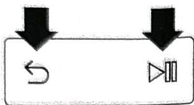

### 安装电池

将电池安装到 三星智能遥控器 (Samsung Smart Remote) 中

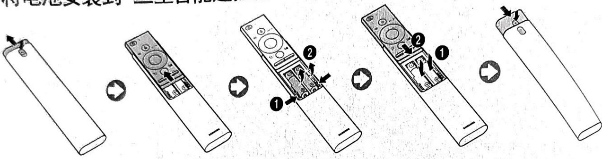

1. 按下 Samsung Smart Remote 后部顶端的 ▲ 按钮。主体将从主体盖中轻轻弹出。

2. 翻转遥控器，然后向上滑动遥控器主体，直至电池盒露出。

3. 按下电池盒两旁的 ▶ 和 ◀ 按钮，将现有电池拆下。

4. 将两个新电池 (1.5V AAA 型) 插入电池盒, 确保电池极性 (+, -) 正确取向。在完成之后, 将遥控器主体滑回原位。

5. 翻转遥控器，按住后方顶部的 ▲ 按钮，并将遥控器主体向下滑动到位。

\- 推荐使用碱性电池以获得更长的使用寿命。

**📌 注意**:

\- 强光可能会影响遥控器的性能。因此应避免在荧光灯或霓虹灯附近使用遥控器。

\- 遥控器的颜色和形状可能因电视型号而异。

## 初始设置

首次打开电视时会出现初始设置对话框。遵循屏幕说明完成初始设置流程。也可稍后在设置 > 常规 > 开始设置菜单下手动执行此过程。

\- 如果您在开始安装前已将任何设备连接至 HDMI1，则频道源将自动切换为机顶盒。

\- 如果您不想使用机顶盒，请选择天线。

### 天线隔离器安装

接入本设备的有线网络天线必须与保护接地隔离, 否则可能引起着火等危险, 请将天线隔离器连接到墙上的天线端子, 然后将连接到电视ANT输入的天线连接到天线隔离器。

为防止火灾的危险, 请在使用电视机前, 将天线隔离器正确安装在有线信号线端接口上。如在使用中有损坏情况发生, 请联系三星客户服务部门进行购买或是更换。

由于我国供电条件的特殊性, 接地设施不够完善, 因此要求有线网络天线同轴插座与电视之间应有隔离措施。

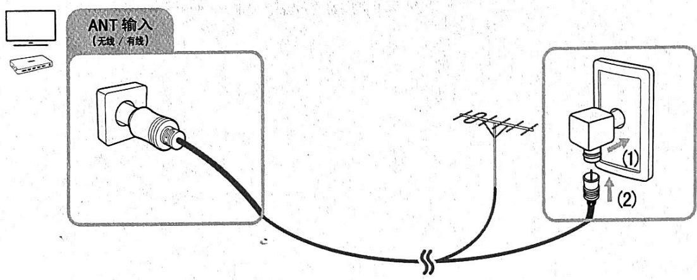

### 使用电视控制器

您可以使用电视底部的电视控制器按钮打开电视，然后使用控制菜单。在电视打开时按下电视控制器，将出现控制菜单。有关控制菜单具体用途的更多信息，请参阅下图。

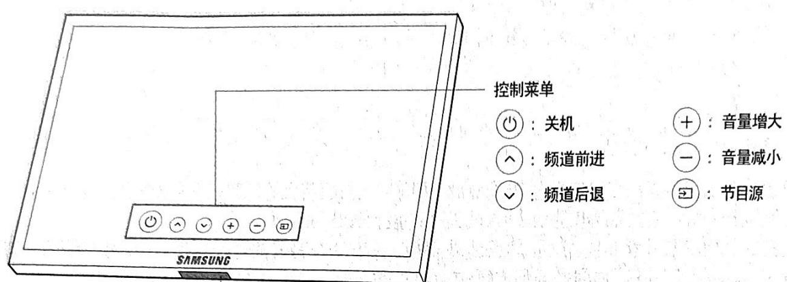

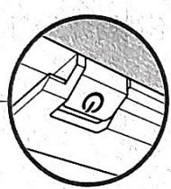

电视控制器 / 遥控传感器  
按：移动  
按住：选择  
电视控制器位于电视的底部。

## 连接网络

将电视连接至网络即可使用在线服务, 例如 Smart Hub 和软件更新。

### 无线连接

使用标准路由器或调制解调器将电视连接到互联网。

**配备 DHCP 服务器的 IP**：路由器或调制解调器

墙上的 LAN 端口

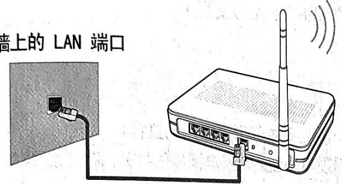  
网线（未提供）

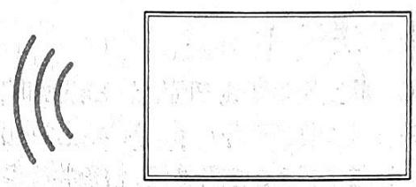

### 有线连接

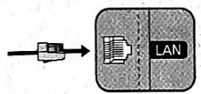

使用网线将电视连接到网络中。

\- 此电视不支持低于或等于 10Mbps 的网速。

\* 屏蔽双绞线

\- 请使用 Cat7(\*STP 型) 缆线进行连接。

## 故障排除

如果电视看上去有问题，请先参考以下列表，找到可能的问题并尝试相应的解决方案。另外，请查阅电子手册中的"故障排除"部分。如果这些故障排除方法都不奏效，请访问"www.samsung.com"网站，然后单击"支持"，或联系呼叫中心（见本手册封底）。

\- 此 TFT LED 面板由采用先进技术制造的子像素构成。然而，屏幕上可能还是会有或明或暗的像素斑点。这些像素斑点不会影响产品性能。

\- 为使您的电视处于最佳状态，请将软件升级到最新版本。使用电视菜单上的立即更新或自动更新功能（图标 > 设置 > 支持 > 软件更新 > 立即更新或自动更新）。

### 电视无法开启

\- 确保将交流电源线牢固地插入电视和墙壁插座中。

\- 确保墙壁插座工作正常，且电视上的电源指示灯亮起并显示为稳定的红色。

\- 尝试按电视上的电源按钮，检查并确保遥控器没有问题。如果电视能够打开，请参阅下文的"遥控器不起作用"。

### 无图像/视频/伴音

使用外部设备时无图像/视频/伴音或者图像/视频/伴音失真，或者在电视上显示"信号弱或没有信号"，或者您无法找到频道。

\- 确保设备妥当连接，且所有缆线正确插入。

\- 拔掉电视和外部设备上连接的所有缆线，然后再重新连接。如果可能，尝试使用新缆线。

\- 确认选择了正确的输入源（>节目源）。

\- 执行电视自检, 判断问题是来自电视还是外部设备 (☐ > ☐ 设置 > 支持 > 自诊断 > 开始图像测试或开始声音测试)。

\- 如果自检结果正常，则断开并重新连接各设备的电源线，重启连接的设备。如果问题仍然存在，请参阅所连接设备的用户手册中的连接指南。

\- 如果电视未连接有线电视盒或机顶盒, 请运行自动选台以搜索频道 ( ) > 设置 > 广播 > 自动选台)。

### 遥控器不起作用

\- 按控制器的电源按钮，检查电视上的电源指示灯是否闪烁。如果不闪烁，请更换遥控器的电池。

\- 确保电池正负极（+/-）方向正确。

\- 尝试在距离电视 1.5 \sim 1.8 {~m} 的地方将遥控器对准电视。

\- 如果电视配备 三星智能遥控器（Samsung Smart Remote）（蓝牙遥控器），请确保将遥控器与电视配对。

**有线电视盒或机顶盒遥控器不能打开或关闭电视，或无法调整音量**：

\- 设置有线电视盒/机顶盒遥控器的程序，使其能够控制电视。请参阅有线电视盒或机顶盒的用户手册，获取 SAMSUNG 电视代码。

单楼层

### 设置 5 分钟后丢失

\- 电视处于零售模式。将常规菜单中的使用模式更改为家用模式（图标 > 设置 > 常规 > 系统管理器 > 使用模式 > 家用模式）。

### Wi-Fi 连接间歇性中断

\- 确保电视已连接网络（m）> 设置 > 常规 > 网络 > 网络状态。
- 确保 Wi-Fi 密码输入正确。

\- 检查电视与调制解调器/路由器之间的距离。该距离不应超过 15.2 m 不使用或关闭无线设备，以减少无线信号。

\- 不使用或关闭无线设备, 以减少干扰。同时, 确认电视与调制解调器/路由器之间无障碍物。(电器、无绳电话、石墙/壁炉等会导致 Wi-Fi 信号强度降低。)

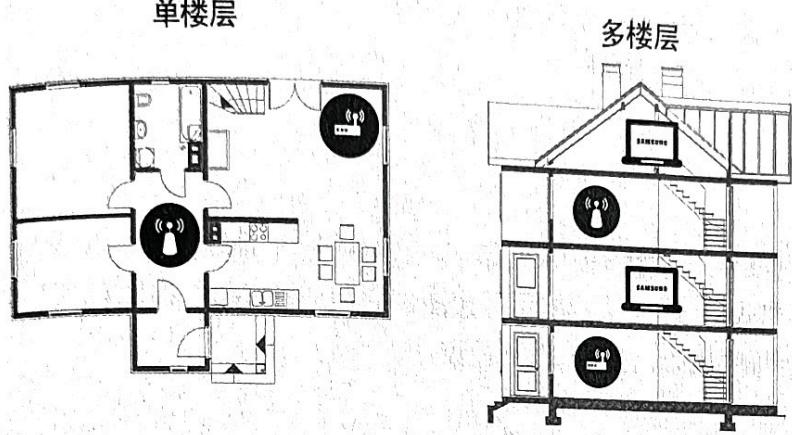

无线路由器

无线中继器

\- 致电您的 ISP 并要求他们重置您的网路，以便重新注册新调制解调器/路由器和电视的 Mac 地址。

### 视频应用问题

\- 将 DNS 更改为 8.8.8.8。选择 > 设置 > 常规 > 网络 > 网络状态 > IP 设置 > DNS 设置 > 手动输入 > DNS服务器 > 输入 8.8.8.8 > 确定。

\- 通过选择 > 设置 > 支持 > 自诊断 > 重设 Smart Hub。

### 远程支持

Samsung 远程支持服务可让 Samsung 技术人员为您提供一对一的远程支持:

\- 诊断电视故障

\- 调整电视设置

\- 恢复电视的出厂设置

\- 安装推荐的固件更新

**如何获得远程支持**：

您可以轻松地让 Samsung 技术服务人员为您远程维护电视:

1. 致电 Samsung 服务中心寻求远程支持。

2. 打开电视菜单，转至支持部分。

3. 选择远程管理，然后阅读并同意服务协议。PIN 码屏幕出现时，将 PIN 码提供给服务代表。

4. 服务代表随后会访问您的电视。

## 技术规格

### 电视规格

<table><tr><td colspan="3">显示分辨率</td><td>3840 x 2160</td></tr><tr><td colspan="3">环境条件</td><td></td></tr><tr><td colspan="3">工作温度</td><td>10°C至40°C(50°F至104°F)</td></tr><tr><td colspan="3">工作湿度</td><td>10%至80%,无凝结</td></tr><tr><td colspan="3">存放温度</td><td>-20°C至45°C(-4°F至113°F)</td></tr><tr><td colspan="3">存放湿度</td><td>5%至95%,无凝结</td></tr><tr><td colspan="3">支架旋转角度(向左/向右)</td><td>0°</td></tr><tr><td colspan="3">型号</td><td>QA65Q7FAMJXXZ</td></tr><tr><td colspan="3">可视图像对角尺寸(英寸/厘米)(需沿屏幕表面测量对角)</td><td>约64.5约163.9</td></tr><tr><td colspan="3">平均功率</td><td>100W</td></tr><tr><td colspan="3">音频最大输出功率</td><td>42W(主声道7WX2/低音声道7Wx2/高音声道7Wx2)</td></tr><tr><td colspan="3">尺寸(宽x高x深)不带底座带底座</td><td>约1444.1x826.4x45.0毫米约1444.1x916.7x376.9毫米</td></tr><tr><td colspan="3">重量不带底座带底座</td><td>约24.3千克约28.2千克</td></tr><tr><td colspan="3">亮度</td><td>≥200cd/m2</td></tr><tr><td colspan="3">对比度</td><td>≥200:1</td></tr><tr><td rowspan="2">色度可视角</td><td colspan="2">水平</td><td>≥60°</td></tr><tr><td colspan="2">垂直</td><td>≥60°</td></tr><tr><td rowspan="2">亮度可视角</td><td colspan="2">水平</td><td>≥70°</td></tr><tr><td colspan="2">垂直</td><td>≥60°</td></tr><tr><td rowspan="4">静态清晰度</td><td rowspan="2">标清</td><td>水平</td><td>≥450线</td></tr><tr><td>垂直</td><td>≥450线</td></tr><tr><td rowspan="2">高清</td><td>水平</td><td>≥720线</td></tr><tr><td>垂直</td><td>≥720线</td></tr><tr><td colspan="3">色域覆盖率</td><td>≥28%</td></tr><tr><td colspan="3">执行标准</td><td>Q/12JD 6298液晶电视技术规范</td></tr></table>

- 有关电源和功耗的更多信息，请参阅贴在产品上的标签。  
- 您可在端口护盖内部看到产品标签。

### 能效标识

**减少功耗**：电视关闭后即进入待机模式。处于待机模式时，电视还会继续消耗少量电源。为了减少功耗，请在长时间不打算使用电视时拔掉电源线。

<table><tr><td>规格型号</td><td>能效等级</td><td>能效指数</td><td>被动待机功率(W)</td></tr><tr><td>QA65Q7FAMJXXZ</td><td>2</td><td>2.0</td><td>0.30</td></tr></table>

\- 电视的实际外观可能与本手册中的图像有所不同，具体视型号而定。

**待机模式**：为了减少功耗，请在长时间不使用电视时拔掉电源线。

### Eco 传感器和屏幕亮度

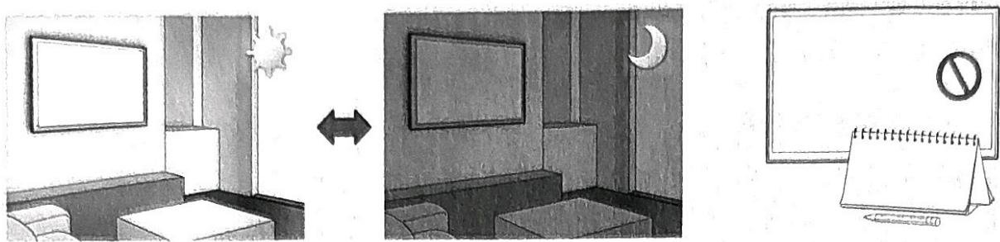

Eco 传感器可自动调整电视的亮度。这一功能将测量房间光线强度，并自动优化电视亮度以减少能耗。如果您要关闭此功能，请转至 > 设置 > 常规 > Eco 解决方案 > 环境光线检测。

\- 在昏暗环境中观看电视时，如果发现屏幕太暗，则可能是由环境光线检测功能造成的。

\- 请勿使用任何物体阻挡传感器，否则图像亮度将降低。

### 静止图像警告

避免屏幕上显示静止画面（如 jpeg 图片文件）、静止的画面元素（如电视频道徽标、屏幕底部的股市行情或新闻栏等）或全景画或 4:3 图像格式的节目。持续显示静止图片会造成 LED 屏幕出现烧屏，从而影响画面质量。要减小产生这种不良后果的风险，请遵循以下建议：

\- 避免长时间显示相同的电视频道。

\- 始终尝试全屏显示所有图像。使用电视的图像格式菜单实现最佳长宽比匹配。

\- 降低亮度和对比度以避免出现残影。

\- 使用专为减少残影和烧屏而设计的所有电视功能。有关详细信息，请参阅电子手册。

### 电视保养

\- 如果电视屏幕上粘贴有贴纸，在撕下贴纸后可能会留下一些痕迹。请在观看电视前清除这些痕迹。

\- 产品的外壳和屏幕可能在清洁时被划伤。清洁时，请务必使用柔软的抹布轻轻擦拭外壳和屏幕，以防划伤产品。

\- 请勿向电视喷水或直接喷洒任何液体。任何液体流入本产品都可能引起故障、火灾或触电。

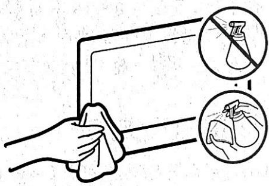

\- 要清洁屏幕，先关闭电视，然后使用超细纤维布轻轻擦去屏幕上的污迹和指纹。使用沾有少量水的软布清洁电视机身或屏幕。然后使用干抹布擦干水分。清洁时，不得用力擦拭面板表面，否则可能损坏面板屏幕。请勿使用可燃液体（苯、稀释剂等）或清洁剂。对于顽固污渍，可在微纤维布上喷洒少量的屏幕清洁剂，然后使用布拭去污渍。

### 许可

DOLBY AUDIO™ dts Premium Sound | 5.1

POWERED BY QUICK SET®

### HDMI

术语 HDMI 和 HDMI High-Definition Multimedia Interface 以及 HDMI 徽标是 HDMI Licensing LLC 在美国和其他国家或地区的商标或注册商标。

### 有害物质含量

**液晶电视**

<table><tr><td rowspan="2">部件名称</td><td colspan="6">有害物质</td></tr><tr><td>铅(Pb)</td><td>汞(Hg)</td><td>镉(Cd)</td><td>六价铬Cr(VI)</td><td>多溴联苯(PBB)</td><td>多溴二苯醚(PBDE)</td></tr><tr><td>印刷电路组件</td><td>x</td><td>o</td><td>o</td><td>o</td><td>o</td><td>o</td></tr><tr><td>电缆组件</td><td>x</td><td>o</td><td>o</td><td>o</td><td>o</td><td>o</td></tr><tr><td>塑料和聚合物部件</td><td>o</td><td>o</td><td>o</td><td>o</td><td>o</td><td>o</td></tr><tr><td>金属部件</td><td>x</td><td>o</td><td>o</td><td>o</td><td>o</td><td>o</td></tr><tr><td>液晶屏</td><td>x</td><td>o</td><td>o</td><td>o</td><td>o</td><td>o</td></tr></table>

环境保护期限适用条件

环境温度：0 \~ 40 度

环境湿度：10% \~ 80%

10 本产品的"环保使用期限"为10年，其标志如左图所示。可更换部件的环保使用期限可能与产品的环保使用期限不同。只有在本说明书所述的正常情况下使用本产品时，"环保使用期限"才有效。

### 兼容性声明

CCC A级 警示

如果您的产品属于 A级、在生活环境中、该产品可能会造成无线电干扰。

在这种情况下、可能需要用户对其干扰采取切实可行的措施。

A级 产品 会在功率标签 或 说明书 上进行标记。如未进行标记、则不属于A级产品。

### 电池限制要求

**碱性及非碱性锌-二氧化锰电池中汞、镉、铅含量的限制要求**

标准: GB/T-8897.2.-2013

**📌 注意**: 使用前请确认电池正负极。请勿将电池拆卸、焚烧或充电。不同种类电池不可混用。长期不

用时、请取出电池。

含量汞: "低汞" 或 "无汞"

**锌-氧化银、锌-空气、锌-二氧化锰 扣式电池中汞含量的限制要求**

标准：GB/T-8897.2.-2013

**📌 注意**: 使用前请确认电池正负极。请勿将电池拆卸、焚烧或充电。不同种类电池不可混用。

长期不用时、请取出电池。将电池远离儿童、如误吞食、请即刻就医。

含量汞: "无汞"或"含量 \leq 20mg/g"

## 安装服务信息

### 产品报装方式

三星安装热线: 400-810-5858

\- 官网预约安装: 登录官网www.samsung.com, 依次选择"售后服务 → 自助服务 → 预约上门"填写相关信息后点击提交即可完成安装服务预约。

### 授权安装识别

通过短信服务单号与上门人员确认: 安装预约成功后, 顾客将收到服务短信 (下图示例, 仅供参考, 服务单号请以实际情况为准), 请与上门人员确认服务单号以辨别是否为三星授权安装人员为您服务, 若上门人员无法提供服务单号, 顾客将有权拒绝接受服务。

[三星电子]

顾客您好，本次安装服务单号为4025859567，请与上

门人员核实服务单号。

如不符，请拒绝服务并联系400-810-5858核实。

### 安装配件选择

\- 为保证产品使用安全, 建议您采用三星认证挂架, 三星认证挂架及相关收费信息请登录官网进行查询, www.samsung.com, 依次选择"售后服务 → 政策&公告 → 服务政策 → 安装产品的收费项目 → 电视"。

### 安装服务单保存

\- 安装完成后, 安装人员会邀请您协助填写安装服务单上相关内容, 请您认真填写、评价后, 签字确认, 并妥善保管好安装服务单粉色联部分, 以作为三星提供安装服务的凭据。

### 授权安装建议

\- 非授权安装服务可能对您的产品造成损坏，且存在安全隐患。为保证产品使用安全，建议选择三星授权安装服务及安装配件（挂架等）

\- 非授权安装服务及配件造成产品损坏，不属三星产品/服务质量问题，您将无法享受三星公司的售后服务。

**三星全球服务网**

如果您对三星产品有任何咨询或建议，请联系三星客服中心。

400-810-5858(收费)

www.samsung.com/cn/support

生产者(制造商)：天津三星电子有限公司

地址：天津经济技术开发区西区江泰路20号

生产企业(TSEC)：天津三星电子有限公司

<!-- 标题改动说明：原文件标题层级完全扁平化，所有内容均使用 h2，包含大量编号前缀（01-08）、按钮名称作标题、重复标题等问题。本次重构按逻辑章节分组为 h2，将子内容降级为 h3，删除了编号前缀，将遥控器按键说明合并到"遥控器使用"下，将分散的故障排除项目归入"故障排除"父标题，将规格、有害物质、许可等内容归入"技术规格"。 -->
