米家手持无线吸尘器 1C 使用说明书

## 安全须知

## 为了避免使用不当所造成的触电、起火等意外伤害，请在使用前仔细阅读使用说明书，并妥善保管

本产品不可由身体、感官或智力残障残障人士以及无相关经验与知识之人士(包括儿童)使用，除非有监护人的看管或指导，以确保其能够安全使用本产品。

禁止儿童操作产品或者当作玩具使用，当在儿童附近使用产品时，需要密切关注；禁止儿童在无监护人的情况下清理或者维护产品。

禁止在户外或潮湿的表面使用，仅限室内干燥表面使用，请勿以湿手触摸插头或产品的任何部分。

为了防止起火、爆炸或受伤，请在使用前检查锂电池以及电源适配器是否有损坏，禁止在锂电池或电源适配器损坏时使用吸尘器。

吸尘器软绒滚刷、电池、延长杆以及吸尘器主机均为带电部件，请勿浸入水中或者其它液体中清洗，日常清洁后，请确保所有过滤器彻底干燥。

当清理软绒滚刷时，请先关闭主机，防止旋转的刷头损伤用户，禁止在软绒滚刷、尘杯以及过滤器未安装好的情况下使用产品。

仅限使用原装电源适配器，请勿使用非官方适配器，否则可能导致锂电池起火。（电源适配器与米家1代吸尘器不能互用）

请勿使用产品吸水、汽油等可燃或可爆炸液体，禁止吸入有毒溶液，例如氯漂白剂、氨、下水道清理剂或者其它液体。

禁止用吸尘器清洁石膏板灰、壁炉灰以及灰烬，禁止吸入冒烟物或燃烧物，例如火炭、烟蒂或者火柴。

禁止用吸尘器清洁尖锐或坚硬物品，例如玻璃、钉子、螺丝、硬币，否则将导致吸尘器的损坏。

请将产品气流通道和活动部分远离毛发、宽松服装、手指及身体其他部分，请勿将吸尘管、管状延长把手或工具对着眼睛、耳朵，或将其放入口中。

禁止在吸口处放置任何物体。禁止在任何吸口堵塞时使用吸尘器，灰尘、棉絮、毛发或者其他物品可能造成气流减弱，请及时清理。

请勿将吸尘器靠置于椅子、餐桌等不稳定表面，以防跌落后损坏吸尘器或者伤害到用户，当吸尘器因为摔倒、损坏或者其它异常时，请联系官方授权维修，请勿自行拆解。

请严格按照说明书中指导的方式充电，在超出指定温度范围的情况下不正确充电，可能导致电池损坏。

仅使用本公司推荐的附件和替换件。

透明集尘盒底盖和滤网未安装到位前请勿使用。

在长期不使用、维护或维修前，请拔下插头。

使用产品清洁楼梯时请特别注意。

请勿在户外、浴室或游泳池周围内对本产品进行安装、充电或使用。

火灾危险警告：请勿将任何香味产品涂抹到本产品的过滤器上，已知此类产品中的化学物质具有易燃性，会导致产品起火。

本产品设计仅限居家用途。

## 产品介绍

## 配件清单

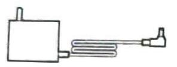  
电源适配器

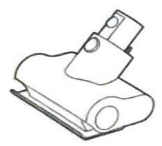  
电动除螨刷

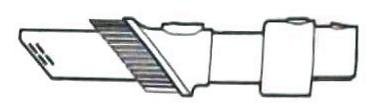  
二合一扁吸

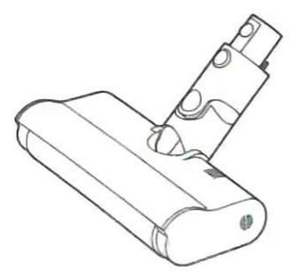  
软绒滚刷

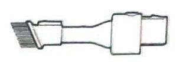  
二合一毛刷

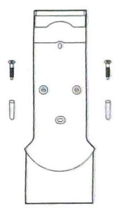  
充电收纳二合一支架
(含螺丝\*2、膨胀管\*2)

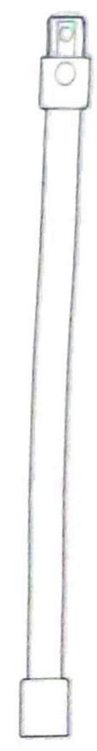  
延长杆

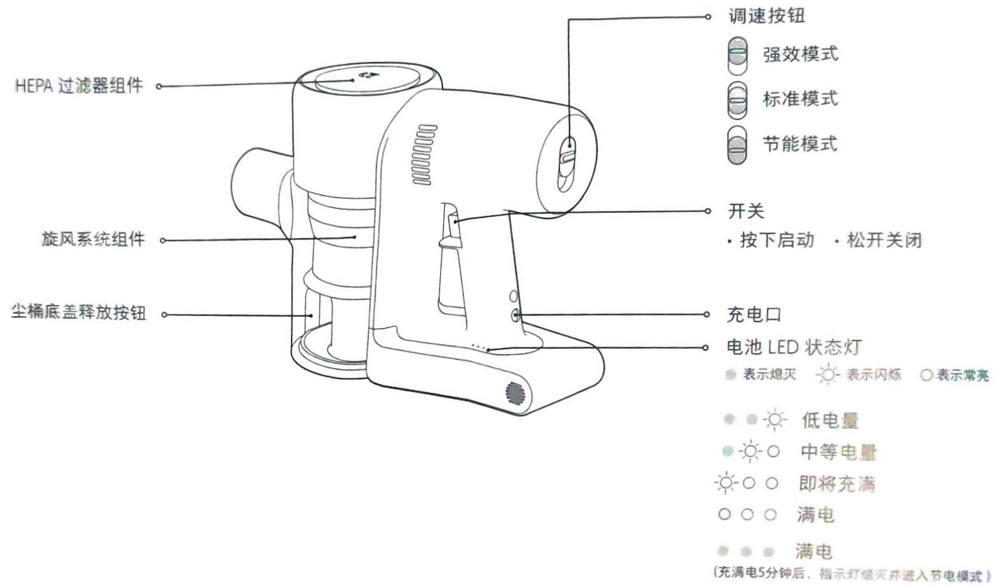

## 安装

主机与配件安装图

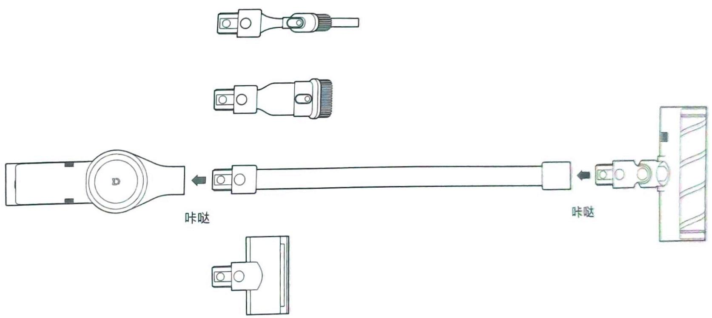

## 安装 (2)

## 充电收纳二合一支架安装

1. 支架为选装件，可根据实际情况选择是否安装。

2 支架安装应选择附近有电源、阴凉干燥处，避免安装在阳光直射或厨房等易潮湿的墙壁上。

3 应使用适合墙身类型的安装硬件，并确保扩充底座安装牢固。确保安装区域的正后方位置没有管道(燃气管、水管、通气管)或电缆、电线、下水道。

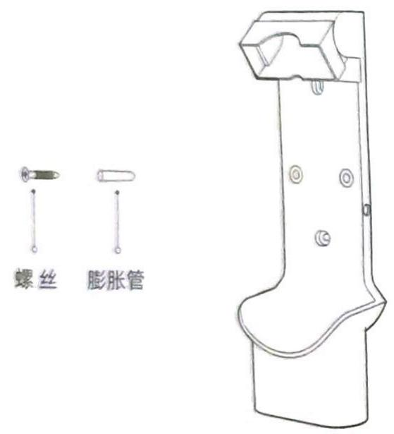

4. 建议请专业人员进行安装，在必要时使用防护服、护目镜和其他防护材料。

5. 请先在墙体用电钻打直径8mm，深约30mm的孔，然后将膨胀管放入孔中，将支架定位好后，用螺丝与墙面固定。

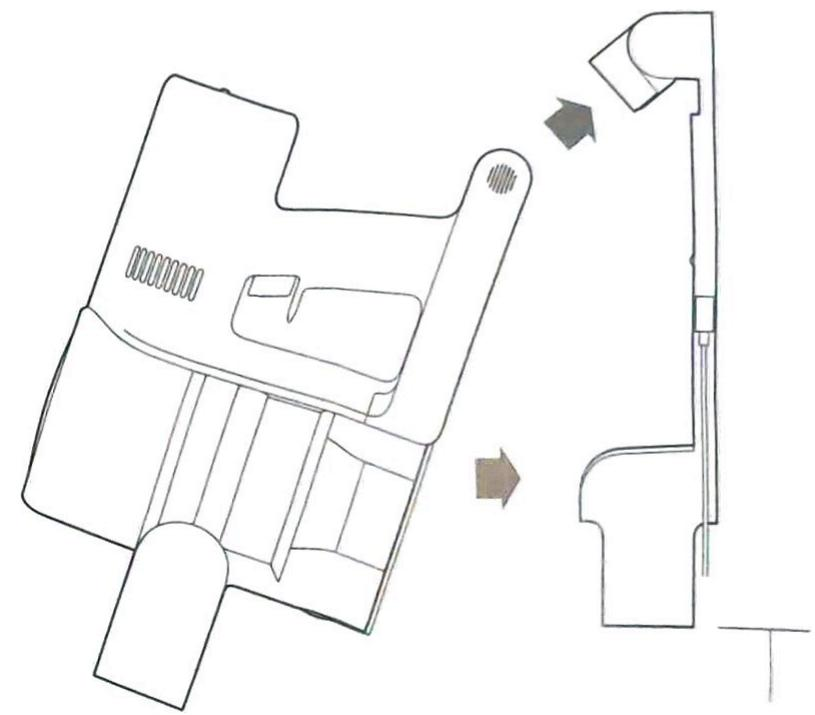  
106m

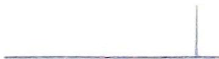

使用

充电

电池LED状态指示灯表示熄灭 - 表示闪烁 ○表示常亮

即将充满

○ ○ ○ 满电

在继续之前，请阅读本使用说明书中的“安全须知”

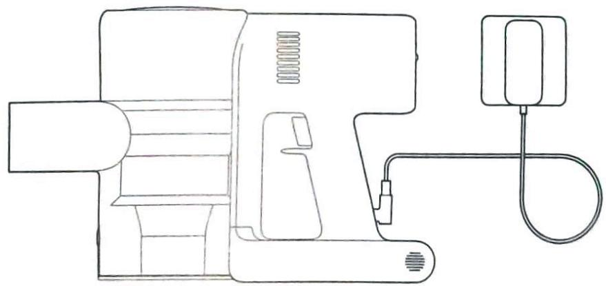  
电源适配器直接充电

## 提示：

1. 首次使用时，请充满电，充电时间约为4小时。

2. 吸尘器在充电状态下无法启动工作。

3. 强效模式下连续使用后电池温度较高，此时充电可能会增加充电时间，建议让主机冷却30分钟后再充电。

4. 充电器与米家1代吸尘器不能互用。

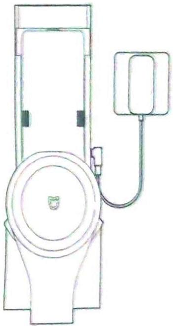  
挂座充电

## 使用

## 配件的使用场景

1. 电动除螨刷，通过刷头的拍打振动吸入，深度去除床褥及织物表面、深层的灰尘及螨虫。

提示：除螨刷不可与延长杆连接使用。

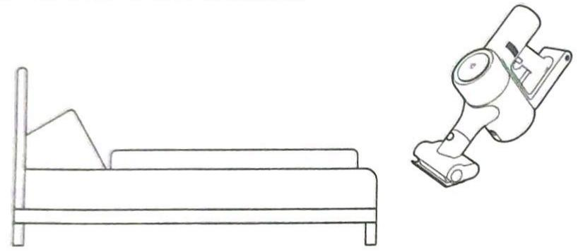

2. 二合一毛刷：适合床面、沙发等各种布艺家具螨虫、灰尘的清理。

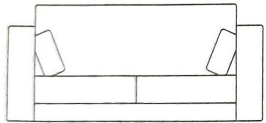

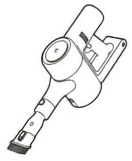

3. 二合一扁吸：适合清理狭缝、门窗死角、楼梯等狭小的缝隙。

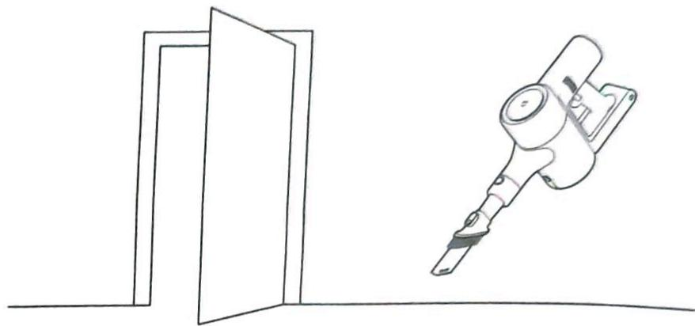

4. 软绒滚刷：适合地板、瓷砖、大理石地面等硬质地表面，和部分大颗粒灰尘的清洁。软绒滚刷也可以直接安装在主机上使用。

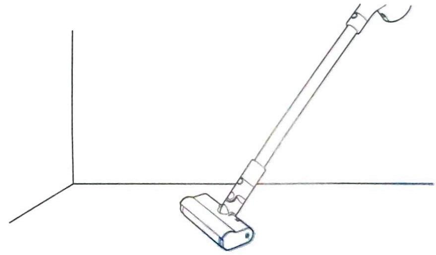

**📌 注意**

## 维护与保养

## 产品保养注意点

1.务必使用原装部件，否则可能无法享受保修服务。

2. 若过滤组件、吸头等堵塞，主机会间歇工作几次后停止，请及时清理过滤组件、吸头等。

3. 长时间不使用时，请将吸尘器充满电后拔下电源适配器插头并放置在阴凉干燥处，切勿放置在阳光直射或潮湿的环境中。至少每3个月充电一次避免电池出现过放。

## 清洁主机

使用柔软干布擦拭主机。

## 清理集尘桶

在清理集尘桶之前，请确认电源适配器已断开，并注意不要误碰开关启动吸尘器。一旦灰尘达到“MAX”（最大）标记，继续使用会影响吸尘效果，请尽快清理后再使用。

1. 垃圾倾倒：请按下尘桶底盖释放按钮，即可倾倒尘桶内的灰尘。

2. 清洁集尘桶内壁：用抹布或纸巾擦拭尘桶内壁的灰尘。

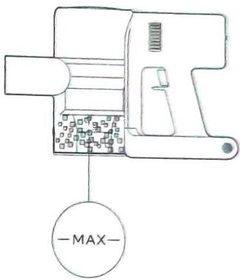

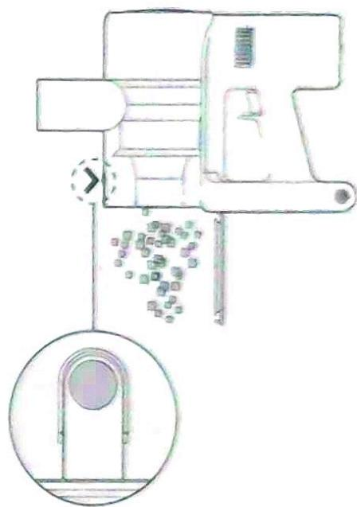

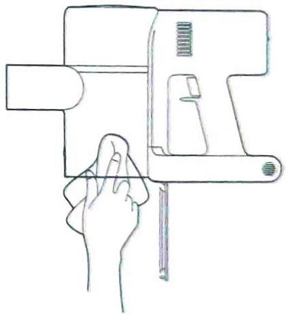

## 维护与保养 (2)

## 清理旋风系统组件

1. 按图示方向转动解锁旋风系统组件，即可取出旋风系统组件。

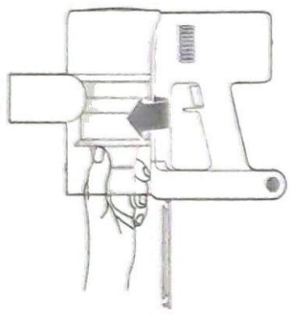

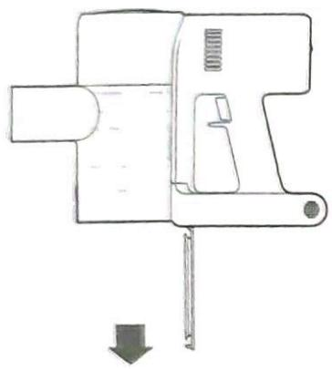

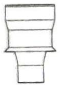

2. 冲洗旋风系统组件，直到干净为止，冲洗完毕后，充分晾晒至少24小时以便彻底晾干。

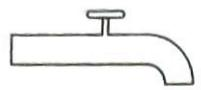

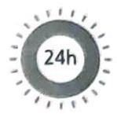

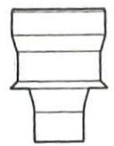

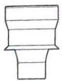

注意 请勿将旋风系统组件放入洗碗机、洗衣机中进行清洗或放在转筒式干燥机、烤箱、微波炉或明火附近进行烘干。

3. 晾干后，装回旋风系统组件。

## 维护与保养 (3)

## 清理 HEPA 过滤器组件

1. 请在平坦的位置固定主机，按图示方向转动HEPA过滤器组件上盖，可将HEPA过滤器组件取出。

提示：清洗HEPA过滤器组件前将内置海绵去除，可用清水冲洗HEPA过滤器与海绵。

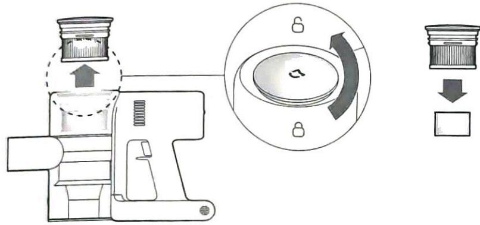

2. 用水清洗HEPA过滤器和海绵，清洗时应360°转动HEPA过滤器，确认HEPA过滤器缝隙内灰尘均被清除。对着水槽轻敲数次，去除所有灰尘。晾晒HEPA过滤器组件至干透。

提示：请务必晾干后再重新装回使用（至少晾晒24小时）。

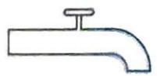

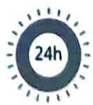

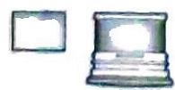

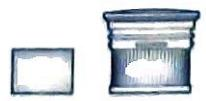

## 清理软绒滚刷与电动除螨刷

提示 取下刷头前，请确保软绒滚刷或电动除螨刷已经从主机分离，以免误启动吸尘器造成人身伤害。除螨刷、软绒滚刷的机身内含有电器部件、软绒滚刷刷头内含有轴承，请勿用水清洗。清除刺头缠绕异物时，请小心锋利物体。

## 清理软绒滚刷

1. 沿箭头方向拨动刷头释放按钮，刷头一侧盖板自动弹开，按图示方向可将刷头从槽口取出清理。

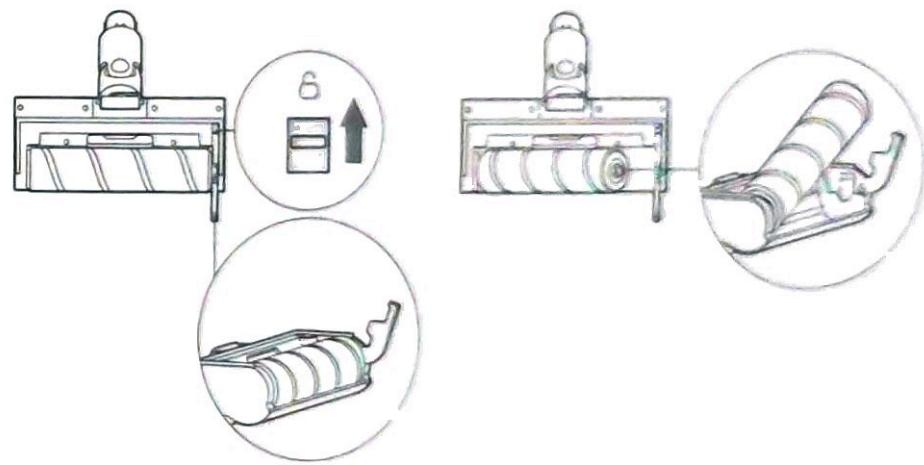

2. 使用剪刀将刷头上附着的毛发及纤维物质挑起并剪断。
3. 清理干净后，按照与拆分相反顺序组装好即可。

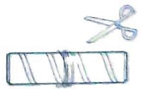

## 维护与保养 (4)

清洁电动除螨刷

1 用硬币按图示方向将锁扣逆时针旋转，直到听到“咔嗒”声。
提示 建议每次使用后清理。

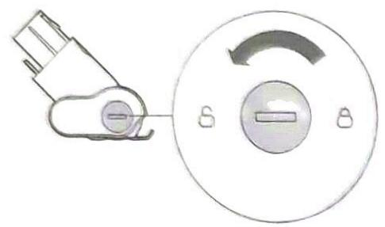

2. 解锁后将刷头从电动除螨刷内取出，冲洗并清理刷头。

3. 晾晒时将刷头竖直摆放，放置至少24小时以便彻底晾干。

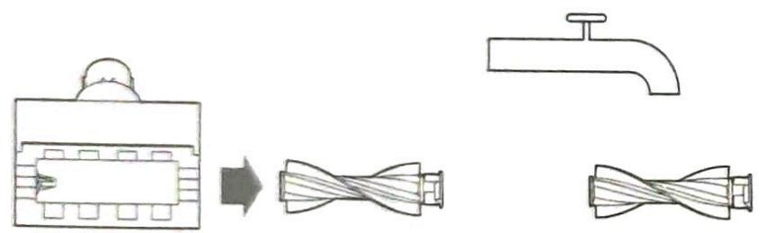

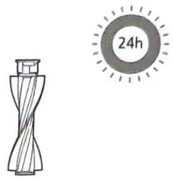

4. 确认滚刷完全干燥后，按照与拆分相反的顺序组装即可。

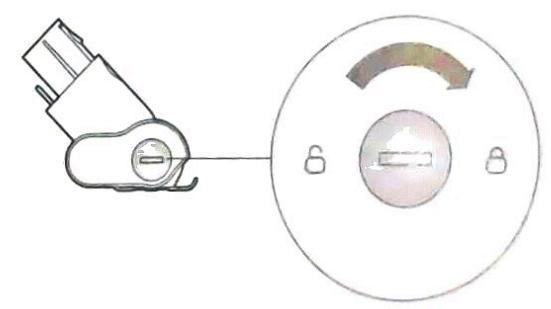

## 基本参数

## 主机

<table><tr><td>型号</td><td>SCWXCQ02ZHM</td></tr><tr><td>外形尺寸</td><td>1208×256×204.5mm</td></tr><tr><td>电池标称容量</td><td>2500 mAh</td></tr><tr><td>产品净重</td><td>3.5 kg</td></tr><tr><td>尘杯容量</td><td>0.5L(最大)</td></tr><tr><td>额定电压</td><td>25.2 V---</td></tr><tr><td>额定功率</td><td>400 W</td></tr></table>

执行标准：GB4706.1,GB4706.7,GB4343.1,GB17625.1

<table><tr><td colspan="2">软绒滚刷</td></tr><tr><td>型号</td><td>1C-01</td></tr><tr><td>额定电压</td><td>25.2V=</td></tr><tr><td>额定功率</td><td>40W</td></tr></table>

<table><tr><td colspan="2">电动除螨刷</td></tr><tr><td>型号</td><td>1C-02</td></tr><tr><td>额定电压</td><td>25.2V=</td></tr><tr><td>额定功率</td><td>20W</td></tr></table>

## 产品中有害物质的名称及含量

<table><tr><td rowspan="2">部件名称</td><td colspan="6">有害物质</td></tr><tr><td>铅(Pb)</td><td>汞(Hg)</td><td>镉(Cd)</td><td>六价铬(Cr(VI))</td><td>多溴联苯(PBB)</td><td>多溴二苯醚(PBDE)</td></tr><tr><td>电路板</td><td>×</td><td>○</td><td>○</td><td>○</td><td>○</td><td>○</td></tr><tr><td>金属件</td><td>×</td><td>○</td><td>○</td><td>○</td><td>○</td><td>○</td></tr><tr><td>壳体</td><td>○</td><td>○</td><td>○</td><td>○</td><td>○</td><td>○</td></tr><tr><td>电池</td><td>×</td><td>○</td><td>○</td><td>○</td><td>○</td><td>○</td></tr><tr><td>其他配件</td><td>○</td><td>○</td><td>○</td><td>○</td><td>○</td><td>○</td></tr></table>

本表格依据 SJ/T11364 的规定编制。

○ 表示该有害物质在该部件所有均质材料中的含量均在 GB/T 26572 规定的限量要求以下。

\times 表示该有害物质至少在该部件的某一均质材料中的含量超出GB/T26572规定的限量要求。

本标识内数字表示产品在正常使用状态下的环保使用年限为10年。

本器具含有可充电锂电池组，报废时对环境有害，请在废弃器具前按照以下提示将电池从器具中取出，并合理的处置：

\* 拆卸电池前请断电以及尽可能用完电量，然后拧开机器手柄处和底壳固定螺丝。

\* 轻轻分离电池组与手柄组件后取下电池组，注意请勿破坏电池外壳以防危险产生。

\* 请将取出的电池交由专业的回收机构处理。

## 常见问题

吸尘器无法正常工作时，请参阅下表以处理异常情况。

<table><tr><td>常见故障</td><td>可能的原因</td><td>解决办法</td></tr><tr><td rowspan="3">吸尘器不工作</td><td>电池没电或者电量不足。</td><td>请为产品充满电后再使用。</td></tr><tr><td>因堵塞导致温度过高而触发的自动保护。</td><td>待冷却后重新启动。</td></tr><tr><td>吸尘口或通道被堵塞。</td><td>清理吸尘口或通道。</td></tr><tr><td rowspan="2">产品吸力减弱</td><td>尘桶装满,HEPA过滤器组件积满灰尘堵塞。</td><td>清理尘桶垃圾以及清洗HEPA过滤器组件。</td></tr><tr><td>配件堵塞。</td><td>清理配件堵塞物。</td></tr><tr><td>电机运转有异声</td><td>主吸口或延长杆等被堵塞。</td><td>清理主吸口、延长杆内的障碍物。</td></tr><tr><td>启动时,第一个指示灯红色常亮</td><td>电池损坏。</td><td>请联系本公司售后服务进行维修。</td></tr><tr><td>启动时,第一个指示灯红色快闪</td><td>电源适配器不匹配。</td><td>请使用原装电源适配器。</td></tr><tr><td rowspan="3">充电时电池状态指示灯不亮</td><td>主机与适配器插口未连接好。</td><td>检查电源适配器是否插好。</td></tr><tr><td>电池已充满,电池进入休眠状态。</td><td>可正常使用。</td></tr><tr><td>排除以上两种情况,如问题仍然存在。</td><td>请联系本公司售后服务进行维修。</td></tr><tr><td>充电过慢</td><td>电池温度较低或较高。</td><td>请等待电池温度恢复正常后再充电。</td></tr></table>

## 米家手持无线吸尘器1C产品保修说明

米家手持无线吸尘器1C产品售后服务严格依据《中华人民共和国消费者权益保护法》、《中华人民共和国产品质量法》实行售后三包服务，服务内容如下：

## 一、保修期限

1. 自您签收次日起7日内，本产品出现《米家手持无线吸尘器1C产品性能故障表》所列性能故障的情况，经由小米售后服务中心检测确定，可免费享受退货或换货服务；

2. 自您签收次日起8日-15日内，本产品出现《米家手持无线吸尘器1C产品性能故障表》所列性能故障的情况，经由小米售后服务中心检测确定，可免费享受换货或者维修服务；

3. 自您签收次日起12个月内，本产品出现《米家手持无线吸尘器1C产品性能故障表》所列性能故障的情况，经由小米售后服务中心检测确定，可免费享受维修服务。

## 二、保修内容

<table><tr><td>类型</td><td>保修内容</td><td>保修时间</td></tr><tr><td>主机</td><td>主机及构成(不包含主要部件)</td><td>1年</td></tr><tr><td>主要部件</td><td>电机</td><td>3年</td></tr><tr><td>附件</td><td>电源适配器、电动除螨刷(不含刷头)、软绒滚刷(不含刷头)、充电收纳二合一支架、延长杆、二合一扁吸(不含扁吸头)、二合一毛刷(不含毛刷头)</td><td>1年</td></tr></table>

注意：电动除螨刷的刷头、软绒滚刷的刷头、二合一扁吸的扁吸头、二合一毛刷的毛刷头、HEPA过滤器和海绵为产品随机耗材，无保修期。

## 米家手持无线吸尘器1C三包凭证

## 三、非保修条例

1. 未经授权的维修、误用、碰撞、疏忽、滥用、进液、事故、改动、不正确的使用非本产品配件，或撕毁、涂改标贴、防伪标记，

2. 已超过三包有效期；

3. 因不可抗力造成的损坏；

4. 不符合《米家手持无线吸尘器1C产品性能故障表》所列性能故障的情况；

5. 因人为原因导致本产品及其配件产生《米家手持无线吸尘器1C产品性能故障表》所列性能故障。

## 四、米家手持无线吸尘器 1C 产品性能故障表

<table><tr><td>名称</td><td>性能故障</td></tr><tr><td>米家手持无线吸尘器1C</td><td>1.整机不工作;2.调档功能失效;3.软绒滚刷不工作;4.软绒滚刷反转;5.适配器无法充电;</td></tr></table>

## 五、提示

1. 因运输过程中需使用包装箱保证产品运输安全，建议您自签收之日起至少保留包装箱30天。

2. 本产品仅限中国地区（不含港澳台地区）销售，故本产品仅在中国地区（不含港澳台地区）提供售后服务。本保修条例仅适用于中国地区（不含港澳台地区）。

## 米家手持无线吸尘器 1C 三包凭证

## 六、产品保修卡

<table><tr><td>用户姓名</td><td></td></tr><tr><td>通讯地址</td><td></td></tr><tr><td>联系电话</td><td></td></tr><tr><td>产品名称及型号</td><td></td></tr><tr><td>产品序列号</td><td></td></tr><tr><td>产品购买日期</td><td></td></tr></table>

## 七、维修记录

<table><tr><td>序号</td><td>维护日期</td><td>故障描述及更换配件</td><td>维修中心</td><td>维护工程师</td></tr><tr><td>1</td><td></td><td></td><td></td><td></td></tr><tr><td>2</td><td></td><td></td><td></td><td></td></tr><tr><td>3</td><td></td><td></td><td></td><td></td></tr></table>

服务电话：400-100-5678

服务网址：www.m1.com/service

委托方：小米通讯技术有限公司

制造商：追觅科技（天津）有限公司

(小米生态链企业)

地址：天津自贸试验区（东疆保税港区）亚洲路6975号金融贸易中心南区1-1-2112