干衣机

HGY901P

HGY902P

HGY1002P

目录
产品介绍 1
产品特点 1
工作原理 1
整机结构 2
型号规格 2
产品电路图 3
随机配件 3
安装步骤(拆卸步骤) 3-5
使用说明 5
使用须知 6
使用安全注意事项 6-8
保养与储藏 8
故障排除 8- 非常感谢您购买艾美特产品.
- 使用前请详阅本说明书.
- 说明书请妥为保管.

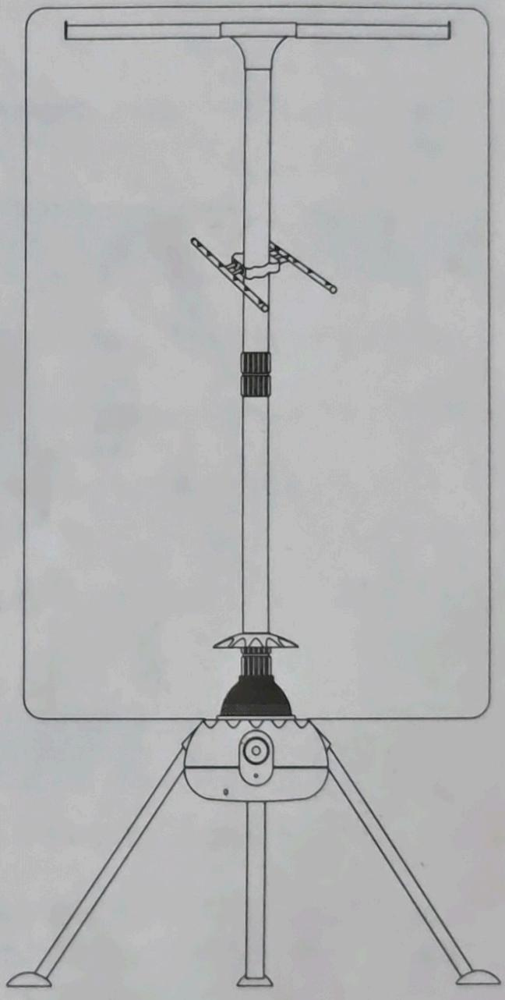

## 产品介绍

艾美特电器有限公司是国际知名电风扇、电暖器及小家电等系列产品的专业制造公司，电风扇、电暖器的设计开发技术水平已处于国际领先地位。艾美特多功能干衣机，是艾美特精心研发设计的具有干衣、取暖、衣柜、衣架多种功能产品。

主要使用环境场所：

①冬天日照较少，导致衣物长晾不干；

②南方梅雨季节，导致衣物潮湿；

③ 家有小孩，衣服洗换频率高；

④ 家庭阳台较小或周围环境污染大。

以上环境场所均可使用本产品，将会有效改善衣物发霉、异味、二次污染现象。

### 产品特点

1. 采用风扇式加热器干衣，与传统干衣不同，干衣过程避免衣物互相摩擦而打折、受损。

2. 采用PTC发热材料：改变传统制热方法，并采用多项过热保护装置和防触电装置。

3. 采用全新设计的超静型风扇，干衣噪音低至42dB。

4. 杜绝二次污染：衣物与外界隔离，无灰尘及虫类侵入及高温杀菌作用。

5. 多功能：集干衣机、暖风机和衣柜于一身。

6. 干衣速度快：干衣时间约1\~2小时。

7. 便于携带：体积小、重量轻、拆卸方便，便于旅行使用。

### 工作原理

艾美特多功能干衣机系列的热源是采用PTC发热体，它具有安全、节能、使用寿命长、耐腐蚀等优点。

该产品的工作原理是利用风扇式加热使干衣机内形成正压，空气经过滤再经PTC发热体加热后被送进干衣罩内，衣物在罩内静态悬挂时受热风作用，水分快速蒸发被排出罩外，而达成加热干衣的目的。（温馨提示：把被干衣物脱水后挂到通风处，晾至不滴水，再用干衣机烘干，可达到更节能更环保的原则。）

### 整机结构

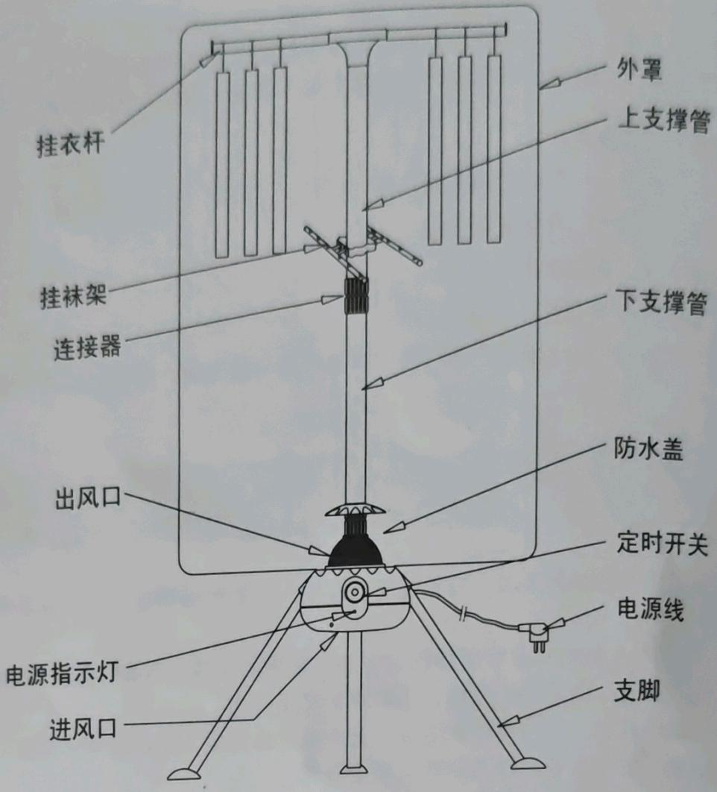

### 型号规格

<table><tr><td>型号</td><td>HGY901P / HGY902P</td><td>HGY1002P</td></tr><tr><td>电源</td><td>220V~50Hz</td><td>220V~50Hz</td></tr><tr><td>输入功率</td><td>900W</td><td>1000W</td></tr><tr><td>额定干衣容量</td><td>10kg</td><td>10kg</td></tr><tr><td>干衣时间</td><td>180min</td><td>180min</td></tr><tr><td>产品净重</td><td>3.5kg</td><td>3.5kg</td></tr><tr><td>产品毛重</td><td>4.5kg</td><td>4.5kg</td></tr><tr><td>外型尺寸</td><td>63.5x150cm</td><td>63.5x150cm</td></tr><tr><td>彩盒尺寸</td><td>51x25.5x25.5cm</td><td>51x25.5x25.5cm</td></tr></table>

### 产品电路图

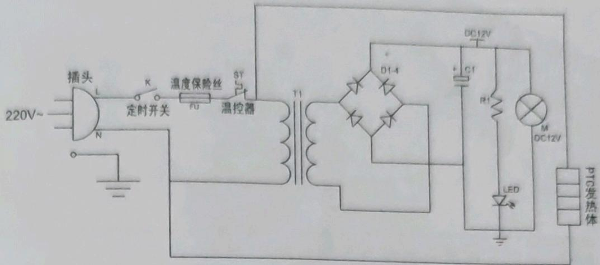

### 随机配件

在安装此机前，请仔细检查随机配件(如下表):

<table><tr><td>名称</td><td>数量</td><td>单位</td></tr><tr><td>主机</td><td>1</td><td>台</td></tr><tr><td>上支撑管</td><td>1</td><td>支</td></tr><tr><td>下支撑管</td><td>1</td><td>支</td></tr><tr><td>挂衣架组件</td><td>1</td><td>套</td></tr><tr><td>防水盖</td><td>1</td><td>个</td></tr><tr><td>支撑脚</td><td>3</td><td>支</td></tr><tr><td>外罩</td><td>1</td><td>个</td></tr><tr><td>说明书</td><td>1</td><td>本</td></tr><tr><td>保修卡</td><td>1</td><td>份</td></tr><tr><td>挂袜架</td><td>1</td><td>套</td></tr></table>

## 安装步骤

1. 把三支支脚插进机体相应孔内，并插到位。（如图）

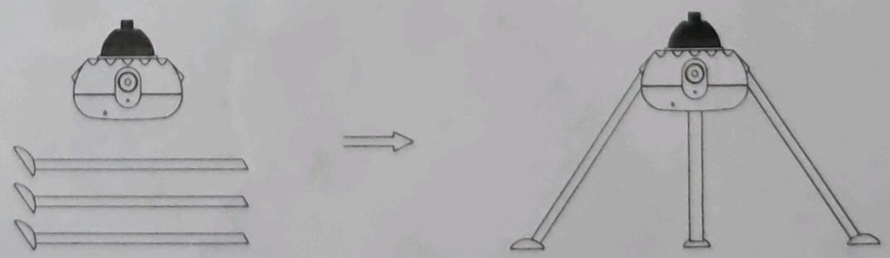

2. 把下支撑管（组件）的丝牙部分对准主机出风口上的螺母，按顺时针方向拧进螺母，并拧紧。（如图）

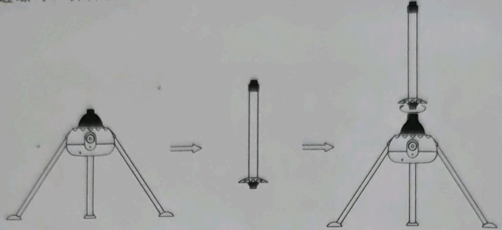

**📌 注意**：开机前要确保防水盖安装好后才能开机。

3. 把上支撑管（组件）丝牙部分对准连接器，按顺时针方向拧进连接器，并拧紧。（如图）

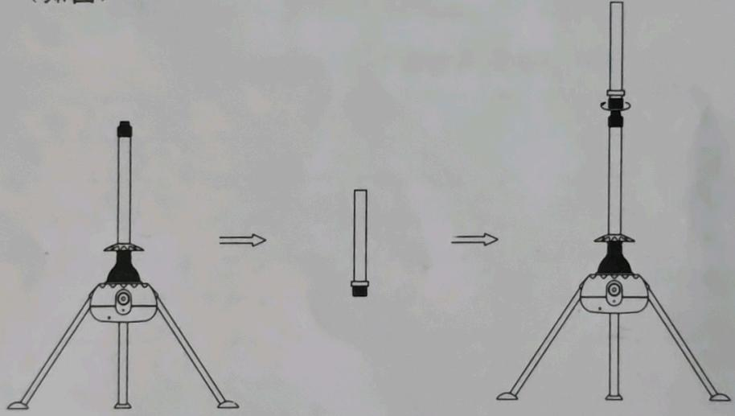

4. 装上挂袜架，将挂衣架组件向水平方向散开，套到上支撑管上按顺时针方向拧紧。（如图）

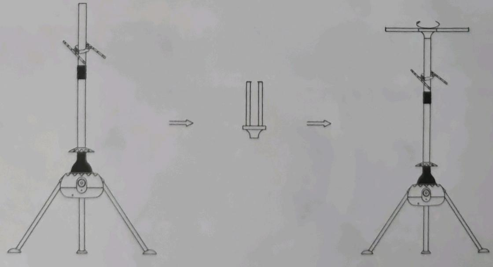

5. 把被干衣物均匀挂到挂衣杆上，装上外罩，并拉上拉链。

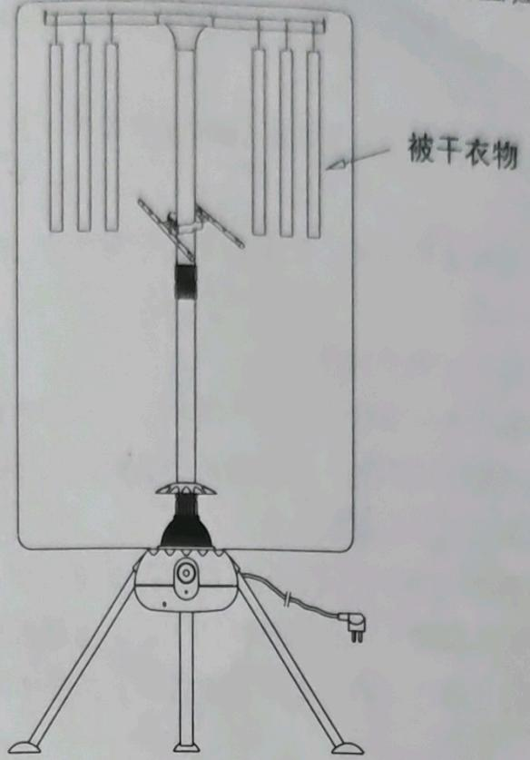  
被干衣物

6.作暖风机使用时，完成第一步安装即可。

\- 拆卸步骤: 按安装的相反步骤完成即可。

## 使用说明

1. 把电源插头插入带接地的插座上(**📌 注意**：插座必须可靠接地)。

2. 旋转定时旋钮，机器正常工作状态，此时电源指示灯亮。

3. 顺时针旋转开关旋钮为开机同时选定定时时间。

4. 中间位置为关机(关)。

5.逆时针旋转开关旋钮为无时限开关(连续)。

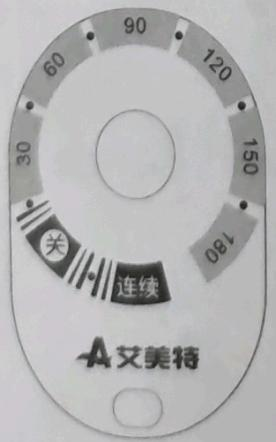  
控制面板

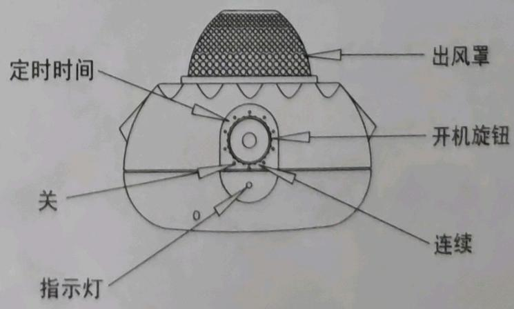

**📌 注意**：机器工作时不能用手触摸出风罩或覆盖出风罩。

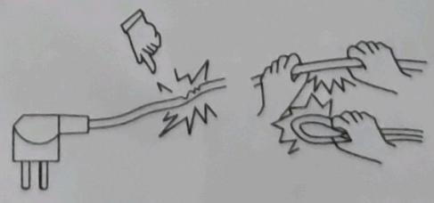

### 使用须知

1、机器正常使用或闲置时离水源和火种1.5M以上，清洁时用干布擦，不能用水冲洗。

2、本产品不能在户外和浴室内使用，使用前需先检查电源，电压是否与机器电压标签上之标示相符。

3、本产品只适用于干燥水洗的纺织物。

4、干衣时请务必将衣服脱水（或拧干）至不滴水，以减少水珠下滴，避免弄湿地面，并可提高绝缘安全系数，以及缩短干衣时间，节约能源。

5、机器工作时切勿触摸出风口，以免烫伤。

6、机器工作时切勿堵塞进/出风口，进/出风口应保持通畅。

7、被干衣物仅适用于耐高温75℃以上的布料，干衣总重量≤10kg。

8、如果电源线损坏，为了避免危险，必须由制造商，其维修部或类似部门的专业人员更换。

9、本产品不预备给体能弱，反应迟缓或精神障碍的人（包括儿童）使用，除非在对其负有安全责任的人指导或帮助下安全使用。

10、为避免干衣效率降低，请经常检查和清洁进风口隔尘网。

11、干衣时不能长时间连续使用，最长使用360分钟后须停顿30分钟再重开。

### 安全注意事项

**⚠️ 警告**

● 使用前需先检查所有电压是否与本机电压标签上之标示相符。拔出插头前先关掉电源，勿用湿手拔电源插头。

● 有感电，触电的危险有时会起火。

● 使用前需先检查电源线以及插头有否破损，电源线请勿曲折，拉扯。电源线为专用电源线，请勿随意更换。

● 以免接触不良或有感电，触电的危险。

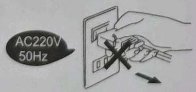

<table><tr><td>●禁止阻塞或盖住出风口。●会造成高温、故障,影响性能。●机体过热,造成外壳变形变色。</td><td>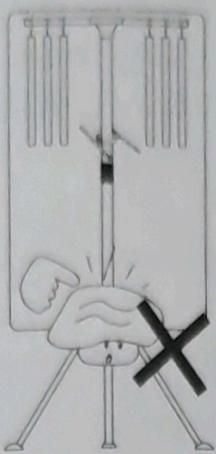</td><td>●请勿直接放置在固定插座的下方或户外使用,以免事故的发生。</td><td>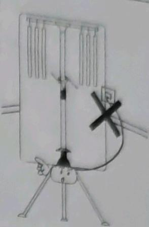</td></tr><tr><td>●勿在不平稳定的场所作成摔坏、破原因。</td><td>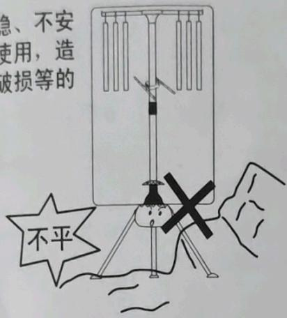</td><td>●勿将本机靠近或其他易燃性使用。如需使其间隔距离至0.5m以上。</td><td>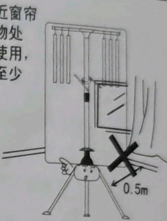</td></tr><tr><td>●请勿喷射挥发剂、杀虫剂,机体外壳有变质破损之虑,会造成感电。</td><td>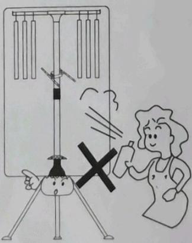</td><td colspan="2">●使用时绝对禁止插入异物,或用手触摸出风口或出风口的周围,会造成感电或烫伤等危险事故。●勿在无人看护的小孩,行动不便的老人,残疾人士的场所使用以免事故的发生。</td></tr><tr><td colspan="2">●勿在长期性潮湿、灰尘多的地方使用或储藏,会造成外壳腐蚀或因湿气引起漏电、感电等事故的发生。●勿在存放有汽油、油漆、酸碱油等油烟的厨房或其他易燃品的地方使用,以免造成火灾等危险事故的发生。</td><td>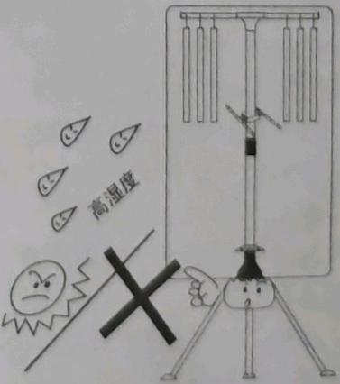</td><td>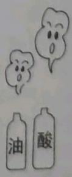</td></tr></table>

● 被干衣物仅适用于耐高温75℃以上布料，总重量≤10kg，否则会损坏衣物。

● 干衣物前，请将衣物先脱水或拧干或晾至无滴水后再放入布罩烘干，以便提高安全系数，保持地面干燥。

## 故障排除

<table><tr><td>序号</td><td>故障现象</td><td>故障原因</td></tr><tr><td>1</td><td>接通电源后电源指示灯不亮,机器不工作</td><td>●停电 ●插座保险丝熔断●插头没有插好 ●机器保险丝熔断*</td></tr><tr><td>2</td><td>干衣时间过长(3h)</td><td>●被干衣物太厚 ●被干衣物未经脱水●外罩没有套好而漏风</td></tr><tr><td>3</td><td>干衣过程突然停机</td><td>●进、出风口被衣物或其它东西堵塞,保护电路动作●超过定时时间</td></tr></table>

\- 如遇到"\*"处的问题请与本公司联系或请专业人员维修，切勿自行拆卸。

**⚠️ 警告**：本产品仅使用于水洗后的纺织物。

## 保养与储藏

**机体的清洁**：

1. 依图示进行清洁与保养。

2. 在做外部清洁工作以前，必须先关闭开关及拔掉电源插头，并且等待机体冷却后再做清洁。

3. 表面污垢必须清除干净，以免造成变色，破损。

4. 保养清洁后，按原包装顺序将各部件装入包装盒。

5. 放置于湿气较少的地方妥善保管。

6.本机只需做一般性外部清洁保养。

7. 先使用厨房用的洗涤剂擦拭，再用干净柔软的布擦净。

8. 切忌用水直接冲洗。

9.忌用稀释剂，甲苯，酸性洗剂，灯油，酒精或化学抹布擦拭，以免变色或变质。

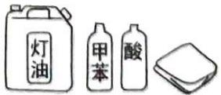

## 三包凭证

本三包凭证各栏请详填

<table><tr><td rowspan="2">客户姓名</td><td></td><td>地址</td><td colspan="3"></td></tr><tr><td></td><td>电话</td><td></td><td>邮政编码</td><td></td></tr><tr><td>购买日期</td><td></td><td>购买商场</td><td></td><td>商场电话</td><td></td></tr><tr><td>型号</td><td></td><td>产品条码</td><td></td><td>包修期</td><td>一年</td></tr></table>

<table><tr><td colspan="8">维修记录</td></tr><tr><td>接机日期</td><td>维修日期</td><td>故障与措施</td><td>维修部</td><td>维修员</td><td>维修费</td><td>配件费</td><td>退换货证明</td></tr><tr><td></td><td></td><td></td><td></td><td></td><td></td><td></td><td></td></tr><tr><td></td><td></td><td></td><td></td><td></td><td></td><td></td><td></td></tr><tr><td></td><td></td><td></td><td></td><td></td><td></td><td></td><td></td></tr></table>

**三包服务**：

3. 产品自售出之日起7日内，发生性能故障，消费者可以选择退货、换货或修理；产品自售出之日起15日内，发生性能故障，消费者可选择换货或者修理。

售后服务热线: 400-8860-315

电子服务热线: service@airmate-china.net

艾美特电器(深圳)有限公司

地址:深圳市宝安区石岩黄峰岭工业区 邮编:518108

电话:(0755)27655988

传真:(0755)27642047

公司网址：http://www.airmate-china.com

<!-- 标题改动说明：原文件产品介绍下的子章节（产品特点、工作原理、整机结构、产品电路图、随机配件）均使用 h2，现已统一降为 h3。将分散的"使用说明"操作步骤、使用须知合并为同一 h2 下，安全注意事项归为其 h3 子章节。故障排除、保养与储藏、三包凭证保持为独立 h2。 -->
